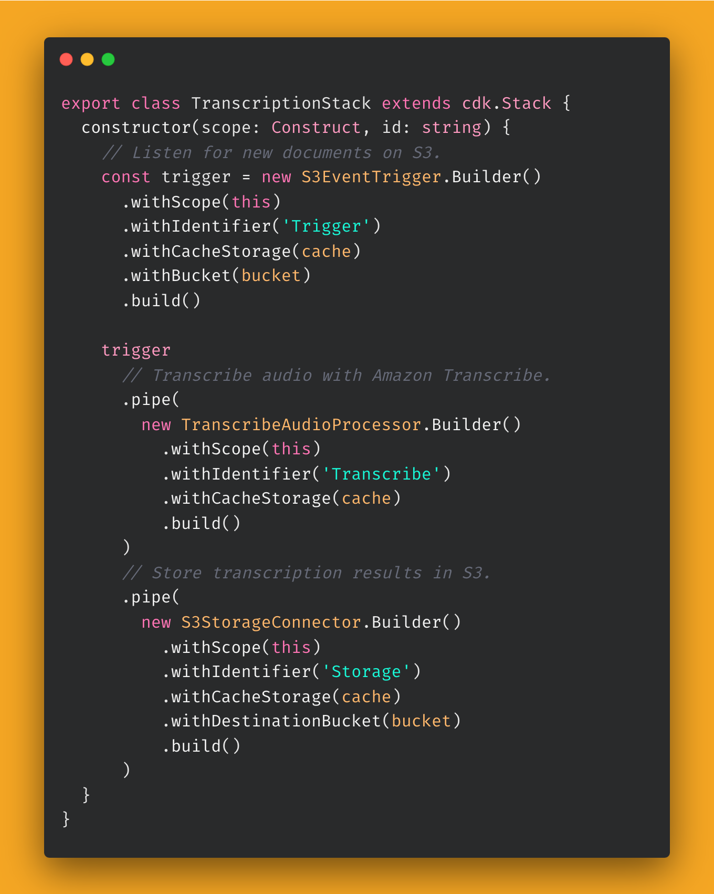

  

  
    
  <h2 align="center">Project Lakechain &nbsp;</h2>
  
Cloud-native, AI-powered, document processing pipelines on AWS.

  

    
  

 

## 🔖 Features

- 🤖 **Composable** — Composable API to express document processing pipelines using middlewares.
- ☁️ **Scalable** — Scales out-of-the box. Process millions of documents, scale to zero automatically when done.
- ⚡ **Cost Efficient** — Uses cost-optimized architectures to reduce costs and drive a pay-as-you-go model.
- 🚀 **Ready to use** — **60+** built-in middlewares for common document processing tasks, ready to be deployed.
- 🦎 **GPU and CPU Support** — Use the right compute type to balance between performance and cost.
- 📦 **Bring Your Own** — Create your own transform middlewares to process documents and extend Lakechain.
- 📙 **Ready Made Examples** - Quickstart your journey by leveraging [50+ examples](./examples/) we've built for you.

## 🚀 Getting Started

> 👉 Head to our [documentation](https://awslabs.github.io/project-lakechain/) which contains all the information required to understand the project, and quickly start building!

## What's Lakechain ❓

Project Lakechain is an experimental framework based on the [AWS Cloud Development Kit (CDK)](https://github.com/aws/aws-cdk) that makes it easy to express and deploy scalable document processing pipelines on AWS using infrastructure-as-code. It emphasizes on modularity of pipelines, and provides **40+** ready to use components for prototyping complex document pipelines that can scale out of the box to millions of documents.

This project has been designed to help AWS customers build and scale different types of document processing pipelines, ranging a wide array of use-cases including _metadata extraction_, _document conversion_, _NLP analysis_, _text summarization_, _translations_, _audio transcriptions_, _computer vision_, _[Retrieval Augmented Generation](https://docs.aws.amazon.com/sagemaker/latest/dg/jumpstart-foundation-models-customize-rag.html) pipelines_, and much more!

## Show me the code ❗

> 👇 Below is an example of a pipeline that deploys the AWS infrastructure to automatically transcribe audio files uploaded to S3, in just a few lines of code. Scales to millions of documents.

  

  

  

## LICENSE

See [LICENSE](LICENSE).
