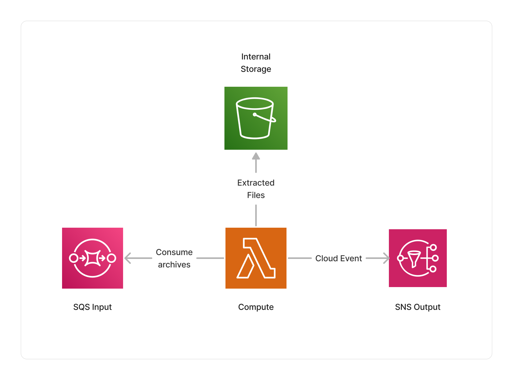

<span title="Label: Pro" data-view-component="true" class="Label Label--api text-uppercase">
  Unstable API
</span>
<span title="Label: Pro" data-view-component="true" class="Label Label--version text-uppercase">
  0.4.0
</span>
<span title="Label: Pro" data-view-component="true" class="Label Label--package">
  @project-lakechain/tar-inflate-processor
</span>
<br>

---

The TAR inflate processor makes it possible to extract, on-the-fly, the content of TAR archives and publish each file within them to other middlewares in a pipeline. This makes it possible for customers to process documents within TAR and TAR Gzipped archives in a Lakechain pipeline.

---

### 🗄️ Inflating Archives

To use this middleware, you import it in your CDK stack and connect it to a data source that provides TAR archives, such as the [S3 Trigger](/project-lakechain/triggers/s3-event-trigger) if your TAR archives are stored in S3.

> ℹ️ The below example shows how to create a pipeline that inflates TAR archives uploaded to an S3 bucket.

```typescript
import { S3EventTrigger } from '@project-lakechain/s3-event-trigger';
import { TarInflateProcessor } from '@project-lakechain/tar-inflate-processor';
import { CacheStorage } from '@project-lakechain/core';

class Stack extends cdk.Stack {
  constructor(scope: cdk.Construct, id: string) {
    // Sample bucket.
    const bucket = new s3.Bucket(this, 'Bucket', {});

    // The cache storage.
    const cache = new CacheStorage(this, 'Cache');

    // Create the S3 event trigger.
    const trigger = new S3EventTrigger.Builder()
      .withScope(this)
      .withIdentifier('Trigger')
      .withCacheStorage(cache)
      .withBucket(bucket)
      .build();

    // Create the TAR inflate processor.
    const tarProcessor = new TarInflateProcessor.Builder()
      .withScope(this)
      .withIdentifier('TarProcessor')
      .withCacheStorage(cache)
      .withSource(trigger)
      .build();
  }
}
```

#### Streaming Processing

> 💁 The TAR inflate processor processes TAR archives in streaming, meaning that the compute driving archive inflation do not need to hold the entire archive in memory. This makes it possible to process large archives without having to worry about memory constraints.

<br>

---

### 🏗️ Architecture

The TAR inflate processor uses AWS Lambda as a compute for inflating tarballs. The compute can run up to 15 minutes to extract the files part of a tarball, and provides the next middlewares in the pipeline with the extracted files.



<br>

---

### 🏷️ Properties

<br>

##### Supported Inputs

|  Mime Type  | Description |
| ----------- | ----------- |
| `application/x-tar` | TAR archives |
| `application/x-gzip` | Gzipped TAR archives |

##### Supported Outputs

|  Mime Type  | Description |
| ----------- | ----------- |
| `*/*` | The TAR inflate processor will publish each file within the tarball to the next middlewares in the pipeline.

##### Supported Compute Types

| Type  | Description |
| ----- | ----------- |
| `CPU` | This middleware only supports CPU compute. |

<br>

---

### 📖 Examples

- [Inflate Pipeline](https://github.com/awslabs/project-lakechain/tree/main/examples/simple-pipelines/inflate-pipeline) - An example showcasing how to inflate archives.
