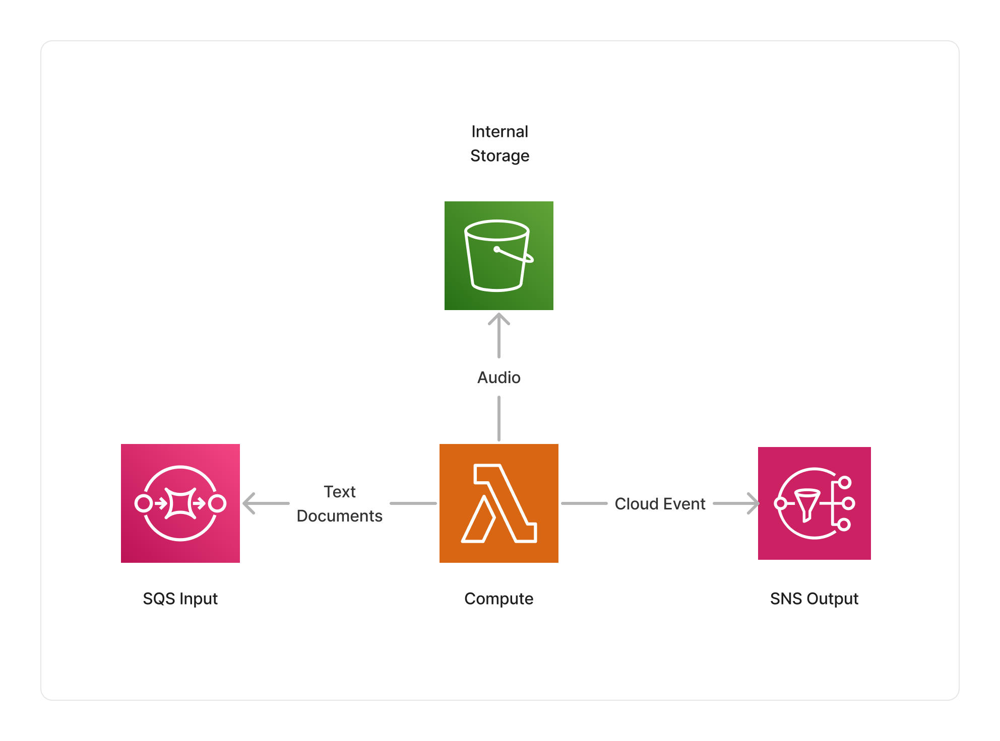

<span title="Label: Pro" data-view-component="true" class="Label Label--api text-uppercase">
  Unstable API
</span>
<span title="Label: Pro" data-view-component="true" class="Label Label--version text-uppercase">
  0.8.0
</span>
<span title="Label: Pro" data-view-component="true" class="Label Label--package">
  <a target="_blank" href="https://www.npmjs.com/package/@project-lakechain/elevenlabs-synthesizer">
    @project-lakechain/elevenlabs-synthesizer
  </a>
</span>
<span class="language-icon">
  <svg role="img" viewBox="0 0 24 24" width="30" xmlns="http://www.w3.org/2000/svg" style="fill: #3178C6;"><title>TypeScript</title><path d="M1.125 0C.502 0 0 .502 0 1.125v21.75C0 23.498.502 24 1.125 24h21.75c.623 0 1.125-.502 1.125-1.125V1.125C24 .502 23.498 0 22.875 0zm17.363 9.75c.612 0 1.154.037 1.627.111a6.38 6.38 0 0 1 1.306.34v2.458a3.95 3.95 0 0 0-.643-.361 5.093 5.093 0 0 0-.717-.26 5.453 5.453 0 0 0-1.426-.2c-.3 0-.573.028-.819.086a2.1 2.1 0 0 0-.623.242c-.17.104-.3.229-.393.374a.888.888 0 0 0-.14.49c0 .196.053.373.156.529.104.156.252.304.443.444s.423.276.696.41c.273.135.582.274.926.416.47.197.892.407 1.266.628.374.222.695.473.963.753.268.279.472.598.614.957.142.359.214.776.214 1.253 0 .657-.125 1.21-.373 1.656a3.033 3.033 0 0 1-1.012 1.085 4.38 4.38 0 0 1-1.487.596c-.566.12-1.163.18-1.79.18a9.916 9.916 0 0 1-1.84-.164 5.544 5.544 0 0 1-1.512-.493v-2.63a5.033 5.033 0 0 0 3.237 1.2c.333 0 .624-.03.872-.09.249-.06.456-.144.623-.25.166-.108.29-.234.373-.38a1.023 1.023 0 0 0-.074-1.089 2.12 2.12 0 0 0-.537-.5 5.597 5.597 0 0 0-.807-.444 27.72 27.72 0 0 0-1.007-.436c-.918-.383-1.602-.852-2.053-1.405-.45-.553-.676-1.222-.676-2.005 0-.614.123-1.141.369-1.582.246-.441.58-.804 1.004-1.089a4.494 4.494 0 0 1 1.47-.629 7.536 7.536 0 0 1 1.77-.201zm-15.113.188h9.563v2.166H9.506v9.646H6.789v-9.646H3.375z"/></svg>
</span>
<div style="margin-top: 26px"></div>

---

The ElevenLabs synthesizer middleware transforms text documents into speech using the [ElevenLabs API](https://elevenlabs.io/api).
It implements a throttling mechanism to stay within the ElevenLabs API [Limits](https://help.elevenlabs.io/hc/en-us/articles/14312733311761-How-many-requests-can-I-make-and-can-I-increase-it),
and allows pipeline builders to customize the model and voices they use for synthesis.

> ℹ️ This middleware interacts with a third-party API outside of your AWS account.

---

### 🗣️ Synthesizing Text

To use this middleware, you import it in your CDK stack and instantiate it as part of a pipeline.

> 💁 You need to specify an ElevenLabs API key to the middleware, by specifying a reference to an [AWS Secrets Manager](https://aws.amazon.com/secrets-manager/) secret containing the API key.

```typescript
import { ElevenLabsSynthesizer } from '@project-lakechain/elevenlabs-synthesizer';

class Stack extends cdk.Stack {
  constructor(scope: cdk.Construct, id: string) {
    const cache = new CacheStorage(this, 'Cache');
    
    // The ElevenLabs API key.
    const apiKey = secrets.Secret.fromSecretNameV2(
      this,
      'ApiKey',
      process.env.ELEVENLABS_API_KEY_SECRET_NAME as string
    );

    // Convert the text to speech using the ElevenLabs API.
    const synthesizer = new ElevenLabsSynthesizer.Builder()
      .withScope(this)
      .withIdentifier('ElevenLabsSynthesizer')
      .withCacheStorage(cache)
      .withSource(source) // 👈 Specify a data source
      .withApiKey(apiKey)
      .withVoice('Rachel')
      .build();
  }
}
```

<br />

---

#### Model Selection

You can specify the [ElevenLabs Model](https://elevenlabs.io/docs/speech-synthesis/models) you want to use during the synthesis process using the `withModel` method.

> 💁 By default, this middleware uses the `eleven_multilingual_v2` model.

```typescript
const synthesizer = new ElevenLabsSynthesizer.Builder()
  .withScope(this)
  .withIdentifier('ElevenLabsSynthesizer')
  .withCacheStorage(cache)
  .withSource(source)
  .withApiKey(apiKey)
  .withModel('eleven_turbo_v2_5') // 👈 Specify the model
  .build();
```

<br />

---

#### Voice Selection

You can specify the voice identifier you would like to use and that is attached to your ElevenLabs account.

> 💁 See the [ElevenLabs documentation](https://elevenlabs.io/docs/voices/premade-voices) for more information.

```typescript
const synthesizer = new ElevenLabsSynthesizer.Builder()
  .withScope(this)
  .withIdentifier('ElevenLabsSynthesizer')
  .withCacheStorage(cache)
  .withSource(source)
  .withApiKey(apiKey)
  .withVoice('pNInz6obpgDQGcFmaJgB') // 👈 Specify the voice
  .build();
```

---

You can also customize the voice settings by passing an optional object describing the features of the voice you want to generate.

> 💁 See the [Voice settings documentation](https://elevenlabs.io/docs/speech-synthesis/voice-settings) for more information.

```typescript
import { ElevenLabsSynthesizer, VoiceSettings } from '@project-lakechain/elevenlabs-synthesizer';

const synthesizer = new ElevenLabsSynthesizer.Builder()
  .withScope(this)
  .withIdentifier('ElevenLabsSynthesizer')
  .withCacheStorage(cache)
  .withSource(source)
  .withApiKey(elevenlabsApiKey)
  .withVoice('pNInz6obpgDQGcFmaJgB', new VoiceSettings.Builder()
    .withStability(0)
    .withSimilarityBoost(0.5)
    .withStyle(0.5)
    .withSpeakerBoost(false)
    .build())
  .build();
```

<br />

---

#### Output Format

You can customize the output format of the synthesized speech using the `withOutputFormat` method.
Note that updating the output format will affect the mime-type of the output documents.

> 💁 By default, this middleware uses the `mp3_44100_128` format.

```typescript
const synthesizer = new ElevenLabsSynthesizer.Builder()
  .withScope(this)
  .withIdentifier('ElevenLabsSynthesizer')
  .withCacheStorage(cache)
  .withSource(source)
  .withApiKey(apiKey)
  .withOutputFormat('mp3_22050_32') // 👈 Specify the output format
  .build();
```

<br />

---

### ℹ️ Limits

This middleware automatically applies a throttling mechanism when consuming messages from its input queue to stay within the minimal ElevenLabs API [Limits](https://help.elevenlabs.io/hc/en-us/articles/14312733311761-How-many-requests-can-I-make-and-can-I-increase-it).
However, throttling may happen when using different instances of this middleware in parallel with the same API key.

This middleware does not chunk the audio for long form text, and relies on the remote model to generate consistent speech for long form documents.
While the ElevenLabs API is pretty good at that, the quality of the results may vary between different models for long form documents.

<br />

---

### 🏗️ Architecture

This middleware is based on a Lambda ARM64 compute to perform the text-to-speech synthesis using the ElevenLabs API.
It also leverages AWS Secrets Manager to retrieve the ElevenLabs API key at runtime.



<br />

---

### 🏷️ Properties

<br />

##### Supported Inputs

|  Mime Type  | Description |
| ----------- | ----------- |
| `text/plain` | This middleware supports plain text documents. |

##### Supported Outputs

The output mime type of this middleware depends on the output format specified.

|  Mime Type  | Description |
| ----------- | ----------- |
| `audio/mpeg` | This middleware can output audio files in the MPEG format by default. |
| `audio/L16` | This middleware can output audio files in the L16 format. |
| `audio/basic` | This middleware can output audio files in the ulaw format. |

##### Supported Compute Types

| Type  | Description |
| ----- | ----------- |
| `CPU` | This middleware only supports CPU compute. |

<br />

---

### 📖 Examples

- [ElevenLabs Synthesizer](https://github.com/awslabs/project-lakechain/tree/main/examples/simple-pipelines/text-to-speech-pipelines/elevenlabs-synthesizer) - Builds a pipeline for synthesizing text to speech using the ElevenLabs API.
