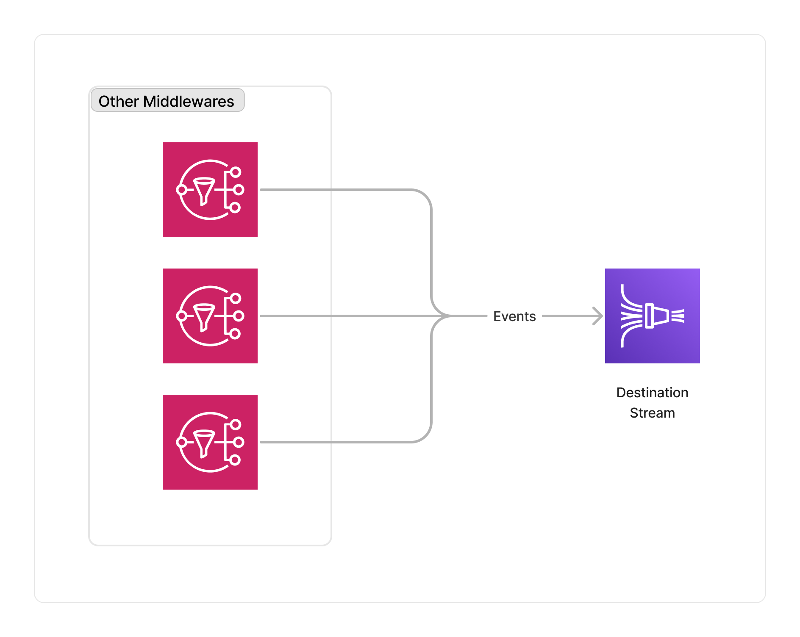

<span title="Label: Pro" data-view-component="true" class="Label Label--api text-uppercase">
  Unstable API
</span>
<span title="Label: Pro" data-view-component="true" class="Label Label--version text-uppercase">
  0.3.4
</span>
<span title="Label: Pro" data-view-component="true" class="Label Label--package">
  @project-lakechain/firehose-storage-connector
</span>
<br>

---

The Firehose storage connector makes it possible to forward [CloudEvents](/project-lakechain/general/events) emitted by one or multiple middlewares in a pipeline to a user-defined Kinesis Firehose delivery stream. This connector allows to nicely decouple the processing of your documents with third-party applications that can consume processed documents from a delivery stream.

> 💁 This connector only forwards the CloudEvents emitted by middlewares to the delivery stream, and not the documents themselves.

---

### ⏳ Buffering Documents

To use the Firehose storage connector, you import it in your CDK stack, and connect it to a data source providing documents.

```typescript
import { FirehoseStorageConnector } from '@project-lakechain/firehose-storage-connector';
import { CacheStorage } from '@project-lakechain/core';

class Stack extends cdk.Stack {
  constructor(scope: cdk.Construct, id: string) {
    // The cache storage.
    const cache = new CacheStorage(this, 'Cache');

    // The destination delivery stream.
    const stream = // ...

    // Create the Firehose storage connector.
    const connector = new FirehoseStorageConnector.Builder()
      .withScope(this)
      .withIdentifier('FirehoseStorageConnector')
      .withCacheStorage(cache)
      .withSource(source) // 👈 Specify a data source
      .withDestinationStream(stream)
      .build();
  }
}
```

<br>

---

### 🏗️ Architecture

This middleware makes use of the native integration between the SNS output topics of source middlewares with Kinesis Firehose to forward messages to a delivery stream, without relying on any additional compute resources.



<br>

---

### 🏷️ Properties

<br>

##### Supported Inputs

|  Mime Type  | Description |
| ----------- | ----------- |
| `*/*` | This middleware supports any type of documents. |

---

##### Supported Outputs

*This middleware does not emit any output.*

---

##### Supported Compute Types

| Type  | Description |
| ----- | ----------- |
| `CPU` | This middleware only supports CPU compute. |

<br>

---

### 📖 Examples

- [Storage Connector Pipeline](https://github.com/awslabs/project-lakechain/tree/main/examples/simple-pipelines/storage-connector-pipeline) - Builds a pipeline connected to other AWS services.
