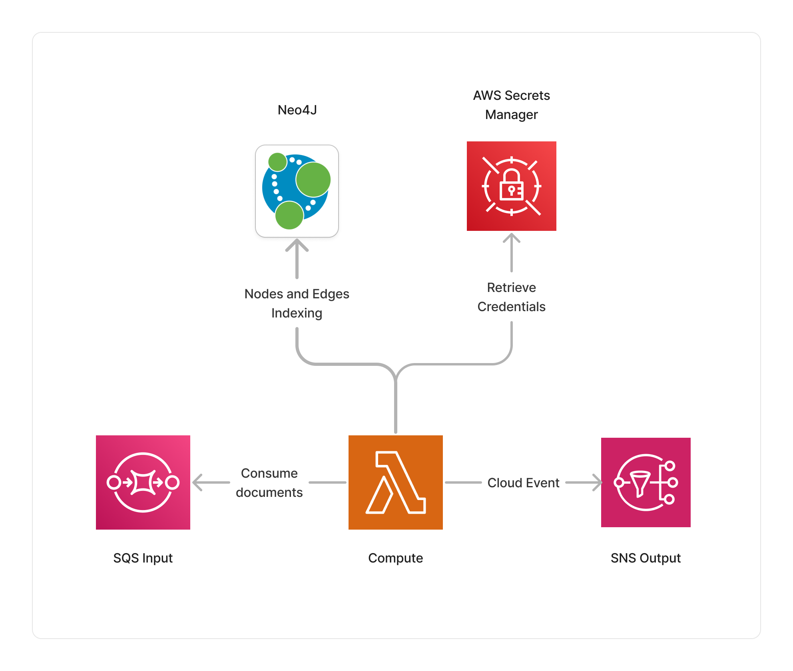

import { Image } from 'astro:assets';
import icon from '../../../assets/icon-neo4j.svg';

<span title="Label: Pro" data-view-component="true" class="Label Label--api text-uppercase">
  Unstable API
</span>
<span title="Label: Pro" data-view-component="true" class="Label Label--version text-uppercase">
  0.7.0
</span>
<span title="Label: Pro" data-view-component="true" class="Label Label--package">
  <a target="_blank" href="https://www.npmjs.com/package/@project-lakechain/neo4j-storage-connector">
    @project-lakechain/neo4j-storage-connector
  </a>
</span>
<span class="language-icon">
  <svg role="img" viewBox="0 0 24 24" width="30" xmlns="http://www.w3.org/2000/svg" style="fill: #3178C6;"><title>TypeScript</title><path d="M1.125 0C.502 0 0 .502 0 1.125v21.75C0 23.498.502 24 1.125 24h21.75c.623 0 1.125-.502 1.125-1.125V1.125C24 .502 23.498 0 22.875 0zm17.363 9.75c.612 0 1.154.037 1.627.111a6.38 6.38 0 0 1 1.306.34v2.458a3.95 3.95 0 0 0-.643-.361 5.093 5.093 0 0 0-.717-.26 5.453 5.453 0 0 0-1.426-.2c-.3 0-.573.028-.819.086a2.1 2.1 0 0 0-.623.242c-.17.104-.3.229-.393.374a.888.888 0 0 0-.14.49c0 .196.053.373.156.529.104.156.252.304.443.444s.423.276.696.41c.273.135.582.274.926.416.47.197.892.407 1.266.628.374.222.695.473.963.753.268.279.472.598.614.957.142.359.214.776.214 1.253 0 .657-.125 1.21-.373 1.656a3.033 3.033 0 0 1-1.012 1.085 4.38 4.38 0 0 1-1.487.596c-.566.12-1.163.18-1.79.18a9.916 9.916 0 0 1-1.84-.164 5.544 5.544 0 0 1-1.512-.493v-2.63a5.033 5.033 0 0 0 3.237 1.2c.333 0 .624-.03.872-.09.249-.06.456-.144.623-.25.166-.108.29-.234.373-.38a1.023 1.023 0 0 0-.074-1.089 2.12 2.12 0 0 0-.537-.5 5.597 5.597 0 0 0-.807-.444 27.72 27.72 0 0 0-1.007-.436c-.918-.383-1.602-.852-2.053-1.405-.45-.553-.676-1.222-.676-2.005 0-.614.123-1.141.369-1.582.246-.441.58-.804 1.004-1.089a4.494 4.494 0 0 1 1.47-.629 7.536 7.536 0 0 1 1.77-.201zm-15.113.188h9.563v2.166H9.506v9.646H6.789v-9.646H3.375z"/></svg>
</span>
<span class="language-icon" style="margin-right: 10px">
  <a target="_blank" href="https://neo4j.com/">
    <Image width="28" src={icon} alt="Icon" style="border-radius: 50%" />
  </a>
</span>
<div style="margin-top: 26px"></div>

---

The Neo4J connector makes it easy for developers to store [CloudEvents](/project-lakechain/general/events) ontologies in a [Neo4j](https://neo4j.com/) graph database.
This connector makes it possible to store structured ontologies into a Neo4J database, whether it is
hosted on AWS, on-premises, or on the [Neo4J AuraDB](https://neo4j.com/cloud/platform/aura-graph-database/) service.

This connector is a very good choice for use-cases involving the storage of document as a knowledge graph.

> 💁 The [Ontology](/project-lakechain/guides/ontology) documentation provides information about the standard structure of nodes and edges defined by Project Lakechain.

---

### 🗄️ Indexing Documents

To use the Neo4J storage connector, you import it in your CDK stack, and connect it to a data source providing documents.

> ℹ️ You will also need to provide credentials stored in AWS Secrets Manager to the Neo4j storage connector.

```typescript
import * as secrets from 'aws-cdk-lib/aws-secretsmanager';
import { Neo4jStorageConnector } from '@project-lakechain/neo4j-storage-connector';
import { CacheStorage } from '@project-lakechain/core';

class Stack extends cdk.Stack {
  constructor(scope: cdk.Construct, id: string) {
    const cache = new CacheStorage(this, 'Cache');

    // The Neo4j credentials secret.
    const neo4jCredentials = secrets.Secret.fromSecretNameV2(
      this,
      'Neo4jCredentials',
      process.env.NEO4J_CREDENTIALS_SECRET_NAME
    );

    // Create the Neo4j storage connector.
    const connector = new Neo4jStorageConnector.Builder()
      .withScope(this)
      .withIdentifier('Neo4jStorage')
      .withCacheStorage(cache)
      .withSource(source)
      .withUri('neo4j+s://neo4j.example.com')
      .withCredentials(neo4jCredentials)
      .build();
  }
}
```

<br />

---

### ✏️ Credentials

This middleware currently only supports basic authentication with Neo4j.
You can provide the credentials to the connector by creating a secret in AWS Secrets Manager that follows the following structure.

```json
{
  "USERNAME": "neo4j",
  "PASSWORD": "password"
}
```

<br />

---

### 🔐 VPC

If you have Neo4j instances deployed within a VPC private subnet, you can use the `.withVpc` method to provide the VPC instance to use to the middleware.

```typescript
const connector = new Neo4jStorageConnector.Builder()
  .withScope(this)
  .withIdentifier('Neo4jStorage')
  .withCacheStorage(cache)
  .withSource(source)
  .withVpc(vpc) // 👈 Specify the VPC to use.
  .withUri('neo4j+s://neo4j.example.com')
  .withCredentials(neo4jCredentials)
  .build();
```

<br />

---

### ℹ️ Limits

The Neo4j storage connector middleware has several limitations that we document in this section.

1. The first limitation is that only basic authentication is supported by the connector at the moment.
2. Another limitation is that the connector will not store vector embeddings associated with a document into the database, only document metadata ontologies.

<br />

---

### 🏗️ Architecture

This middleware is based on a Lambda ARM64 compute to perform the indexing of Nodes and Edges associated with the current document ontology into the destination Neo4J database. It also leverages AWS Secrets Manager to retrieve the Neo4J credentials at runtime.



<br />

---

### 🏷️ Properties

<br />

##### Supported Inputs

|  Mime Type  | Description |
| ----------- | ----------- |
| `*/*` | This middleware supports any type of documents. |

##### Supported Outputs

*This middleware does not produce any output.*

##### Supported Compute Types

| Type  | Description |
| ----- | ----------- |
| `CPU` | This middleware only supports CPU compute. |

<br />

---

### 📖 Examples

- [Knowledge Graph Pipeline](https://github.com/awslabs/project-lakechain/tree/main/examples/simple-pipelines/knowledge-graph-pipeline) - Builds a pipeline for semantic ontology extraction from documents.
