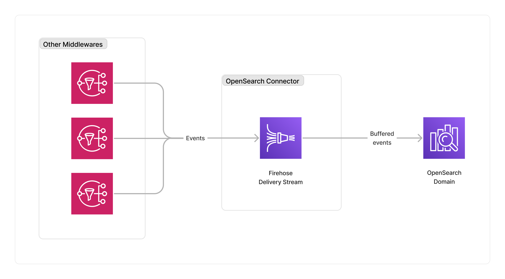

<span title="Label: Pro" data-view-component="true" class="Label Label--api text-uppercase">
  Unstable API
</span>
<span title="Label: Pro" data-view-component="true" class="Label Label--version text-uppercase">
  0.4.0
</span>
<span title="Label: Pro" data-view-component="true" class="Label Label--package">
  @project-lakechain/opensearch-storage-connector
</span>
<br>

---

The OpenSearch storage connector enables developers to automatically push [CloudEvents](/project-lakechain/general/events) to an [OpenSearch](https://opensearch.org/) domain, and index documents at scale within their pipelines. This connector uses [AWS Firehose](https://aws.amazon.com/firehose/) to buffer events and store them in batch to OpenSearch using a serverless architecture.

---

### 🗄️ Indexing Documents

To use the OpenSearch storage connector, you import it in your CDK stack, and connect it to a data source providing document embeddings.

```typescript
import { OpenSearchStorageConnector } from '@project-lakechain/opensearch-storage-connector';
import { CacheStorage } from '@project-lakechain/core';

class Stack extends cdk.Stack {
  constructor(scope: cdk.Construct, id: string) {
    // The cache storage.
    const cache = new CacheStorage(this, 'Cache');

    // Sample VPC.
    const vpc = new ec2.Vpc(this, 'Vpc');

    // The OpenSearch domain.
    const domain = // ...

    // Create the OpenSearch storage connector.
    const connector = new OpenSearchStorageConnector.Builder()
      .withScope(this)
      .withIdentifier('OpenSearchStorage')
      .withCacheStorage(cache)
      .withSource(source)
      .withDomain(domain)
      .withVpc(vpc)
      .withIndexName('document-index')
      .build();
  }
}
```

<br>

---

#### Buffering Hints

This connector creates an AWS Firehose delivery stream to buffer events before sending them to OpenSearch. You can customize the way that the connector will buffer events by specifying optional buffering hints.

> ℹ️ The buffering hints are set to `10MB` or `60s` by default.

```typescript
const connector = new OpenSearchStorageConnector.Builder()
  .withScope(this)
  .withIdentifier('OpenSearchStorage')
  .withCacheStorage(cache)
  .withSource(source)
  .withDomain(domain)
  .withVpc(vpc)
  .withIndexName('document-index')
  .withBufferingHints({
    intervalInSeconds: 60,
    sizeInMBs: 50
  })
  .build();
```

<br>

---

#### Index Rotation

You can also configure the rotation period of the OpenSearch index that is applied by AWS Firehose.

> ℹ️ The index rotation is set to `NoRotation` by default.

```typescript
import {
  OpenSearchStorageConnector,
  IndexRotationPeriod
} from '@project-lakechain/opensearch-storage-connector';

const connector = new OpenSearchStorageConnector.Builder()
  .withScope(this)
  .withIdentifier('OpenSearchStorage')
  .withCacheStorage(cache)
  .withSource(source)
  .withDomain(domain)
  .withVpc(vpc)
  .withIndexName('document-index')
  .withIndexRotationPeriod(IndexRotationPeriod.OneDay)
  .build();
```

Possible values for the index rotation period are `NoRotation`, `OneHour`, `OneDay`, `OneWeek`, and `OneMonth`.

<br>

---

### ℹ️ Limits

This middleware forwards each discrete document events to OpenSearch using the [Default Document Id Format](https://docs.aws.amazon.com/cdk/api/v2/docs/aws-cdk-lib.aws_kinesisfirehose.CfnDeliveryStream.DocumentIdOptionsProperty.html#defaultdocumentidformat), which means that Firehose will generate a new unique document ID for each record based on a unique internal identifier.

This identifier remains stable across delivery attempts. However if you resubmit the same document in the pipeline (having the same URI), Firehose will generate a new unique document identifier, resulting in the duplication of the document in the OpenSearch index.

Another limitation of this middleware is that it currently only supports OpenSearch domains, and not OpenSearch Serverless collections.

<br>

---

### 🏗️ Architecture

This middleware uses AWS Firehose to buffer incoming document events from other middlewares in a pipeline, and uses the AWS Firehose native integration with OpenSearch to index documents.



<br>

---

### 🏷️ Properties

<br>

##### Supported Inputs

|  Mime Type  | Description |
| ----------- | ----------- |
| `*/*` | This middleware supports any type of documents. |

##### Supported Outputs

*This middleware does not produce any output.*

##### Supported Compute Types

| Type  | Description |
| ----- | ----------- |
| `CPU` | This middleware only supports CPU compute. |

<br>

---

### 📖 Examples

- [Building a Document Index](https://github.com/awslabs/project-lakechain/tree/main/examples/end-to-end-use-cases/building-a-document-index) - End-to-end document metadata extraction with OpenSearch.
