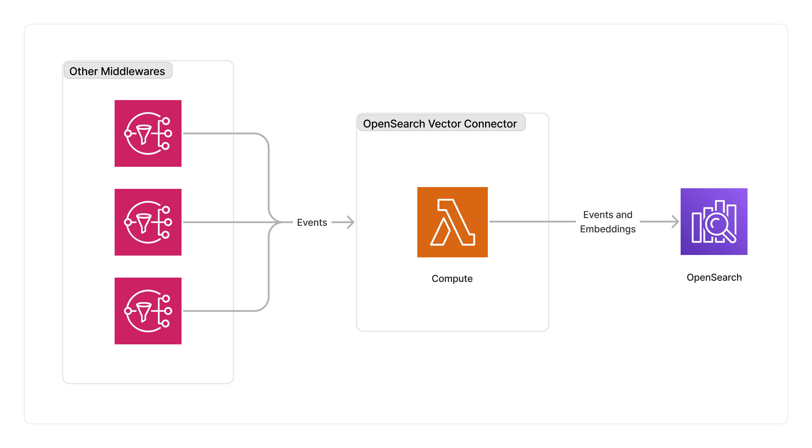

<span title="Label: Pro" data-view-component="true" class="Label Label--api text-uppercase">
  Unstable API
</span>
<span title="Label: Pro" data-view-component="true" class="Label Label--version text-uppercase">
  0.1.4
</span>
<span title="Label: Pro" data-view-component="true" class="Label Label--package">
  @project-lakechain/opensearch-vector-storage-connector
</span>
<br>

---

The OpenSearch vector storage connector enables developers to automatically index document events and their associated vector embeddings into an [Amazon OpenSearch Domains](https://docs.aws.amazon.com/opensearch-service/latest/developerguide/createupdatedomains.html) domain or an [Amazon Serverless Collection](https://docs.aws.amazon.com/opensearch-service/latest/developerguide/serverless.html).

---

### 🗄️ Indexing Documents

To use the OpenSearch vectors storage connector, you import it in your CDK stack, and connect it to a data source providing document embeddings.

> 💁 You specify an *index definition* describing the index that the connector will create in your OpenSearch database to store document events and embeddings.

```typescript
import { OpenSearchVectorStorageConnector } from '@project-lakechain/opensearch-vector-storage-connector';
import { CacheStorage } from '@project-lakechain/core';

class Stack extends cdk.Stack {
  constructor(scope: cdk.Construct, id: string) {
    const cache = new CacheStorage(this, 'Cache');

    // Sample VPC.
    const vpc = new ec2.Vpc(this, 'Vpc');

    // The OpenSearch domain or collection.
    const opensearch = // ...

    // Create the OpenSearch storage connector.
    const connector = new OpenSearchVectorStorageConnector.Builder()
      .withScope(this)
      .withIdentifier('OpenSearchVectorStorageConnector')
      .withCacheStorage(cache)
      .withEndpoint(opensearch)
      .withSource(embeddingProcessor)
      .withVpc(vpc)
      .withIndex(new OpenSearchVectorIndexDefinition.Builder()
        .withIndexName('vector-index')
        .withKnnMethod('hnsw')
        .withKnnEngine('nmslib')
        .withSpaceType('l2')
        .withDimensions(1536)
        .withParameters({ 'ef_construction': 512, 'm': 16 })
        .build()
      )
      .build();
  }
}
```

<br>

---

#### Index Definition

The index definition allows you to configure the index attributes that will be used by the connector. Below is a description of the attributes that can be configured.

| Attribute | Description |
| --------- | ----------- |
| `indexName` | The name of the index to create. |
| `knnMethod` | The KNN method (only `hnsw` is currently supported). |
| `knnEngine` | The KNN engine (`faiss` or `nmslib`). |
| `spaceType` | The space type (`l2`, `l1`, `innerproduct`, `cosinesimil`, `linf`). |
| `dimensions` | The number of dimensions of the vectors. |
| `parameters` | The parameters for the index. |

<br>

---

### 🌐 Endpoints

This middleware supports instances of [`IDomain`](https://docs.aws.amazon.com/cdk/api/v2/docs/aws-cdk-lib.aws_elasticsearch.IDomain.html), [`ICollection`](https://github.com/awslabs/project-lakechain/tree/main/packages/constructs/opensearch-collection) or an Amazon Serverless [`CfnCollection`](https://docs.aws.amazon.com/cdk/api/v2/docs/aws-cdk-lib.aws_opensearchserverless.CfnCollection.html) that you can pass to the `withEndpoint` method.

<br>

---

### 🏗️ Architecture

THis middleware uses a Lambda function to index documents in batches into an OpenSearch domain or OpenSearch Serverless collection.

> 💁 By default, this connector uses a batch of 10 documents and batches documents for a period of 20 seconds.



<br>

---

### 🏷️ Properties

<br>

##### Supported Inputs

|  Mime Type  | Description |
| ----------- | ----------- |
| `*/*` | This middleware supports any type of documents. Note that if no embeddings are specified in the document metadata, the document is filtered out. |

##### Supported Outputs

*This middleware does not produce any output.*

##### Supported Compute Types

| Type  | Description |
| ----- | ----------- |
| `CPU` | This middleware only supports CPU compute. |

<br>

---

### 📖 Examples

- [Bedrock OpenSearch Pipeline](https://github.com/awslabs/project-lakechain/tree/main/examples/simple-pipelines/embedding-pipelines/bedrock-opensearch-pipeline) - An example showcasing an embedding pipeline using Amazon Bedrock and OpenSearch.
- [Cohere OpenSearch Pipeline](https://github.com/awslabs/project-lakechain/tree/main/examples/simple-pipelines/embedding-pipelines/cohere-opensearch-pipeline) - An example showcasing an embedding pipeline using Cohere models on Bedrock and OpenSearch.
