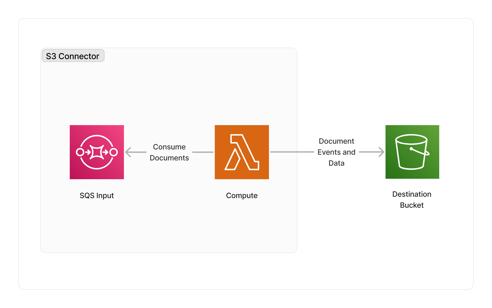

<span title="Label: Pro" data-view-component="true" class="Label Label--api text-uppercase">
  Unstable API
</span>
<span title="Label: Pro" data-view-component="true" class="Label Label--version text-uppercase">
  0.4.0
</span>
<span title="Label: Pro" data-view-component="true" class="Label Label--package">
  <a target="_blank" href="https://www.npmjs.com/package/@project-lakechain/s3-storage-connector">
    @project-lakechain/s3-storage-connector
  </a>
</span>
<span class="language-icon">
  <svg role="img" viewBox="0 0 24 24" width="30" xmlns="http://www.w3.org/2000/svg" style="fill: #3178C6;"><title>TypeScript</title><path d="M1.125 0C.502 0 0 .502 0 1.125v21.75C0 23.498.502 24 1.125 24h21.75c.623 0 1.125-.502 1.125-1.125V1.125C24 .502 23.498 0 22.875 0zm17.363 9.75c.612 0 1.154.037 1.627.111a6.38 6.38 0 0 1 1.306.34v2.458a3.95 3.95 0 0 0-.643-.361 5.093 5.093 0 0 0-.717-.26 5.453 5.453 0 0 0-1.426-.2c-.3 0-.573.028-.819.086a2.1 2.1 0 0 0-.623.242c-.17.104-.3.229-.393.374a.888.888 0 0 0-.14.49c0 .196.053.373.156.529.104.156.252.304.443.444s.423.276.696.41c.273.135.582.274.926.416.47.197.892.407 1.266.628.374.222.695.473.963.753.268.279.472.598.614.957.142.359.214.776.214 1.253 0 .657-.125 1.21-.373 1.656a3.033 3.033 0 0 1-1.012 1.085 4.38 4.38 0 0 1-1.487.596c-.566.12-1.163.18-1.79.18a9.916 9.916 0 0 1-1.84-.164 5.544 5.544 0 0 1-1.512-.493v-2.63a5.033 5.033 0 0 0 3.237 1.2c.333 0 .624-.03.872-.09.249-.06.456-.144.623-.25.166-.108.29-.234.373-.38a1.023 1.023 0 0 0-.074-1.089 2.12 2.12 0 0 0-.537-.5 5.597 5.597 0 0 0-.807-.444 27.72 27.72 0 0 0-1.007-.436c-.918-.383-1.602-.852-2.053-1.405-.45-.553-.676-1.222-.676-2.005 0-.614.123-1.141.369-1.582.246-.441.58-.804 1.004-1.089a4.494 4.494 0 0 1 1.47-.629 7.536 7.536 0 0 1 1.77-.201zm-15.113.188h9.563v2.166H9.506v9.646H6.789v-9.646H3.375z"/></svg>
</span>
<div style="margin-top: 26px"></div>

---

The S3 storage connector makes it possible to capture the result of one or multiple middlewares in a pipeline and store their results in a user-defined S3 bucket destination. This connector supports storing both the [CloudEvents](/project-lakechain/general/events) emitted by middlewares, but also optionally copy the output document itself to the destination bucket.

---

### 🗄️ Storing Documents

To use the S3 storage connector, you import it in your CDK stack, and connect it to a data source providing documents.

```typescript
import { S3StorageConnector } from '@project-lakechain/s3-storage-connector';
import { CacheStorage } from '@project-lakechain/core';

class Stack extends cdk.Stack {
  constructor(scope: cdk.Construct, id: string) {
    // The cache storage.
    const cache = new CacheStorage(this, 'Cache');

    // The destination bucket.
    const bucket = // ...

    // Create the S3 storage connector.
    const connector = new S3StorageConnector.Builder()
      .withScope(this)
      .withIdentifier('S3StorageConnector')
      .withCacheStorage(cache)
      .withSource(source) // 👈 Specify a data source
      .withDestinationBucket(bucket)
      .build();
  }
}
```

<br>

---

#### Copy Documents

By default, this connector will copy the CloudEvent emitted by middlewares, *and* also copy the document itself to the destination bucket. This behavior can be disabled by using the `.withCopyDocuments` API.

> 💁 This implementation uses a streaming approach for copying bytes to optimize the copy of large documents, such that it doesn't need to load the entire document in memory. Note however that copies in general can be time and cost expensive.

```typescript
const connector = new S3StorageConnector.Builder()
  .withScope(this)
  .withIdentifier('S3StorageConnector')
  .withCacheStorage(cache)
  .withSource(source)
  .withDestinationBucket(bucket)
  .withCopyDocuments(false) // 👈 Disable copying documents
  .build();
```

<br>

---

#### Storage Class

You can specify a storage class for the documents and their metadata being written in the destination bucket to tailor the cost of the storage using the `.withStorageClass` API.

> 💁 By default, the S3 Standard class will be used to store the documents and their metadata.

```typescript
const connector = new S3StorageConnector.Builder()
  .withScope(this)
  .withIdentifier('S3StorageConnector')
  .withCacheStorage(cache)
  .withSource(source)
  .withDestinationBucket(bucket)
  .withStorageClass('ONEZONE_IA') // 👈 Specify the storage class
  .build();
```

<br>

---

### 🏗️ Architecture

Thi middleware is based on a Lambda ARM64 compute to perform the copying of document data from source middlewares into the destination bucket.



<br>

---

### 🏷️ Properties

<br>

##### Supported Inputs

|  Mime Type  | Description |
| ----------- | ----------- |
| `*/*` | This middleware supports any type of documents. |

##### Supported Outputs

*This middleware does not emit any output.*

##### Supported Compute Types

| Type  | Description |
| ----- | ----------- |
| `CPU` | This middleware only supports CPU compute. |

<br>

---

### 📖 Examples

- [Article Curation Pipeline](https://github.com/awslabs/project-lakechain/tree/main/examples/simple-pipelines/article-curation-pipeline) - Builds a pipeline converting HTML articles into plain text.
- [Face Detection Pipeline](https://github.com/awslabs/project-lakechain/tree/main/examples/simple-pipelines/face-detection-pipeline) - An example showcasing how to build face detection pipelines using Project Lakechain.
