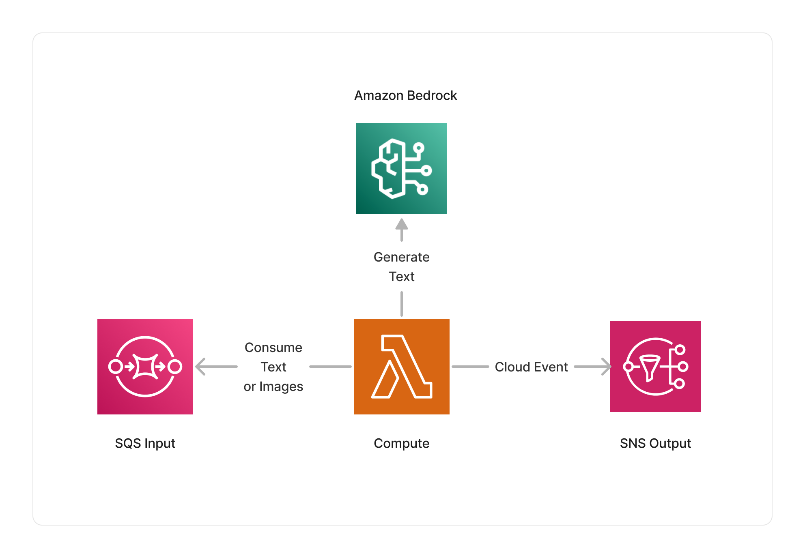

<span title="Label: Pro" data-view-component="true" class="Label Label--api text-uppercase">
  Unstable API
</span>
<span title="Label: Pro" data-view-component="true" class="Label Label--version text-uppercase">
  0.1.4
</span>
<span title="Label: Pro" data-view-component="true" class="Label Label--package">
  @project-lakechain/bedrock-embedding-processors
</span>
<br>

---

This package enables developers to use embedding models hosted on [Amazon Bedrock](https://docs.aws.amazon.com/bedrock/latest/userguide/what-is-bedrock.html) to create vector embeddings for text and markdown documents within their pipelines. It exposes different constructs that you can integrate as part of your pipelines, including Amazon Titan, and Cohere embedding processors.

---

### 📝 Embedding Documents

To use the Bedrock embedding processors, you import the Titan or Cohere construct in your CDK stack and specify the embedding model you want to use.

#### Amazon Titan

> ℹ️ The below example demonstrates how to use the Amazon Titan embedding processor to create vector embeddings for text documents.

```typescript
import { TitanEmbeddingProcessor, TitanEmbeddingModel } from '@project-lakechain/bedrock-embedding-processors';
import { CacheStorage } from '@project-lakechain/core';

class Stack extends cdk.Stack {
  constructor(scope: cdk.Construct, id: string) {
    // The cache storage.
    const cache = new CacheStorage(this, 'Cache');

    // Creates embeddings for input documents using Amazon Titan.
    const embeddingProcessor = new TitanEmbeddingProcessor.Builder()
      .withScope(this)
      .withIdentifier('BedrockEmbeddingProcessor')
      .withCacheStorage(cache)
      .withSource(source) // 👈 Specify a data source
      .withModel(TitanEmbeddingModel.AMAZON_TITAN_EMBED_TEXT_V1)
      .build();
  }
}
```

<br>

---

#### Cohere

> ℹ️ The below example uses one of the supported Cohere embedding models.

```typescript
import { CohereEmbeddingProcessor, CohereEmbeddingModel } from '@project-lakechain/bedrock-embedding-processors';
import { CacheStorage } from '@project-lakechain/core';

class Stack extends cdk.Stack {
  constructor(scope: cdk.Construct, id: string) {
    // The cache storage.
    const cache = new CacheStorage(this, 'Cache');

    // Creates embeddings for input documents using a Cohere model.
    const embeddingProcessor = new CohereEmbeddingProcessor.Builder()
      .withScope(this)
      .withIdentifier('CohereEmbeddingProcessor')
      .withCacheStorage(cache)
      .withSource(source) // 👈 Specify a data source
      .withModel(CohereEmbeddingModel.COHERE_EMBED_MULTILINGUAL_V3)
      .build();
  }
}
```

<br>

---

#### Escape Hatches

Both Titan and Cohere constructs reference embedding models currently supported by Amazon Bedrock through the `TitanEmbeddingModel` and `CohereEmbeddingModel` classes. In case a model is not yet referenced, we allow developers to specify a custom model identifier.

```typescript
const embeddingProcessor = new TitanEmbeddingProcessor.Builder()
  .withScope(this)
  .withIdentifier('BedrockEmbeddingProcessor')
  .withCacheStorage(cache)
  .withSource(source)
  // Specify a custom embedding model to use.
  .withModel(TitanEmbeddingModel.of('specific.model-id'))
  .build();
```

<br>

---

### 🌐 Region Selection

You can specify the AWS region in which you want to invoke Amazon Bedrock using the `.withRegion` API. This can be helpful if Amazon Bedrock is not yet available in your deployment region.

> 💁 By default, the middleware will use the current region in which it is deployed.

```typescript
const embeddingProcessor = new TitanEmbeddingProcessor.Builder()
  .withScope(this)
  .withIdentifier('BedrockEmbeddingProcessor')
  .withCacheStorage(cache)
  .withSource(source)
  .withModel(TitanEmbeddingModel.AMAZON_TITAN_EMBED_TEXT_V1)
  .withRegion('eu-central-1') // 👈 Alternate region
  .build();
```

<br>

---

### 📄 Output

The Bedrock embedding processor does not modify or alter source documents in any way. It instead enriches the metadata of the documents with a pointer to the vector embeddings that were created for the document.

<details>
  <summary>💁 Click to expand example</summary>

  ```json
  {
    "specversion": "1.0",
    "id": "1780d5de-fd6f-4530-98d7-82ebee85ea39",
    "type": "document-created",
    "time": "2023-10-22T13:19:10.657Z",
    "data": {
        "chainId": "6ebf76e4-f70c-440c-98f9-3e3e7eb34c79",
        "source": {
            "url": "s3://bucket/document.txt",
            "type": "text/plain",
            "size": 245328,
            "etag": "1243cbd6cf145453c8b5519a2ada4779"
        },
        "document": {
            "url": "s3://bucket/document.txt",
            "type": "text/plain",
            "size": 245328,
            "etag": "1243cbd6cf145453c8b5519a2ada4779"
        },
        "metadata": {
          "properties": {
            "kind": "text",
            "attrs": {
              "embeddings": {
                "vectors": "s3://cache-storage/bedrock-embedding-processor/45a42b35c3225085.json",
                "model": "amazon.titan-embed-text-v1",
                "dimensions": 1536
            }
          }
        }
    }
  }
  ```

</details>

<br>

---

### ℹ️ Limits

Both the Titan and Cohere embedding models have limits on the number of input tokens they can process. For more information, you can consult the [Amazon Bedrock documentation](https://docs.aws.amazon.com/bedrock/latest/userguide/limits.html) to understand these limits.

> 💁 To limit the size of upstream text documents, we recommend to use a text splitter to chunk text documents before they are passed to this middleware, such as the [Recursive Character Text Splitter](/text-splitters/recursive-character-text-splitter).

Furthermore, this middleware applies a throttling of 10 concurrently processed documents from its input queue to ensure that it does not exceed the limits of the embedding models it uses — see [Bedrock Quotas](https://docs.aws.amazon.com/bedrock/latest/userguide/quotas.html) for more information.

<br>

---

### 🏗️ Architecture

The middlewares part of this package are based on a Lambda compute running on an ARM64 architecture, and integrate with Amazon Bedrock to generate embeddings for text documents.



<br>

---

### 🏷️ Properties

<br>

##### Supported Inputs

|  Mime Type  | Description |
| ----------- | ----------- |
| `text/plain` | UTF-8 text documents. |
| `text/markdown` | UTF-8 markdown documents. |

##### Supported Outputs

|  Mime Type  | Description |
| ----------- | ----------- |
| `text/plain` | UTF-8 text documents. |
| `text/markdown` | UTF-8 markdown documents. |

##### Supported Compute Types

| Type  | Description |
| ----- | ----------- |
| `CPU` | This middleware only supports CPU compute. |

<br>

---

### 📖 Examples

- [Bedrock OpenSearch Pipeline](https://github.com/awslabs/project-lakechain/tree/main/examples/simple-pipelines/embedding-pipelines/bedrock-opensearch-pipeline) - An example showcasing an embedding pipeline using Amazon Bedrock and OpenSearch.
- [Cohere OpenSearch Pipeline](https://github.com/awslabs/project-lakechain/tree/main/examples/simple-pipelines/embedding-pipelines/cohere-opensearch-pipeline) - An example showcasing an embedding pipeline using Cohere models on Bedrock and OpenSearch.
