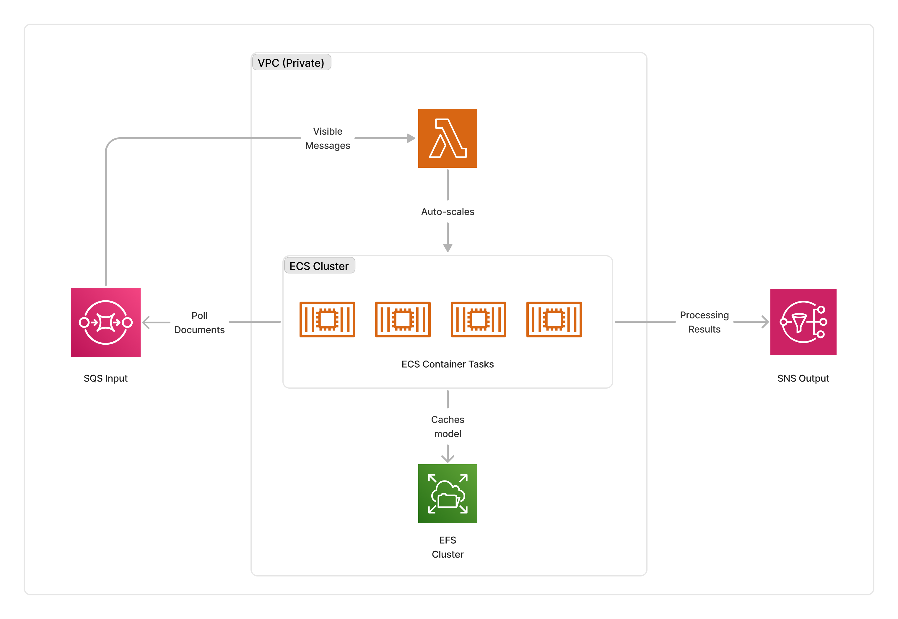

<span title="Label: Pro" data-view-component="true" class="Label Label--api text-uppercase">
  Unstable API
</span>
<span title="Label: Pro" data-view-component="true" class="Label Label--version text-uppercase">
  0.1.4
</span>
<span title="Label: Pro" data-view-component="true" class="Label Label--package">
  @project-lakechain/clip-image-processor
</span>
<br>

---

The CLIP embedding processor leverages [OpenAI CLIP](https://github.com/openai/CLIP) models to create vector embeddings for image documents. It deploys the required infrastructure to create embeddings on an AWS account such that all the processing remains on customers AWS environment.

---

### 📷 Embedding Images

To use this middleware, you import it in your CDK stack and specify a VPC in which the image processing cluster will be deployed.

> ℹ️ The below example shows how to deploy the CLIP processor in a VPC.

```typescript
import { ClipImageProcessor } from '@project-lakechain/clip-image-processor';
import { CacheStorage } from '@project-lakechain/core';

class Stack extends cdk.Stack {
  constructor(scope: cdk.Construct, id: string) {
    // Sample VPC.
    const vpc = new ec2.Vpc(this, 'Vpc', {});

    // The cache storage.
    const cache = new CacheStorage(this, 'Cache');

    // Create the CLIP processor.
    const clipProcessor = new ClipImageProcessor.Builder()
      .withScope(this)
      .withIdentifier('ImageProcessor')
      .withCacheStorage(cache)
      .withVpc(vpc)
      .withSource(source) // 👈 Specify a data source
      .build();
  }
}
```

<br>

---

#### Specifying a Model

The `ClipImageProcessor` API makes it possible to specify a select CLIP model to use for creating embeddings.

> ℹ️ The default model is `ViT-B/32`, and this middleware supports the `ViT-B/32`, `ViT-B/16`, and `ViT-L/14` models.

```typescript
import { ClipImageProcessor, ClipModel } from '@project-lakechain/clip-image-processor';

const clipProcessor = new ClipImageProcessor.Builder()
  .withScope(this)
  .withIdentifier('ImageProcessor')
  .withCacheStorage(cache)
  .withVpc(vpc)
  .withSource(source)
  .withModel(ClipModel.VIT_L_14) // 👈 Specify a model
  .build();
```

<br>

---

#### Auto-Scaling

The cluster of containers deployed by this middleware will auto-scale based on the number of images that need to be processed. The cluster scales up to a maximum of 5 instances by default, and scales down to zero when there are no images to process.

> ℹ️ You can configure the maximum amount of instances that the cluster can auto-scale to by using the `withMaxInstances` method.

```typescript
const clipProcessor = new ClipImageProcessor.Builder()
  .withScope(this)
  .withIdentifier('ImageProcessor')
  .withCacheStorage(cache)
  .withVpc(vpc)
  .withSource(source)
  .withMaxInstances(10)
  .build();
```

<br>

---

### 📄 Output

The CLIP image processor middleware does not modify or alter source documents in any way. It instead enriches the metadata of the image documents with a pointer to the vector embedding that were created for the document.

<details>
  <summary>💁 Click to expand example</summary>
  
  ```json
  {
    "specversion": "1.0",
    "id": "1780d5de-fd6f-4530-98d7-82ebee85ea39",
    "type": "document-created",
    "time": "2023-10-22T13:19:10.657Z",
    "data": {
      "chainId": "6ebf76e4-f70c-440c-98f9-3e3e7eb34c79",
      "source": {
          "url": "s3://bucket/image.png",
          "type": "image/png",
          "size": 245328,
          "etag": "1243cbd6cf145453c8b5519a2ada4779"
      },
      "document": {
          "url": "s3://bucket/image.png",
          "type": "image/png",
          "size": 245328,
          "etag": "1243cbd6cf145453c8b5519a2ada4779"
      },
      "metadata": {
        "properties": {
            "kind": "text",
            "attrs": {
              "embeddings": {
                "vectors": "s3://cache-storage/clip-image-processor/45a42b35c3225085.json",
                "model": "ViT-B/32",
                "dimensions": 512
            }
          }
        }
      },
      "callStack": []
    }
  }
  ```

</details>

<br>

---

### 🏗️ Architecture

The CLIP image processor requires GPU-enabled instances ([g4dn.xlarge](https://aws.amazon.com/ec2/instance-types/g4)) to run the embedding models. To orchestrate deployments, it deploys an ECS auto-scaled cluster of containers that consume documents from the middleware input queue. The cluster is deployed in the private subnet of the given VPC, and caches the models on an EFS storage to optimize cold-starts.

> ℹ️ The average cold-start for the CLIP containers is around 3 minutes when no instances are running.



<br>

---

### 🏷️ Properties

<br>

##### Supported Inputs

|  Mime Type  | Description |
| ----------- | ----------- |
| `image/bmp` | Bitmap image. |
| `image/gif` | GIF image. |
| `image/jpeg` | JPEG image. |
| `image/png` | PNG image. |
| `image/tiff` | TIFF image. |
| `image/webp` | WebP image. |
| `image/x-pcx` | PCX image. |

##### Supported Outputs

*This middleware supports as outputs the same types as the supported inputs.*

##### Supported Compute Types

| Type  | Description |
| ----- | ----------- |
| `GPU` | This middleware only supports GPU compute. |

<br>

---

### 📖 Examples

- [Clip Embedding Pipeline](https://github.com/awslabs/project-lakechain/tree/main/examples/simple-pipelines/embedding-pipelines/clip-embeddings-pipeline) - An example showcasing how to create embeddings for images using CLIP.
