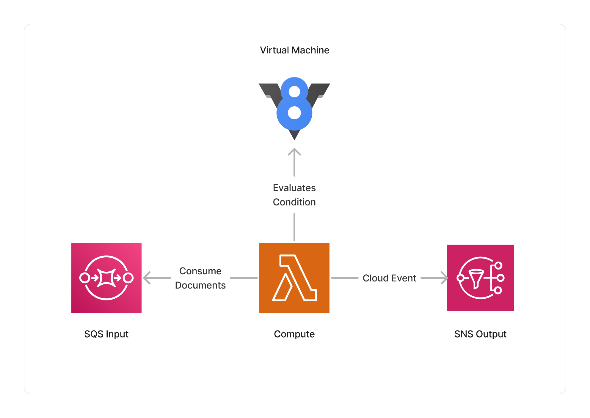

<span title="Label: Pro" data-view-component="true" class="Label Label--api text-uppercase">
  Unstable API
</span>
<span title="Label: Pro" data-view-component="true" class="Label Label--version text-uppercase">
  0.3.4
</span>
<span title="Label: Pro" data-view-component="true" class="Label Label--package">
  @project-lakechain/condition
</span>
<br>

---

The `Condition` middleware allows developers to express complex conditional expressions within their document processing pipelines, that wouldn't be possible using [Filter Expressions](/project-lakechain/guides/api#filters).

With conditional expressions you can either express your conditions using a closure expression in your CDK code and have it executed in the cloud at runtime, or you can provide a Lambda function that gets synchronously invoked to evaluate the condition.

---

### ❓ Using Conditions

To use this middleware, you import it in your CDK stack and instantiate it as part of a pipeline. You can define a conditional expression in TypeScript that will get serialized by Lakechain and evaluated at runtime.

> 💁 In this example, we create a simple condition that verifies whether the `version` field in JSON documents is equal to `1.0.0`.

```typescript
import * as cdk from 'aws-cdk-lib';
import { Condition } from '@project-lakechain/condition';
import { CacheStorage } from '@project-lakechain/core';

class Stack extends cdk.Stack {
  constructor(scope: cdk.Construct, id: string) {
    const cache = new CacheStorage(this, 'Cache');

    // 👇 The below expression will be executed in the cloud at runtime.
    const expression = async (event: CloudEvent) => {
      const document = event.data().document();

      // Load the document in memory.
      const data = JSON.parse(
        (await document.data().asBuffer()).toString('utf-8')
      );

      // Return a boolean value.
      return (data.version === '1.0.0');
    };

    // A condition step that evaluates the above expression.
    const condition = new Condition.Builder()
      .withScope(this)
      .withIdentifier('Condition')
      .withCacheStorage(cache)
      .withSource(source)
      .withConditional(expression) // 👈 Specify the conditional expression.
      .build();
    
    // Create a matching branch.
    condition.onMatch(middleware1);

    // Create a non-matching branch.
    condition.onMismatch(middleware2);
  }
}
```

<br>

---

#### Conditional Expressions

Conditional expressions (we also call them *"funclets"*) use the power of a full programming language to express complex conditions. They are asynchronous and can be defined as TypeScript named functions, anonymous functions, or arrow functions.

Each expression takes a `CloudEvent` describing the document being processed as an input argument, and returns a promise to a boolean value representing the result of the evaluation.

```typescript
type ConditionalExpression = (event: CloudEvent) => Promise<boolean>;
```

<br>

---

#### VM

The execution of funclets is performed in a restricted V8 [virtual machine](https://nodejs.org/api/vm.html) within an AWS Lambda container and must execute in 10 seconds or less.

The Condition middleware uses a Lambda compute limited to 128 MB of memory which should be enough for the vast majority of use-cases. It is however possible to allocate more memory to the environment by using the [`.withMemorySize`](http://localhost:4321/project-lakechain/guides/api#memory-size) API.

The V8 virtual machine makes the following symbols available to funclets : `console`, `require`, `setTimeout`, `setInterval`, `setImmediate`.

> 💁 **Important** - One current limit of funclets is that you cannot use expressions located outside of the scope of the funclet closure. All variables must be self-contained within the scope of the funclet.

<br>

---

### Conditions + Filters = ❤️

You can use conditions in conjunction with filters to use the best of both worlds. For example, filters can be used to filter-out document types that don't match a specific mime type, while conditions can be applied on the content of those filtered documents.

> 💁 Below, we filter-out every document that is not a JSON document, and then apply a condition to verify whether the `version` field is equal to `1.0.0`.

<details>
  <summary>Click to expand example</summary>

```typescript
import * as cdk from 'aws-cdk-lib';
import { Condition } from '@project-lakechain/condition';
import { CacheStorage } from '@project-lakechain/core';
import { when } from '@project-lakechain/core/dsl';

class Stack extends cdk.Stack {
  constructor(scope: cdk.Construct, id: string) {
    const cache = new CacheStorage(this, 'Cache');

    // Only listen for JSON documents.
    const filter = when('data.document.type').equals('application/json');

    // A condition that verifies the version field.
    const condition = new Condition.Builder()
      .withScope(this)
      .withIdentifier('Condition')
      .withCacheStorage(cache)
      .withSource(source, filter) // 👈 Specify the filter
      .withConditional(async (event: CloudEvent) => {
        const document = event.data().document();
        const data = JSON.parse(
          (await document.data().asBuffer()).toString('utf-8')
        );
        return (data.version === '1.0.0');
      })
      .build();

    // Create a matching branch.
    condition.onMatch(middleware1);

    // Create a non-matching branch.
    condition.onMismatch(middleware2);
  }
}
```

</details>

<br>

---

### λ Using Lambda Functions

For even more complex conditions that would require additional package dependencies, you can specify a Lambda function instead of a funclet to the `.withConditional` API. The Lambda function will get synchronously invoked to evaluate the condition at runtime and must return a boolean value.

```typescript
import * as lambda from '@aws-cdk/aws-lambda';

const lambda: lambda.IFunction = // ...

const condition = new Condition.Builder()
  .withScope(this)
  .withIdentifier('Condition')
  .withCacheStorage(cache)
  .withSource(source)
  .withConditional(lambda) // 👈 Specify a Lambda function
  .build();
```

<br>

---

### ↔️ Conditions vs. Filters

To help you decide whether you should use conditions in your pipelines, we've created the below table that draws a comparison between Conditional Expressions provided by this middleware and [Filter Expressions](/project-lakechain/guides/api#filters).

| Feature  | Conditions | Filter Expressions | Description |
| -------- | ---------- | ------------------ | ----------- |
| **Scalability** | ✅ | ✅ | Both approaches are very scalable. |
| **Attribute-based filtering** | ✅ | ✅ | Filter based on Cloud Events attributes. |
| **Content-based filtering** | ✅ | ❌ | Filter based on the content of the document. |
| **Complex Conditions** | ✅ | ❌ | Express complex conditions supporting all logical operators. |
| **Underlying System** | AWS Lambda | Payload-based SNS Filtering | The underlying systems powering conditions and filters. |
| **Pricing** | 0.53$ per million document | 0.09$ per million document | The pricing model for conditions and filters<sup>1</sup>. |

<sup>1</sup> Pricing is based on the following assumptions :
- 1 million documents attributes (1KB each) processed by SNS filtering
- AWS Lambda running for 200ms per document, 128MB memory size, no free tier usage.

<br>

---

### 🏗️ Architecture

The `Condition` middleware is built on top of AWS Lambda. It uses an internal V8 virtual machine within the Lambda environment to evaluate conditions.



<br>

---

### 🏷️ Properties

<br>

##### Supported Inputs

| Mime Type | Description |
| --------- | ----------- |
| `*/*`     | The condition middleware can consume any type of document. |

##### Supported Outputs

| Mime Type | Description |
| --------- | ----------- |
| `*/*`     | The condition middleware can produce any type of document. |

##### Supported Compute Types

| Type  | Description |
| ----- | ----------- |
| `CPU` | This middleware only supports CPU compute. |

<br>

---

### 📖 Examples

- [Conditional Pipeline](https://github.com/awslabs/project-lakechain/tree/main/examples/simple-pipelines/conditional-pipeline) - An example showcasing how to use conditional expressions in pipelines.
