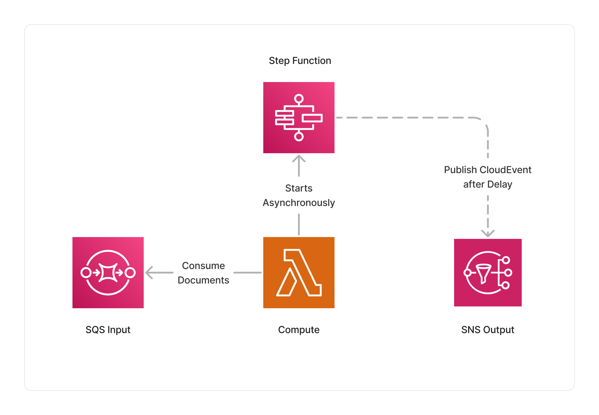

<span title="Label: Pro" data-view-component="true" class="Label Label--api text-uppercase">
  Unstable API
</span>
<span title="Label: Pro" data-view-component="true" class="Label Label--version text-uppercase">
  0.1.4
</span>
<span title="Label: Pro" data-view-component="true" class="Label Label--package">
  @project-lakechain/delay
</span>
<br>

---

The Delay middleware allows to insert a user-defined delay between 2 middlewares. This can either allow to insert a fixed delay between processing of documents, or resume the processing of a pipeline at a given arbitrary time.

---

### ⏰ Delaying Processing

To use this middleware, you import it in your CDK stack and instantiate it as part of a pipeline.

> 💁 In this example, we specify a fixed duration to the `.withTime` method, during which the Delay middleware will wait before passing the document to the next middleware in the pipeline.

```typescript
import * as cdk from 'aws-cdk-lib';
import { Delay } from '@project-lakechain/delay';
import { CacheStorage } from '@project-lakechain/core';

class Stack extends cdk.Stack {
  constructor(scope: cdk.Construct, id: string) {
    // The cache storage.
    const cache = new CacheStorage(this, 'Cache');
        
    // The delay middleware.
    const delay = new Delay.Builder()
      .withScope(this)
      .withIdentifier('Delay')
      .withCacheStorage(cache)
      .withSource(source) // 👈 Specify a data source
      .withTime(cdk.Duration.seconds(30))
      .build();
  }
}
```

<br>

---

#### Using Date Objects

It is also possible to specify an arbitrary `Date` object to the `.withTime` method, specifying when to resume the processing of a pipeline.

```typescript
import * as cdk from 'aws-cdk-lib';
import { Delay } from '@project-lakechain/delay';

// Now + 24 hours.
const date = new Date();
date.setHours(date.getHours() + 24);

const delay = new Delay.Builder()
  .withScope(this)
  .withIdentifier('Delay')
  .withCacheStorage(cache)
  .withSource(source)
  .withTime(date)
  .build();
```

<br>

---

### 🏗️ Architecture

The Delay middleware uses [AWS Step Functions](https://aws.amazon.com/step-functions/) to orchestrate the delay using a state machine. The Step Function is configured to wait for a given duration before passing the document to the next middleware in the pipeline.



<br>

---

### 🏷️ Properties

<br>

##### Supported Inputs

| Mime Type | Description |
| --------- | ----------- |
| `*/*`     | The delay middleware can consume any type of document. |

##### Supported Outputs

| Mime Type | Description |
| --------- | ----------- |
| `*/*`     | The delay middleware can produce any type of document. |

##### Supported Compute Types

| Type  | Description |
| ----- | ----------- |
| `CPU` | This middleware only supports CPU compute. |

<br>

---

### 📖 Examples

- [Delay Pipeline](https://github.com/awslabs/project-lakechain/tree/main/examples/simple-pipelines/delay-pipeline) - An example showcasing how to delay a pipeline execution.
