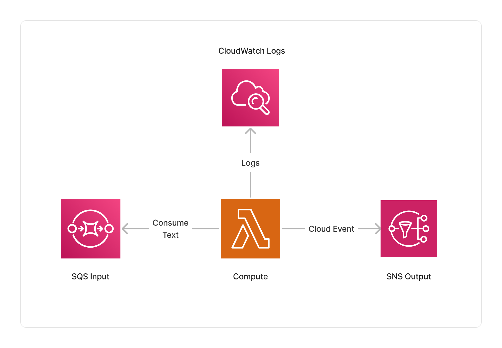

<span title="Label: Pro" data-view-component="true" class="Label Label--api text-uppercase">
  Unstable API
</span>
<span title="Label: Pro" data-view-component="true" class="Label Label--version text-uppercase">
  0.4.0
</span>
<span title="Label: Pro" data-view-component="true" class="Label Label--package">
  @project-lakechain/passthrough
</span>
<br>

---

The Passthrough middleware acts, as its name implies, as a passthrough for document events. Its main purpose is to log document events and their associated metadata.

---

### ➡️ Logging Events

To use this middleware, you import it in your CDK stack and instantiate it as part of a pipeline.

```typescript
import { Passthrough } from '@project-lakechain/passthrough';
import { CacheStorage } from '@project-lakechain/core';

class Stack extends cdk.Stack {
  constructor(scope: cdk.Construct, id: string) {
    // The cache storage.
    const cache = new CacheStorage(this, 'Cache');
    
    // The passthrough middleware.
    const passthrough = new Passthrough.Builder()
      .withScope(this)
      .withIdentifier('Passthrough')
      .withCacheStorage(cache)
      .withSource(source) // 👈 Specify a data source
      .build();
  }
}
```

<br>

---

#### Resolving Metadata

As seen in the [Events](/core/events) section, metadata associated with a document event can contain [Pointers](/core/events#using-pointers) to other documents. You can configure the Passthrough middleware to resolve those pointers and log their value in CloudWatch logs for debugging purposes.

```typescript
const passthrough = new Passthrough.Builder()
  .withScope(this)
  .withIdentifier('Passthrough')
  .withCacheStorage(cache)
  .withSource(source)
  .withResolveMetadata(true)
  .build();
```

<br>

---

### 🏗️ Architecture

The Passthrough middleware executes within a Lambda compute, consumes input events, logs their information to AWS CloudWatch Logs and passes through the events to the next middlewares in the pipeline.



<br>

---

### 🏷️ Properties

<br>

##### Supported Inputs

| Mime Type | Description |
| --------- | ----------- |
| `*/*`     | The passthrough middleware can consume any type of document. |

##### Supported Outputs

| Mime Type | Description |
| --------- | ----------- |
| `*/*`     | The passthrough middleware can produce any type of document. |

##### Supported Compute Types

| Type  | Description |
| ----- | ----------- |
| `CPU` | This middleware is based on a Lambda architecture. |
