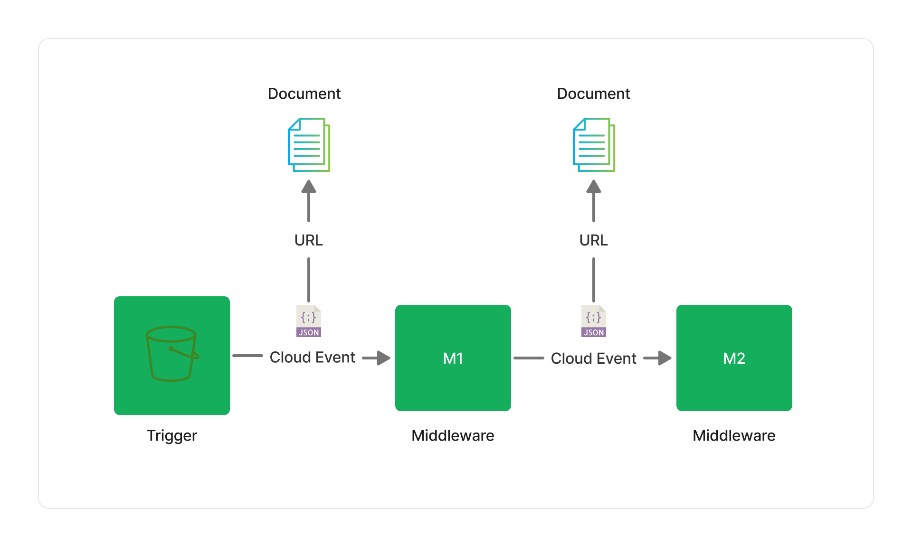

Project Lakechain makes a distinction between the raw *data* that composes a document, such as an audio file, or a text document, and the *description* of that document that flows through a pipeline execution. This description helps middlewares understand the type of the document, its location, and the metadata associated with it. It is the ubiquitous language that binds all middlewares together.

> We call this description a **Cloud Event**, simply because its format is modeled after the [CloudEvents](https://cloudevents.io/) specification.



<br>

---

## 📝 Description

Each *Cloud Event* is a JSON versioned document flowing through a pipeline execution and represents the document being processed. Below is a simple example of its structure.

```json
{
  "specversion": "1.0",
  "id": "1780d5de-fd6f-4530-98d7-82ebee85ea39",
  "type": "document-created",
  "time": "2023-10-22T13:19:10.657Z",
  "data": {
      "chainId": "6ebf76e4-f70c-440c-98f9-3e3e7eb34c79",
      "source": {
          "url": "s3://bucket/initial.txt",
          "type": "text/plain",
          "size": 26378,
          "etag": "1243cbd6cf145453c8b5519a2ada4779"
      },
      "document": {
          "url": "s3://bucket/current.txt",
          "type": "text/plain",
          "size": 36872,
          "etag": "3a3e7eb34c79a6b2154b6f70c440c98f9"
      },
      "metadata": {},
      "callStack": []
  }
}
```

There are multiple elements to this JSON document, that we will cover step-by-step.

### Top-level Attributes

Name             | Description | Format     | Mandatory
---------------- | ----------- | ---------- | ---------
**specversion**  | The version associated with the event format. | String | Yes
**id**           | A unique identifier for the event. | UUID v4 | Yes
**type**         | The type of the event. Can be *document-created* or *document-deleted*. | Enum | Yes
**time**         | The date and time when the event has been created. | ISO 8601 UTC | Yes
**data**         | The data envelope containing information about the document being processed. | Object | Yes

### Data Envelope

This is where most of the interesting information will be stored about the document. The data envelope carries a set of information that are consumed by every middleware in a pipeline execution:

Name             | Description | Format     | Mandatory
---------------- | ----------- | ---------- | ---------
**chainId**      | The instance of a pipeline execution for a given document. | UUID v4 | Yes
**source**       | A pointer to the *initial* document that triggered the pipeline. This object is read-only and remains static throughout the execution of a pipeline. | [Document](#document-type) | Yes
**document**     | A pointer to the *current* version of a document being processed in the pipeline. This is the pointer that is used by middlewares to chain their transformations. | [Document](#document-type) | Yes
**metadata**     | An object containing additional metadata about the document. | Object | Yes
**callStack**    | An array that keeps track of the middlewares that have so far been executed in the pipeline. This field is mostly provided for debugging purposes. | Array | Yes

### Document Type

Both the `source` and `document` fields within the data envelope are pointers to respectively, the initial source document, and the currently processed document. They are both modeled against the `Document` type and contain the following attributes.

Name             | Description | Format     | Mandatory
---------------- | ----------- | ---------- | ---------
**url**          | The document location. | URL | Yes
**type**         | The mime-type of the document. | Mime Type | Yes
**size**         | The size, in bytes, of the document. | Number | No
**etag**         | A content-based hash of the document. | String | No

> ℹ️ The URL locates where the document can be found. Lakechain currently supports `https` and `s3` protocols.

<br>

---

## 📖 Metadata

The `metadata` object contains additional information about the document. Metadata are enriched by middlewares through the lifecycle of a pipeline. For example, the [Image Metadata Extractor](/project-lakechain/image-processing/image-metadata-extractor) enriches the metadata object with information such as image dimensions, EXIF tags, authors, camera model, etc.

```json
{
  "specversion": "1.0",
  "id": "16b350b1-43de-4b47-836f-0e92cacca305",
  "type": "document-created",
  "time": "2023-10-22T13:19:10.657Z",
  "data": {
    "chainId": "6b2154b6-7c68-46fd-a5b8-aa72751c0aee",
    "source": {
      "url": "https://example.com/image.png",
      "type": "image/png",
      "size": 410280,
      "etag": "3e3e7eb34c79a6b2154b6f70c440c98f9"
    },
    "document": {
      "url": "https://example.com/image.png",
      "type": "image/png",
      "size": 410280,
      "etag": "3e3e7eb34c79a6b2154b6f70c440c98f9"
    },
    "metadata": {
      "title": "My Image",
      "authors": [
        "John Doe"
      ],
      "createdAt": "2022-02-20T12:19:22.296Z",
      "properties": {
        "kind": "image",
        "attrs": {
          "dimensions": {
            "width": 800,
            "height": 600
          }
        }
      }
    },
    "callStack": []
  }
}
```

Extracting metadata from documents can help in the process of transforming unstructured data into a more structured representation. When building Generative AI applications and integrating with LLMs, metadata can play an important role in your prompt engineering and help yield better results.

### Top-level Attributes

The metadata object has the following top-level attributes that are common across all types of documents.

> All attributes are optional.

Name             | Description | Format
---------------- | ----------- | ----------
**createdAt**    | The date and time at which the document was created. | ISO 8601 UTC
**updatedAt**    | The date and time at which the document was last updated. | ISO 8601 UTC
**image**        | A URL pointing to the main image representing the document. | URL
**authors**      | The list of authors of the document. | Array
**publisher**    | The publisher of the document. | Publisher
**title**        | The title of the document. | String
**description**  | A meaningful description of the document. | String
**keywords**     | An array of prominent keywords associated with the document. | Array
**rating**       | A rating between 1 and 5 representing the quality of the document. | Number
**properties**   | A discriminated union of metadata specific to the type of document. | Object

### Using Pointers

The same way we *reference* documents in a `CloudEvent`, it is important to also be able to reference any other attributes that would be otherwise too large to store directly in the metadata object.

To this end, Lakechain introduces the concept of a *pointer* type allowing to reference large values within the metadata object.

Let's say you are using a middleware to perform object detection on images. Instead of storing the entire list of detected objects in the metadata, the object detection middleware stores that list in an external location (which we call the cache storage), and provides a pointer to that location in the metadata. Other middlewares can lazily *dereference* that value when needed.

```json
{
  "specversion": "1.0",
  "id": "16b350b1-43de-4b47-836f-0e92cacca305",
  "type": "document-created",
  "time": "2023-10-22T13:19:10.657Z",
  "data": {
    "chainId": "6b2154b6-7c68-46fd-a5b8-aa72751c0aee",
    "source": {
      "url": "https://example.com/image.png",
      "type": "image/png",
      "size": 410280,
      "etag": "3e3e7eb34c79a6b2154b6f70c440c98f9"
    },
    "document": {
      "url": "https://example.com/image.png",
      "type": "image/png",
      "size": 410280,
      "etag": "3e3e7eb34c79a6b2154b6f70c440c98f9"
    },
    "metadata": {
      "properties": {
        "kind": "image",
        "attrs": {
          "objects": "s3://storage-bucket/detected-objects.json" // 👈 Pointer
        }
      }
    },
    "callStack": []
  }
}
```

Middlewares are responsible for serializing values into pointers, and resolve back the pointer into an object to access the underlying data at runtime.
