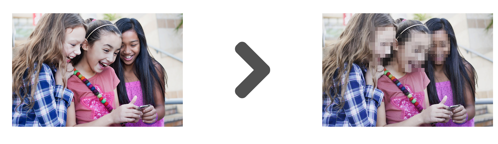
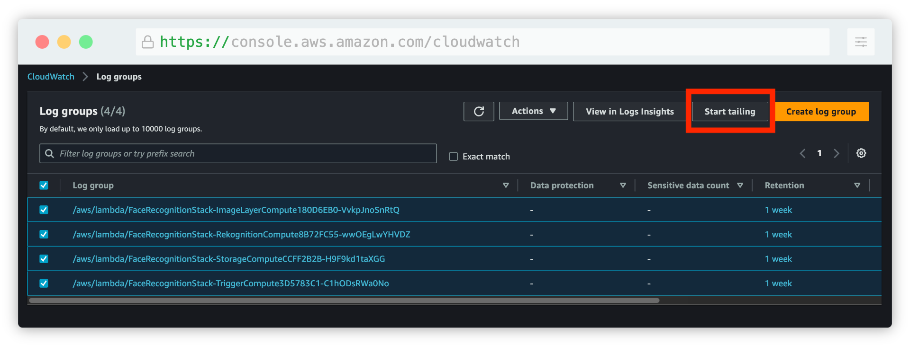
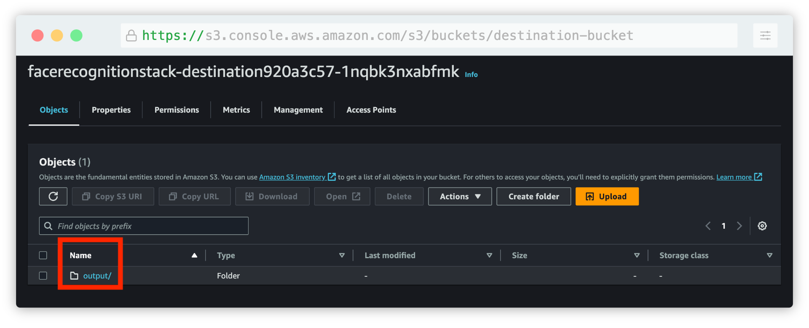
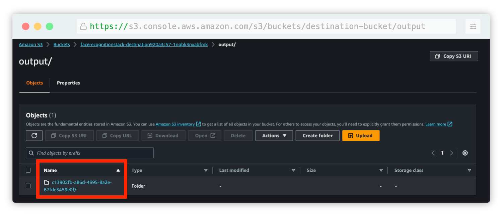
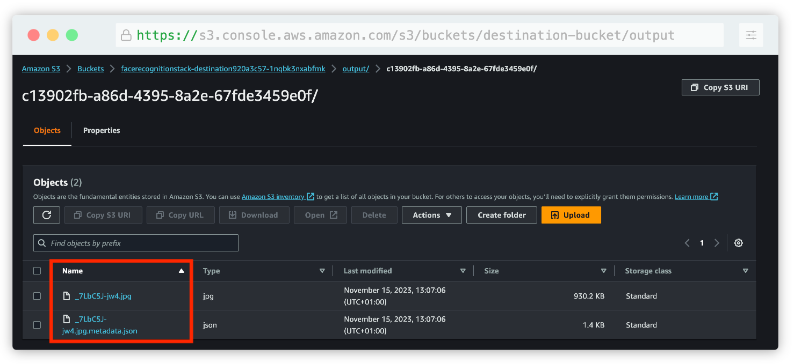
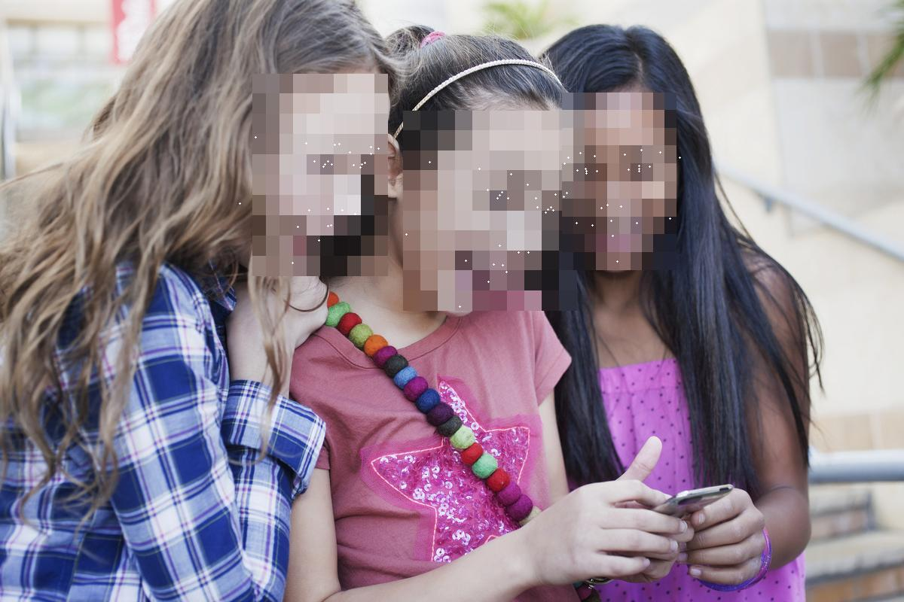
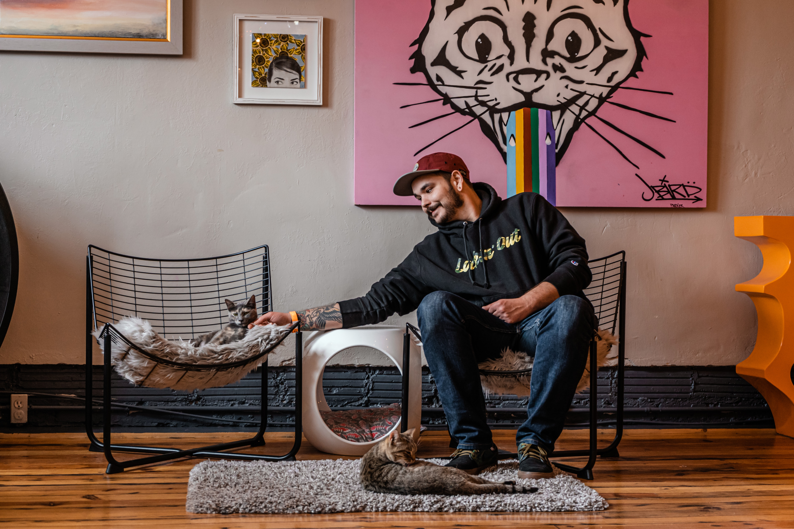

To help you kickstart your journey with Project Lakechain, we are going to walk you through the step-by-step deployment of your first pipeline by deploying one of the [examples](https://github.com/awslabs/project-lakechain/tree/main/examples) we've built for you.

> 💁 The [pre-requisites](/project-lakechain/general/pre-requisites) section helps you ensure you have the necessary setup on your development environment and are ready to go!

---

### 📔 Overview

For this first deployment, we are going to deploy a face detection pipeline [we've created](https://github.com/awslabs/project-lakechain/tree/main/examples/simple-pipelines/image-processing-pipelines/face-detection-pipeline). The pipeline is triggered by images uploaded in a source S3 bucket. It uses AWS Rekognition to detect faces in the uploaded image, and creates a new image with the faces blurred and face landmarks drawn on top of them. Transformed images are then automatically stored in a destination S3 bucket.

<br>



<br>

---

<br>

### 🧬 Pipeline

This is how the pipeline we are going to deploy looks like.


1. The [S3 Trigger](/project-lakechain/triggers/s3-event-trigger) monitors any uploaded document from the source S3 buckets, and translates the S3 event into a [Cloud Event](/project-lakechain/general/events) that's understood by the rest of the middlewares.

2. The [Rekognition Image Processor](/project-lakechain/image-processing/rekognition-image-processor) handles face detections, and enriches document metadata with detected faces information.

3. The [Image Layer Processor](/project-lakechain/image-processing/image-layer-processor) uses face detection information to blur faces and highlight face landmarks in the image.

4. At the end of the pipeline, the [S3 Storage Connector](/project-lakechain/connectors/s3-storage-connector) stores the transformed image in the destination S3 bucket.

<br>

---

<br>

### 🚀 Get started!

First, you will need to clone the Project Lakechain repo, and install the project dependencies.

```bash
git clone https://github.com/awslabs/project-lakechain \
  && cd project-lakechain \
  && npm install
```

<br>

---

<br>

Next, head to the `examples/simple-pipelines/image-processing-pipelines/face-detection-pipeline` directory in the repository, and build the example and the middlewares it relies on :

```bash
cd examples/simple-pipelines/image-processing-pipelines/face-detection-pipeline \
  && npm run build-pkg
```

<pre className="terminal" style="margin-top: 0">
> face-detection-pipeline@1.0.0 build-pkg

    ✔  @project-lakechain/sdk:build
    ✔  @project-lakechain/core:build
    ✔  @project-lakechain/s3-storage-connector:build
    ✔  @project-lakechain/rekognition-image-processor:build
    ✔  @project-lakechain/image-layer-processor:build
    ✔  @project-lakechain/s3-event-trigger:build
    ✔  face-detection-pipeline:build (4s)

 ————————————————————————————————————————————————————————————

 >  Successfully ran target build for 7 projects
</pre>

<br>

---

<br>

Great! You can now deploy the example pipeline to your AWS account using the AWS CDK.

> 💁 Ensure your deployment machine does have valid AWS credentials and a Docker engine is running before proceeding.

```bash
npm run deploy
```

<pre className="terminal" style="margin-top: 0">
> face-detection-pipeline@1.0.0 deploy
> npx cdk deploy

...

 ✅  FaceDetectionStack

✨  Deployment time: 56.44s

Outputs:
FaceDetectionStack.DestinationBucketName = {source-bucket}
FaceDetectionStack.SourceBucketName = {destination-bucket}
</pre>

Once the deployment is completed, you will see in the `Outputs` in the console two references :

- `SourceBucketName` - This is where you upload images to be processed.
- `DestinationBucketName` - This is where processing results will be stored.

<br>

---

<br>

### ⚡ Launch

To launch the pipeline, you upload one or multiple images in the source bucket using the AWS Console, and a pipeline execution will trigger automatically per uploaded images.

> 💁 **Tip** We recommend that you Live Tail the log groups associated with the middlewares to see the logs in real-time and be able to explore them in the [AWS CloudWatch Logs console](https://console.aws.amazon.com/cloudwatch/home#logsV2:log-groups).



Once you upload an image, you should see logs appearing for each middleware execution, and an `output` directory being created in the destination bucket after a few seconds.



The `output` prefix is automatically created by the S3 storage connector which organizes results by execution identifier. This allows to partition different pipeline execution results under different unique identifiers.



Within each execution identifiers are the files that the S3 storage connector aggregated from upstream middlewares. For each processed document, the S3 storage connector stores both the processed document and its description as a JSON file.



If you open the resulting image, you will see the new image modified by the pipeline.

<br>



<br>

Congratulations! You've successfully executed a document processing pipeline with Lakechain! 👍

<br>

---

<br>

### 👨‍💻 Making changes

Now that we know the basics of deploying and triggering a pipeline, we are going to apply some minor changes to it to see how we can leverage the flexibility of middlewares.

In the example directory, you will find a `stack.ts` file that contains the CDK code in TypeScript describing the pipeline. Locate the section defining the `RekognitionImageProcessor` middleware 👇.

```typescript
const rekognition = new RekognitionImageProcessor.Builder()
  .withScope(this)
  .withIdentifier('Rekognition')
  .withCacheStorage(cache)
  .withSource(trigger)
  .withIntent(
    r.detect()
      .faces(r.confidence(80))
  )
  .build();
```

The *intent* describes to the rekognition image processor what actions it is expected to perform on images. In this case, we are asking it to detect faces in the image, and to only return results that have a confidence score of 80% or more.

Let's change that to also detect *objects* in the image that have a similar confidence, and limit the results to 10 objects.

```typescript
const rekognition = new RekognitionImageProcessor.Builder()
  .withScope(this)
  .withIdentifier('Rekognition')
  .withCacheStorage(cache)
  .withSource(trigger)
  .withIntent(
    r.detect()
      .faces(r.confidence(80))
      .labels(r.limit(10), r.confidence(80)) // 👈 Add this line
  )
  .build();
```

Perfect! Now let's also modify the `ImageLayerProcessor` middleware to also highlight the detected objects in addition to blurring faces in the image.
This will cause the image processor to draw a bounding box around the detected objects.

```typescript
const layerProcessor = new ImageLayerProcessor.Builder()
  .withScope(this)
  .withIdentifier('ImageLayer')
  .withCacheStorage(cache)
  .withSource(rekognition)
  .withLayers(
    l.pixelate(l.faces()),
    l.highlight(l.landmarks(), l.objects()) // 👈 Change here
  )
  .build();
```

You can re-deploy the pipeline to apply the changes.

```bash
npm run deploy
```

Once done, you can upload a new image featuring both faces and objects to the source bucket.

> 👇 You can use the below image for example.



<p align="center" style="font-size: 12px">
  <em>Credits <a href="https://unsplash.com/fr/@crtvduo?utm_content=creditCopyText&utm_medium=referral&utm_source=unsplash">Camden & Hailey George</a> on <a href="https://unsplash.com/fr/photos/homme-en-pull-noir-et-jean-en-jean-bleu-assis-sur-un-fauteuil-en-osier-blanc-m6O-OyKniK0?utm_content=creditCopyText&utm_medium=referral&utm_source=unsplash">Unsplash</a></em>
</p>

The image will trigger a new pipeline execution, and this time, face *and* label detection will be performed on the image and drawn on top of it.


<p align="center" style="font-size: 12px">
  <em>Credits <a href="https://unsplash.com/fr/@crtvduo?utm_content=creditCopyText&utm_medium=referral&utm_source=unsplash">Camden & Hailey George</a> on <a href="https://unsplash.com/fr/photos/homme-en-pull-noir-et-jean-en-jean-bleu-assis-sur-un-fauteuil-en-osier-blanc-m6O-OyKniK0?utm_content=creditCopyText&utm_medium=referral&utm_source=unsplash">Unsplash</a></em>
</p>

<br>

Thank you for following this Quickstart! 🎉 We recommend you also explore the different use-cases implemented by our [other examples](https://github.com/awslabs/project-lakechain/tree/main/examples) for learning more in-depth how Lakechain works before creating your own pipelines!

<br>

---

<br>

### 🧹 Cleanup

When you are done experimenting with this example, don't forget to clean up all resources from your account.

```bash
npm run destroy
```
