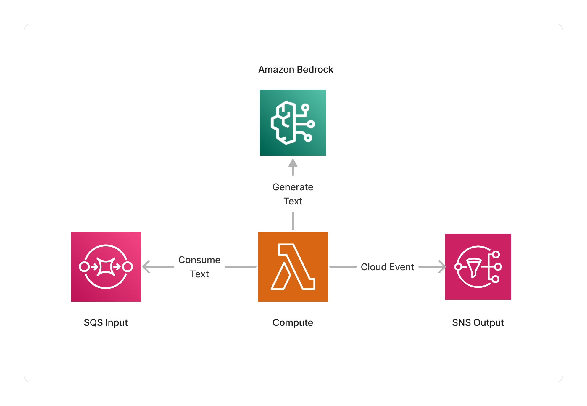

<span title="Label: Pro" data-view-component="true" class="Label Label--api text-uppercase">
  Unstable API
</span>
<span title="Label: Pro" data-view-component="true" class="Label Label--version text-uppercase">
  0.4.0
</span>
<span title="Label: Pro" data-view-component="true" class="Label Label--package">
  <a target="_blank" href="https://www.npmjs.com/package/@project-lakechain/bedrock-text-processors">
    @project-lakechain/bedrock-text-processors
  </a>
</span>
<span class="language-icon">
  <svg role="img" viewBox="0 0 24 24" width="30" xmlns="http://www.w3.org/2000/svg" style="fill: #3178C6;"><title>TypeScript</title><path d="M1.125 0C.502 0 0 .502 0 1.125v21.75C0 23.498.502 24 1.125 24h21.75c.623 0 1.125-.502 1.125-1.125V1.125C24 .502 23.498 0 22.875 0zm17.363 9.75c.612 0 1.154.037 1.627.111a6.38 6.38 0 0 1 1.306.34v2.458a3.95 3.95 0 0 0-.643-.361 5.093 5.093 0 0 0-.717-.26 5.453 5.453 0 0 0-1.426-.2c-.3 0-.573.028-.819.086a2.1 2.1 0 0 0-.623.242c-.17.104-.3.229-.393.374a.888.888 0 0 0-.14.49c0 .196.053.373.156.529.104.156.252.304.443.444s.423.276.696.41c.273.135.582.274.926.416.47.197.892.407 1.266.628.374.222.695.473.963.753.268.279.472.598.614.957.142.359.214.776.214 1.253 0 .657-.125 1.21-.373 1.656a3.033 3.033 0 0 1-1.012 1.085 4.38 4.38 0 0 1-1.487.596c-.566.12-1.163.18-1.79.18a9.916 9.916 0 0 1-1.84-.164 5.544 5.544 0 0 1-1.512-.493v-2.63a5.033 5.033 0 0 0 3.237 1.2c.333 0 .624-.03.872-.09.249-.06.456-.144.623-.25.166-.108.29-.234.373-.38a1.023 1.023 0 0 0-.074-1.089 2.12 2.12 0 0 0-.537-.5 5.597 5.597 0 0 0-.807-.444 27.72 27.72 0 0 0-1.007-.436c-.918-.383-1.602-.852-2.053-1.405-.45-.553-.676-1.222-.676-2.005 0-.614.123-1.141.369-1.582.246-.441.58-.804 1.004-1.089a4.494 4.494 0 0 1 1.47-.629 7.536 7.536 0 0 1 1.77-.201zm-15.113.188h9.563v2.166H9.506v9.646H6.789v-9.646H3.375z"/></svg>
</span>
<div style="margin-top: 26px"></div>

---

*Bedrock text processors expose different constructs that leverage the Generative AI text models powered by [Amazon Bedrock](https://docs.aws.amazon.com/bedrock/latest/userguide/what-is-bedrock.html). Using these constructs, you can use prompt engineering techniques to transform text documents, including, text summarization, text translation, information extraction, and more!*

The Cohere text processor is part of the Bedrock text processors and allows you to leverage machine-learning models provided by Cohere within your pipelines.

---

### 🤖 Text Generation

To start using Cohere models in your pipelines, you import the `CohereTextProcessor` construct in your CDK stack, and specify the specific text model you want to use.

> 💁 The below example demonstrates how to use the Cohere text processor to summarize input documents uploaded to an S3 bucket.

```typescript
import { S3EventTrigger } from '@project-lakechain/s3-event-trigger';
import { CohereTextProcessor, CohereTextModel } from '@project-lakechain/bedrock-text-processors';
import { CacheStorage } from '@project-lakechain/core';

class Stack extends cdk.Stack {
  constructor(scope: cdk.Construct, id: string) {
    const cache = new CacheStorage(this, 'Cache');

    // Create the S3 event trigger.
    const trigger = new S3EventTrigger.Builder()
      .withScope(this)
      .withIdentifier('Trigger')
      .withCacheStorage(cache)
      .withBucket(bucket)
      .build();

    // Transforms input documents using a Cohere model.
    const cohere = new CohereTextProcessor.Builder()
      .withScope(this)
      .withIdentifier('CohereTextProcessor')
      .withCacheStorage(cache)
      .withSource(source)
      .withModel(CohereTextModel.COHERE_COMMAND_TEXT_V14)
      .withPrompt(`
        Give a detailed summary of the text with the following constraints:
        - Write the summary in the same language as the original text.
        - Keep the original meaning, style, and tone of the text in the summary.
      `)
      .withModelParameters({
        max_tokens: 4096
      })
      .build();
  }
}
```

<br>

---

### 🤖 Model Selection

You can select the specific Cohere model to use with this middleware using the `.withModel` API.

```typescript
import { CohereTextProcessor, CohereTextModel } from '@project-lakechain/bedrock-text-processors';

const cohere = new CohereTextProcessor.Builder()
  .withScope(this)
  .withIdentifier('CohereTextProcessor')
  .withCacheStorage(cache)
  .withSource(source)
  .withModel(CohereTextModel.COHERE_COMMAND_LIGHT_TEXT_V14) // 👈 Specify a model
  .withPrompt(prompt)
  .build();
```

You can choose amongst the following models : `COHERE_COMMAND_TEXT_V14`, and `COHERE_COMMAND_LIGHT_TEXT_V14`.

<br>

---

### 🌐 Region Selection

You can specify the AWS region in which you want to invoke Amazon Bedrock using the `.withRegion` API. This can be helpful if Amazon Bedrock is not yet available in your deployment region.

> 💁 By default, the middleware will use the current region in which it is deployed.

```typescript
import { CohereTextProcessor, CohereTextModel } from '@project-lakechain/bedrock-text-processors';

const cohere = new CohereTextProcessor.Builder()
  .withScope(this)
  .withIdentifier('CohereTextProcessor')
  .withCacheStorage(cache)
  .withSource(source)
  .withRegion('eu-central-1') // 👈 Alternate region
  .withModel(CohereTextModel.COHERE_COMMAND_TEXT_V14)
  .withPrompt(prompt)
  .build();
```

<br>

---

### ⚙️ Model Parameters

You can forward specific parameters to text models using the `.withModelParameters` method. See the [Bedrock Inference Parameters](https://docs.aws.amazon.com/bedrock/latest/userguide/model-parameters.html) for more information on the parameters supported by the different models.

<br>

---

### 🏗️ Architecture

This middleware is based on a Lambda compute running on an ARM64 architecture, and integrate with Amazon Bedrock to generate text based on the given prompt and input documents.



<br>

---

### 🏷️ Properties

<br>

##### Supported Inputs

|  Mime Type  | Description |
| ----------- | ----------- |
| `text/plain` | UTF-8 text documents. |
| `text/markdown` | Markdown documents. |
| `text/csv` | CSV documents. |
| `text/html` | HTML documents. |
| `application/x-subrip` | SubRip subtitles. |
| `text/vtt` | Web Video Text Tracks (WebVTT) subtitles. |
| `application/json` | JSON documents. |
| `application/json+scheduler` | Used by the `Scheduler` middleware. |

##### Supported Outputs

|  Mime Type  | Description |
| ----------- | ----------- |
| `text/plain` | UTF-8 text documents. |

##### Supported Compute Types

| Type  | Description |
| ----- | ----------- |
| `CPU` | This middleware only supports CPU compute. |

<br>

---

### 📖 Examples

- [Text Generation Pipeline](https://github.com/awslabs/project-lakechain/tree/main/examples/simple-pipelines/text-generation-pipeline) - An example showcasing how to generate text using Amazon Bedrock models.
