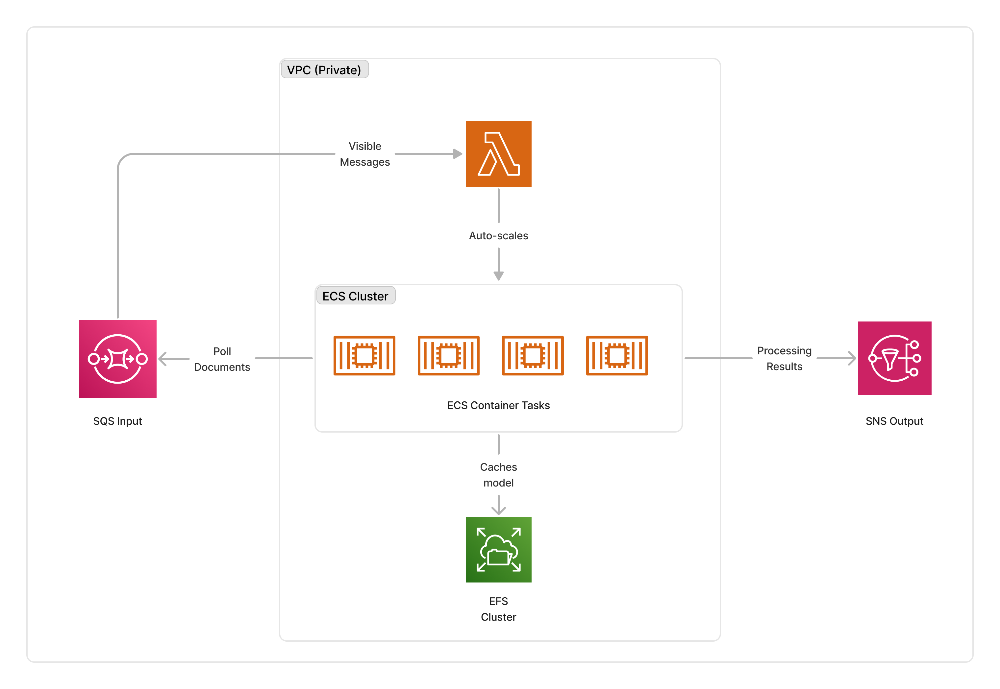

<span title="Label: Pro" data-view-component="true" class="Label Label--api text-uppercase">
  Unstable API
</span>
<span title="Label: Pro" data-view-component="true" class="Label Label--version text-uppercase">
  0.5.0
</span>
<span title="Label: Pro" data-view-component="true" class="Label Label--package">
  <a target="_blank" href="https://www.npmjs.com/package/@project-lakechain/ollama-processor">
    @project-lakechain/ollama-processor
  </a>
</span>
<span class="language-icon">
  <svg role="img" viewBox="0 0 24 24" width="30" xmlns="http://www.w3.org/2000/svg" style="fill: #3178C6;"><title>TypeScript</title><path d="M1.125 0C.502 0 0 .502 0 1.125v21.75C0 23.498.502 24 1.125 24h21.75c.623 0 1.125-.502 1.125-1.125V1.125C24 .502 23.498 0 22.875 0zm17.363 9.75c.612 0 1.154.037 1.627.111a6.38 6.38 0 0 1 1.306.34v2.458a3.95 3.95 0 0 0-.643-.361 5.093 5.093 0 0 0-.717-.26 5.453 5.453 0 0 0-1.426-.2c-.3 0-.573.028-.819.086a2.1 2.1 0 0 0-.623.242c-.17.104-.3.229-.393.374a.888.888 0 0 0-.14.49c0 .196.053.373.156.529.104.156.252.304.443.444s.423.276.696.41c.273.135.582.274.926.416.47.197.892.407 1.266.628.374.222.695.473.963.753.268.279.472.598.614.957.142.359.214.776.214 1.253 0 .657-.125 1.21-.373 1.656a3.033 3.033 0 0 1-1.012 1.085 4.38 4.38 0 0 1-1.487.596c-.566.12-1.163.18-1.79.18a9.916 9.916 0 0 1-1.84-.164 5.544 5.544 0 0 1-1.512-.493v-2.63a5.033 5.033 0 0 0 3.237 1.2c.333 0 .624-.03.872-.09.249-.06.456-.144.623-.25.166-.108.29-.234.373-.38a1.023 1.023 0 0 0-.074-1.089 2.12 2.12 0 0 0-.537-.5 5.597 5.597 0 0 0-.807-.444 27.72 27.72 0 0 0-1.007-.436c-.918-.383-1.602-.852-2.053-1.405-.45-.553-.676-1.222-.676-2.005 0-.614.123-1.141.369-1.582.246-.441.58-.804 1.004-1.089a4.494 4.494 0 0 1 1.47-.629 7.536 7.536 0 0 1 1.77-.201zm-15.113.188h9.563v2.166H9.506v9.646H6.789v-9.646H3.375z"/></svg>
</span>
<div style="margin-top: 26px"></div>

---

The Ollama processor makes it possible to run the open-source language and image models supported by [Ollama](https://ollama.com/) on AWS within a customer VPC.

Using this middleware, customers can transform their text documents, as well as extract meaningful information from their image documents, while keeping their data secure within the boundaries of their AWS account.

> 💁 You can view the list of models supported by Ollama [here](https://ollama.com/library).

---

### 🦙 Running Ollama

To use this middleware, you import it in your CDK stack and connect it to a data source that provides text or image documents.

> ℹ️ The below example shows how to create a pipeline that summarizes text documents uploaded to an S3 bucket.

```typescript
import { S3EventTrigger } from '@project-lakechain/s3-event-trigger';
import { CacheStorage } from '@project-lakechain/core';
import {
  OllamaProcessor,
  OllamaModel,
  InfrastructureDefinition
} from '@project-lakechain/ollama-processor';

class Stack extends cdk.Stack {
  constructor(scope: cdk.Construct, id: string) {
    // Sample VPC.
    const vpc = new ec2.Vpc(this, 'VPC', {});

    // The cache storage.
    const cache = new CacheStorage(this, 'Cache');

    // Create the S3 event trigger.
    const trigger = new S3EventTrigger.Builder()
      .withScope(this)
      .withIdentifier('Trigger')
      .withCacheStorage(cache)
      .withBucket(bucket)
      .build();

    // Summarize uploaded text documents.
    trigger.pipe(new OllamaProcessor.Builder()
      .withScope(this)
      .withIdentifier('OllamaProcessor')
      .withCacheStorage(cache)
      .withVpc(vpc)
      .withModel(OllamaModel.LLAMA2)
      .withPrompt('Give a detailed summary of the provided document.')
      .withInfrastructure(new InfrastructureDefinition.Builder()
        .withMaxMemory(15 * 1024)
        .withGpus(1)
        .withInstanceType(ec2.InstanceType.of(
          ec2.InstanceClass.G4DN,
          ec2.InstanceSize.XLARGE
        ))
        .build())
      .build());
  }
}
```

<br>

---

### 🤖 Model Selection

Ollama supports a variety of models, and you can specify the model and optionally the specific tag to use.

> 💁 When no tag is provided, the `latest` tag is used. The example below showcases how to use a specific tag on a model.

```typescript
import { OllamaProcessor, OllamaModel } from '@project-lakechain/ollama-processor';

const ollama = new OllamaProcessor.Builder()
  .withScope(this)
  .withIdentifier('OllamaProcessor')
  .withCacheStorage(cache)
  .withVpc(vpc)
  .withModel(OllamaModel.LLAMA2.tag('13b')) // 👈 Specify a model and tag.
  .withPrompt(prompt)
  .withInfrastructure(infrastructure)
  .build();
```

<br>

---

#### Escape Hatch

The `OllamaModel` class provides a quick way to reference existing models, and select a specific tag. However, as Ollama adds new models, you may be in a situation where a model is not yet referenced by this middleware.

To address this situation, you can manually specify a model definition pointing to the supported Ollama model you wish to run. You do so by specifying the name of the model in the ollama library, the tag you wish to use, and its input and output mime-types.

> 💁 In the example below, we redefine the `llava` image model and its inputs and outputs.

```typescript
import { OllamaProcessor, OllamaModel } from '@project-lakechain/ollama-processor';

const ollama = new OllamaProcessor.Builder()
  .withScope(this)
  .withIdentifier('OllamaProcessor')
  .withCacheStorage(cache)
  .withVpc(vpc)
  .withModel(OllamaModel.of('llava', {
    tag: 'latest',
    inputs: ['image/png', 'image/jpeg'],
    outputs: ['text/plain']
  }))
  .withPrompt(prompt)
  .withInfrastructure(infrastructure)
  .build();
```

<br />

---

### ↔️ Auto-Scaling

The cluster of containers deployed by this middleware will auto-scale based on the number of documents that need to be processed. The cluster scales up to a maximum of 5 instances by default, and scales down to zero when there are no documents to process.

> ℹ️ You can configure the maximum amount of instances that the cluster can auto-scale to by using the `withMaxInstances` method.

```typescript
const ollama = new OllamaProcessor.Builder()
  .withScope(this)
  .withIdentifier('OllamaProcessor')
  .withCacheStorage(cache)
  .withVpc(vpc)
  .withSource(source)
  .withModel(OllamaModel.LLAMA2)
  .withPrompt(prompt)
  .withInfrastructure(infrastructure)
  .withMaxInstances(10) // 👈 Maximum amount of instances
  .build();
```

<br>

---

### 🌉 Infrastructure

Every model requires a specific infrastructure to run optimally. To ensure the `OllamaProcessor` orchestrates your models using the most optimal instance, memory, and GPU allocation, you need to specify an infrastructure definition.

> 💁 The example below describes the infrastructure suited to run the `Mixtral` model requiring significant RAM and GPU memory to run.

```typescript
const ollama = new OllamaProcessor.Builder()
  .withScope(this)
  .withIdentifier('OllamaProcessor')
  .withCacheStorage(cache)
  .withVpc(vpc)
  .withModel(OllamaModel.MIXTRAL)
  .withPrompt(prompt)
  .withInfrastructure(new InfrastructureDefinition.Builder()
    .withMaxMemory(180_000)
    .withGpus(8)
    .withInstanceType(ec2.InstanceType.of(
      ec2.InstanceClass.G5,
      ec2.InstanceSize.XLARGE48
    ))
    .build())
  .build();
```

Below is a description of the fields associated with the infrastructure definition.

| Field | Description |
| ----- | ----------- |
| maxMemory | The maximum RAM in MiB to allocate to the container. |
| gpus | The number of GPUs to allocate to the container (only relevant for GPU instances). |
| instanceType | The EC2 instance type to use for running the container. |

<br>

---

### 🏗️ Architecture

The Ollama processor can run on either CPU or GPU compute. It packages the Ollama server, and a small Python application loading input documents and running the inference within a Docker container.

To orchestrate deployments, this middleware deploys an ECS auto-scaled cluster of containers that consume documents from the middleware input queue. The cluster is deployed in the private subnet of the given VPC, and caches the models on an EFS storage to optimize cold-starts.

> ℹ️ The average cold-start for the Ollama containers is around 3 minutes when no instances are running.



<br>

---

### 🏷️ Properties

<br>

##### Supported Inputs

*The supported inputs depend on the specific Ollama model used. The [model definitions](https://github.com/awslabs/project-lakechain/blob/main/packages/middlewares/text-processors/ollama-processor/src/definitions/model.ts) describe the supported inputs and outputs for each model.*

##### Supported Outputs

*The supported outputs depend on the specific Ollama model used. The [model definitions](https://github.com/awslabs/project-lakechain/blob/main/packages/middlewares/text-processors/ollama-processor/src/definitions/model.ts) describe the supported inputs and outputs for each model.*

##### Supported Compute Types

| Type  | Description |
| ----- | ----------- |
| `CPU` | This middleware supports CPU compute. |
| `GPU` | This middleware supports GPU compute. |

<br>

---

### 📖 Examples

- [Ollama Summarization Pipeline](https://github.com/awslabs/project-lakechain/tree/main/examples/simple-pipelines/summarization-pipelines/ollama-summarization-pipeline) - Builds a pipeline for text summarization using Ollama.
