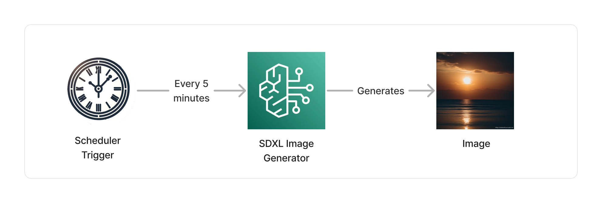
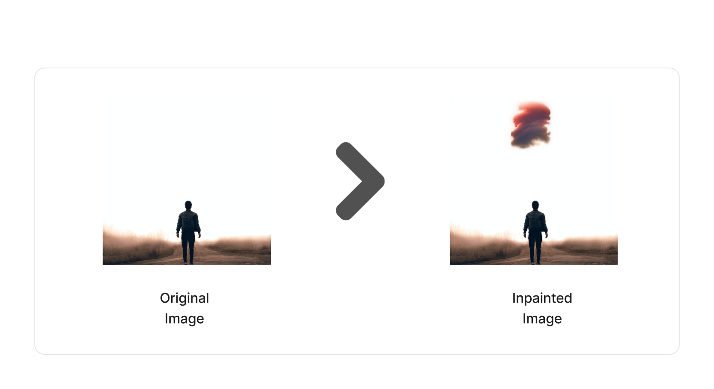

import { Image } from 'astro:assets';
import maskImage from '../../../assets/sdxl-mask-image.png';

<span title="Label: Pro" data-view-component="true" class="Label Label--api text-uppercase">
  Unstable API
</span>
<span title="Label: Pro" data-view-component="true" class="Label Label--version text-uppercase">
  0.1.4
</span>
<span title="Label: Pro" data-view-component="true" class="Label Label--package">
  @project-lakechain/bedrock-image-generators
</span>
<br />

---

The Bedrock image generators package enables developers to use image generation models hosted on [Amazon Bedrock](https://docs.aws.amazon.com/bedrock/latest/userguide/what-is-bedrock.html), and create images at scale within their pipelines. The Stable Diffusion XL image generator is part of this package and we will showcase how to leverage all of its functionalities in this documentation.

---

### 🖼️ Text-to-Image

To generate images as part of your pipelines from a text prompt, you can use the `SdxlImageGenerator` construct. This construct either takes the content of input text document as a prompt for generating an image, allowing you to nicely chain documents together, or can also take a user-provided prompt.

> ℹ️ The below example demonstrates how to use the SDXL image generator to create images from an arbitrary prompt every 5 minutes, using the [Scheduler Trigger](/project-lakechain/triggers/scheduler-event-trigger).



#### Example

```typescript
import * as cdk from '@aws-cdk/core';
import * as scheduler from '@aws-cdk/aws-scheduler-alpha';
import { SchedulerEventTrigger } from '@project-lakechain/scheduler-event-trigger';
import { SdxlImageGenerator } from '@project-lakechain/bedrock-image-generators';

class Stack extends cdk.Stack {
  constructor(scope: cdk.Construct, id: string) {
    // The scheduler trigger.
    const trigger = new SchedulerEventTrigger.Builder()
      .withScope(this)
      .withIdentifier('Trigger')
      .withScheduleExpression(
        scheduler.ScheduleExpression.rate(cdk.Duration.minutes(5))
      )
      .build();

    // The SDXL image generator.
    const imageGenerator = new SdxlImageGenerator.Builder()
      .withScope(this)
      .withIdentifier('SdxlImageGenerator')
      .withSource(trigger)
      .withPrompt(`A beautiful sunset over the ocean.`)
      .withNegativePrompts([
        'low resolution',
        'low quality'
      ])
      .build();
  }
}
```

<br />
<br />

---

### 🧑‍🎨 Image Inpainting

SDXL models on Amazon Bedrock support image inpainting, which refers to the process of painting a new image within an existing image. SDXL supports generating an image and "painting" it within an existing image using a mask image, delimiting the area where the new image should be painted.



The area for inpainting is defined using a black mask image, outlining the region of the image that should be inpainted.
Below is an example of a mask we are using to inpaint the above image.

<p align="center">
  <Image src={maskImage} alt="Mask Image" width="300" />
</p>

To implement inpainting within a pipeline, you can use the `SdxlImageGenerator` by specifying a source image
as well as a mask image. We leverage *Lakechain references* to specify the source and mask images.

> 💁 In the below example we create a pipeline that triggers when an image is uploaded to a source S3 bucket,
this image will be used as the base for inpainting.

```typescript
import { S3EventTrigger } from '@project-lakechain/s3-event-trigger';
import { SdxlImageGenerator } from '@project-lakechain/bedrock-image-generators';
import { CacheStorage } from '@project-lakechain/core';

class Stack extends cdk.Stack {
  constructor(scope: cdk.Construct, id: string) {
    const cache = new CacheStorage(this, 'Cache');

    // Create the S3 event trigger.
    const trigger = new S3EventTrigger.Builder()
      .withScope(this)
      .withIdentifier('Trigger')
      .withCacheStorage(cache)
      .withBucket(bucket)
      .build();
    
    // Modify the input images using SDXL on Amazon Bedrock.
    const imageGenerator = new SdxlImageGenerator.Builder()
      .withScope(this)
      .withIdentifier('ImageGenerator')
      .withCacheStorage(cache)
      .withSource(source)
      // Specify a prompt for the inpainted image.
      .withPrompt('A glowing red cloud')
      .withModelParameters({
        // We reference the input document as the `init_image` parameter.
        init_image: r.reference(r.document()),
        // We reference the mask image as the `mask_image` parameter.
        mask_image: r.reference(
          r.url(`s3://${source.bucketName}/mask.png`)
        ),
        mask_source: 'MASK_IMAGE_BLACK'
      })
      .build();
  }
}
```

> ℹ️ This example assumes that the mask image exists in the source bucket.

<br />
<br />

---

### 🌐 Region Selection

You can specify the AWS region in which you want to invoke Amazon Bedrock using the `.withRegion` API.

> 💁 By default, the middleware will use the current region in which it is deployed.

```typescript
import { SdxlImageGenerator, SdxlImageModel } from '@project-lakechain/bedrock-image-generators';

const imageGenerator = new SdxlImageGenerator.Builder()
  .withScope(this)
  .withIdentifier('SdxlImageGenerator')
  .withSource(trigger)
  .withRegion('us-east-1') // 👈 Alternate region
  .withImageModel(SdxlImageModel.STABILITY_DIFFUSION_XL_V0)
  .build();
```

<br />
<br />

---

### 🤖 Model Selection

Amazon Bedrock supports different versions of the SDXL model and you can specify which model you would like to use by using the `.withModel` API.

> 💁 By default, the `stability.stable-diffusion-xl-v1` model is used.

```typescript
import { SdxlImageGenerator, SdxlImageModel } from '@project-lakechain/bedrock-image-generators';

const imageGenerator = new SdxlImageGenerator.Builder()
  .withScope(this)
  .withIdentifier('SdxlImageGenerator')
  .withSource(trigger)
  .withImageModel(SdxlImageModel.STABILITY_DIFFUSION_XL_V0)
  .build();
```

> Currently, the `stability.stable-diffusion-xl-v0` and `stability.stable-diffusion-xl-v1` models are supported.

<br />
<br />

---

### ⚙️ Parameters

You can pass additional parameters to the SDXL model for customizing how the SDXL model generates images. All the parameters supported by SDXL are supported.

```typescript
import { SdxlImageGenerator } from '@project-lakechain/bedrock-image-generators';

const imageGenerator = new SdxlImageGenerator.Builder()
  .withScope(this)
  .withIdentifier('SdxlImageGenerator')
  .withSource(trigger)
  .withModelParameters({
    cfg_scale: 5,
    steps: 20
  })
  .build();
```

<br />
<br />

---

### 🏗️ Architecture

This middleware is based on a Lambda compute and interacts with the Amazon Bedrock service in the specified
region to generate images.


<br />
<br />

---

### 🏷️ Properties

<br />

##### Supported Inputs

|  Mime Type  | Description |
| ----------- | ----------- |
| `text/plain` | Text document |
| `image/png` | Image document |
| `image/jpeg` | Image document | 
| `application/json+scheduler` | Scheduler event |

##### Supported Outputs

|  Mime Type  | Description |
| ----------- | ----------- |
| `image/png` | Image document |

##### Supported Compute Types

| Type  | Description |
| ----- | ----------- |
| `CPU` | This middleware only supports CPU compute. |

<br />
<br />

---

### 📖 Examples

- [Image Generation Pipeline](https://github.com/awslabs/project-lakechain/tree/main/examples/simple-pipelines/image-generation-pipeline) - An example showcasing how to generate image using Amazon Bedrock models.
- [Image Inpainting Pipeline](https://github.com/awslabs/project-lakechain/tree/main/examples/simple-pipelines/image-inpainting-pipelines/sdxl-inpainting-pipeline) - An example showcasing how to perform image inpainting using SDXL on Amazon Bedrock.
