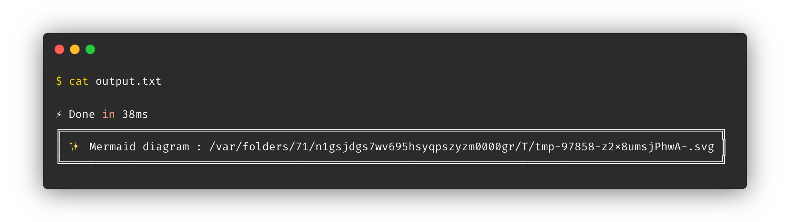
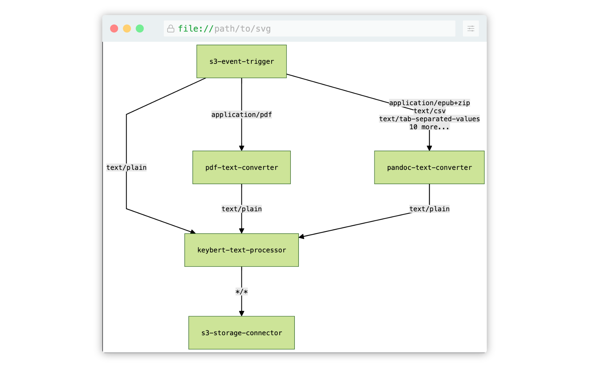

In Lakechain, there is no control plane API in the traditional sense (e.g REST or GraphQL API) that allows to create, mutate and delete pipelines. In fact, the control plane is directly exposed as Infrastructure as Code using the AWS CDK. This enables developers to use the flexibility of a programming language like TypeScript to author pipelines, while being able to implement versioned, auditable and repeatable infrastructure.

## 🧑‍🍳 API Cookbook

All middlewares inherit the [Middleware](https://github.com/awslabs/project-lakechain/blob/main/packages/core/src/middleware.ts) class part of *Lakechain Core*. This class exposes high-level methods usable by developers and implemented by each middleware. In this section, we describe how to instantiate a typical middleware, and the common methods made available by the Middleware API.

### Instantiation

Below is a minimalistic example of how to instantiate an example middleware.

```typescript
import { ExampleMiddleware } from 'example-middleware';
import { CacheStorage } from '@project-lakechain/core';

class Stack extends cdk.Stack {
  constructor(scope: cdk.Construct, id: string) {
    const cache = new CacheStorage(this, 'Cache');

    // Create the middleware.
    const middleware = new ExampleMiddleware.Builder()
      .withScope(this)
      .withIdentifier('Example')
      .withCacheStorage(cache)
      .build();
  }
}
```

In its most basic form, a middleware requires at least three components.

- A CDK *scope* used to create the middleware resources.
- A string *identifier* used to identify the middleware.
- A *cache storage* used to share data between middlewares.

<br>

---

### Source & Destination

As described in the [architecture](/project-lakechain/guides/architecture) section, middlewares can consume documents from other middlewares in a pipeline. Similarly, they produce documents that can be consumed by other middlewares.

In the below example, we show how to connect 2 middlewares together in a sequential manner. This means that whenever `A` produces a document, `B` will receive it as input.

```typescript
const A = new MiddlewareA.Builder()
  .withScope(this)
  .withIdentifier('A')
  .withCacheStorage(cache)
  .build();

const B = new MiddlewareB.Builder()
  .withScope(this)
  .withIdentifier('B')
  .withCacheStorage(cache)
  .withSource(A)
  .build();
```

> ℹ️ You can also connect multiple middlewares to the same destination using `.withSources`.

```typescript
const A = //...
const B = //...

const C = new MiddlewareC.Builder()
  .withScope(this)
  .withIdentifier('C')
  .withCacheStorage(cache)
  .withSources([ A, B ])
  .build();
```

The `.withSource` API provides a simple but very powerful way to express the most complex pipelines and middleware relationships.

<br>

---

### Pipe API

Another way to connect middlewares together is to use the `.pipe` API. This API makes it more convenient to connect middlewares parts of a sequential pipeline, and draws its inspiration from the [Node.js Stream API](https://nodejs.org/api/stream.html).

> ℹ️ For complex pipelines involving maps, and branches, it is advised to use the `.withSource` API.

```typescript
const A = //...
const B = //...
const C = //...

A.pipe(B).pipe(C);
```

<br>

---

### Filters

The Middleware API exposes a built-in filtering API that can be applied on a middleware connection. The filtering API makes it possible to describe a condition that gets compiled at deployment time into an [SNS filtering](https://docs.aws.amazon.com/sns/latest/dg/sns-message-filtering.html) rule. Use filters to filter documents coming from another middleware.

> ℹ️ The below example keeps only documents that have a size inferior to 1MB.

```typescript
import { when } from '@project-lakechain/core/dsl/vocabulary/conditions';

const A = // ...

const B = new MiddlewareB.Builder()
  .withScope(this)
  .withIdentifier('B')
  .withCacheStorage(cache)
  .withSource(A, when('data.document.size').lt(1024 * 1024))
  .build();
```

Filters can be expressed with the `when` API, and are applied on the structure of the input [CloudEvent](/project-lakechain/general/events) document using different operators such as `lt`, `gt`, `lte`, `gte`, `equals`, `includes` and `startsWith`.

You can also combine multiple filters using `and` statements.

> ℹ️ The below example keeps only images that have a size superior to 1MB, and a width equals to 1920px.

```typescript
import { when } from '@project-lakechain/core/dsl';

// The filtering statement.
const filter = when('data.document.size')
  .gt(1024 * 1024)
  .and(
    when('data.metadata.properties.attrs.dimensions.width').equals(1920)
  );

const B = new MiddlewareB.Builder()
  .withScope(this)
  .withIdentifier('B')
  .withCacheStorage(cache)
  .withSource(A, filter)
  .build();
```

> ℹ️ `or` statements are not supported yet.

If you need to express more complex conditions, that also applies on the content of the document, see the [Condition](/project-lakechain/flow-control/condition) middleware.

<br>

---

### Compute Types

Some middlewares support running their processing jobs on different types of compute. Using the `.withComputeType` API, you can specify the type of compute (CPU, GPU, ACCELERATOR) that you want the middleware to run on.

> ℹ️ Note that middlewares use the most efficient (cost vs. performance) compute by default. If a middleware does not support the given compute type, an exception will be thrown at deployment time.

```typescript
import { ComputeType } from '@project-lakechain/core/compute-type';

const middleware = new ExampleMiddleware.Builder()
  .withScope(this)
  .withIdentifier('Example')
  .withCacheStorage(cache)
  .withComputeType(ComputeType.GPU)
  .build();
```

<br>

---

### Retries

When documents are being processed, errors may arise for various reasons. You can control the maximum amount of times a middleware should retry processing a document from its input queue using the `.withMaxRetry` API.

> ℹ️ The default number of retries is set to 5. If a middleware fails to process a document past that threshold, the document will be moved to the middleware dead-letter queue.

```typescript
const middleware = new ExampleMiddleware.Builder()
  .withScope(this)
  .withIdentifier('Example')
  .withCacheStorage(cache)
  .withMaxRetry(3)
  .build();
```

<br>

---

### Batch Size

You can control the maximum amount of documents a given middleware can process in a single execution. This gives developers a certain level of control over the performance of middlewares.

> ℹ️ Note that this is only a hint that a middleware may choose to ignore given its implementation details.

```typescript
const middleware = new ExampleMiddleware.Builder()
  .withScope(this)
  .withIdentifier('Example')
  .withCacheStorage(cache)
  .withBatchSize(10)
  .build();
```

<br>

---

### Batching Window

A batching window represents the amount of time a middleware can wait before pulling documents from its input queue. This is used by some middlewares to optimize the cost of running compute instances by batching as many documents as possible in a single execution.

> ℹ️ Note that this is only a hint that a middleware may choose to ignore given its implementation details.

```typescript
import * as cdk from 'aws-cdk-lib';

const middleware = new ExampleMiddleware.Builder()
  .withScope(this)
  .withIdentifier('Example')
  .withCacheStorage(cache)
  .withBatchingWindow(cdk.Duration.minutes(5))
  .build();
```
<br>

---

### Concurrency

Some middlewares do apply a concurrency limit to the number of documents that they consume from their input queue to implement a throttling mechanism. This is especially useful if they invoke external services that have a limited throughput. You can use the `.withMaxConcurrency` API to tune the performance of a middleware by either increasing or lowering this value.

> 💁 Note that middlewares already use an optimized concurrency limit by default, or no concurrency limit at all, depending on the nature of their processing logic.

```typescript
const middleware = new ExampleMiddleware.Builder()
  .withScope(this)
  .withIdentifier('Example')
  .withCacheStorage(cache)
  .withMaxConcurrency(10)
  .build();
```

<br>

---

### CloudWatch Insights

You can enable additional insights for a given middleware to monitor its performance. In practice, this means that middlewares based on AWS Lambda will use Lambda Insights, and middlewares based on AWS ECS will use Container Insights.

> ℹ️ This option is turned off by default as it comes with additional costs.

```typescript
const middleware = new ExampleMiddleware.Builder()
  .withScope(this)
  .withIdentifier('Example')
  .withCacheStorage(cache)
  .withCloudWatchInsights(true)
  .build();
```

<br>

---

### Log Retention

Every middleware in a pipeline is integrated with AWS CloudWatch Logs. You can control the duration of the log retention for each middleware using the `.withLogRetention` API. This can come in handy to reduce costs, or meet compliance requirements.

> ℹ️ The default log retention is set to 7 days.

```typescript
import * as logs from 'aws-cdk-lib/aws-logs';

const middleware = new ExampleMiddleware.Builder()
  .withScope(this)
  .withIdentifier('Example')
  .withCacheStorage(cache)
  .withLogRetention(logs.RetentionDays.ONE_DAY)
  .build();
```

<br>

---

### Memory Size

You can manually tweak the maximum amount of memory (in MB) that a middleware can use to process a document. This could be lowering this value to reduce costs, or increasing it to improve performance.

> ℹ️ Note that this is only a hint that a middleware may choose to ignore given its implementation details.

```typescript
const middleware = new ExampleMiddleware.Builder()
  .withScope(this)
  .withIdentifier('Example')
  .withCacheStorage(cache)
  .withMemorySize(1024)
  .build();
```

<br>

---

### Metrics

You can retrieve important CloudWatch metrics related to a given middleware. There are 5 metrics made available by the Middleware API.

```typescript
const middleware = new ExampleMiddleware.Builder()
  .withScope(this)
  .withIdentifier('Example')
  .withCacheStorage(cache)
  .build();

// Represents the number of messages currently
// being processed by the middleware.
const inFlightMessages = middleware.metricInFlightMessages();

// Represents the number of messages that have failed to be processed
// and stored in the dead-letter queue.
const deadLetterQueueMessages = middleware.metricDeadLetterQueueMessages();

// Represents the number of messages that have
// been published to other middlewares.
const publishedMessages = middleware.metricPublishedMessages();

// Represents the number of messages that have
// been successfully delivered to other middlewares.
const deliveredMessages = middleware.metricDeliveredMessages();

// Represents the number of messages that have
// failed to be delivered to other middlewares.
const failedMessages = middleware.metricFailedMessages();
```

<br>

---

### Permissions

Each middleware implements the CDK `IGrantable` interface and can be granted IAM permissions by other constructs. Similarly, each middleware can also grant IAM permissions to other `IGrantable` constructs. In the below example we show how to explicitly grant a middleware read-only access to an S3 bucket.

```typescript
import * as s3 from 'aws-cdk-lib/aws-s3';

// Sample bucket.
const bucket = new s3.Bucket(this, 'Bucket');

// Example middleware.
const middleware = new ExampleMiddleware.Builder()
  .withScope(this)
  .withIdentifier('Example')
  .withCacheStorage(cache)
  .build();

// Grant the middleware read-only access to the S3 bucket.
bucket.grantRead(middleware);
```

In the below example, we show how we can provide a Lambda function that is external to a pipeline, read-only access to the documents processed by a middleware.

```typescript
import * as lambda from 'aws-cdk-lib/aws-lambda';

// Sample Lambda function.
const fn = new lambda.Function(this, 'Function', { ... });

// Example middleware.
const middleware = new ExampleMiddleware.Builder()
  .withScope(this)
  .withIdentifier('Example')
  .withCacheStorage(cache)
  .build();

// Grant the Lambda function read-only access to the documents processed by
// the middleware.
middleware.grantReadProcessedDocuments(fn);
```

<br>

---

### Encryption

By default, Lakechain uses AWS managed keys for encryption at rest, and encryption in-transit provided by AWS services. Customers can also provide their own [Customer Managed Keys (CMK)](https://docs.aws.amazon.com/kms/latest/developerguide/concepts.html#customer-cmk) to encrypt data at rest and create end-to-end encrypted pipelines.

> 💁 See the [Encryption Security Model](/project-lakechain/guides/security-model#-encryption) for more information.

You can use the `.withKmsKey` API to provide a CMK to a middleware.

```typescript
import * as kms from 'aws-cdk-lib/aws-kms';

// Sample KMS key.
const key = new kms.Key(this, 'Key');

// Example middleware.
const middleware = new ExampleMiddleware.Builder()
  .withScope(this)
  .withIdentifier('Example')
  .withCacheStorage(cache)
  .withKmsKey(key)
  .build();
```

<br>

---

### Events

Each middleware emit events at deploy-time that can be captured whenever a producer or a consumer is connected to it. You can capture these events in your code using the event emitter API.

> 💁 Note that those events are triggered at deploy time, they are not runtime events.

```typescript
// Listen to producers being added to the middleware.
middleware.on('producer-added', (producer: Middleware) => {
  // ...
});

// Listen to consumers being added to the middleware.
middleware.on('consumer-added', (consumer: Middleware) => {
  // ...
});

// This will trigger the `consumer-added` event.
middleware.pipe(consumer);

// This will trigger the `producer-added` event.
producer.pipe(middleware);
```

<br>

---

### VPC

Some middlewares require a VPC to run (such as those based on ECS), while others, based on AWS Lambda do not. You specify a VPC to be used by a middleware by using the `withVpc` API.

```typescript
const middleware = new ExampleMiddleware.Builder()
  .withScope(this)
  .withIdentifier('Example')
  .withCacheStorage(cache)
  .withVpc(vpc)
  .build();
```

> 💁 Customers having strong security and compliance requirements can also pass a VPC instance to middlewares (including those based on AWS Lambda) that are configured with specific VPC Endpoints. For more information please read our [Using VPC Endpoints](/project-lakechain/guides/security-model#-vpc-endpoints) guide.

<br>

---

### Visualization

When designing complex pipelines, it is very useful to get a visual representation of the pipeline to ensure it is correct. The Middleware API exposes a `DagRenderer` component making it possible to render a pipeline expressed as code into an SVG graph using the [Mermaid](https://mermaid.js.org/) rendering engine.

> ℹ️ In the below example, we use the `DagRenderer` to render the pipeline into an SVG graph, and save it to a file.

```typescript
import { DagRenderer, MermaidRenderer } from '@project-lakechain/core/renderer';

// Assume we have a pipeline defined as follows.
const A, B, C = // ...

// Create the renderer using the `Mermaid` engine.
const renderer = new DagRenderer({
  engine: new MermaidRenderer()
});

// Render the pipeline into an SVG graph.
renderer.render([ A, B, C ]);
```

The link to the generated SVG file is written on `stderr` and can be captured when synthesizing the stack.

```bash
npx cdk synth 2> output.txt
```



The SVG file can be opened in any browser to visualize the pipeline.


