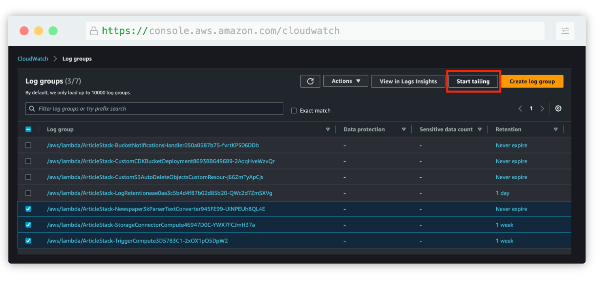
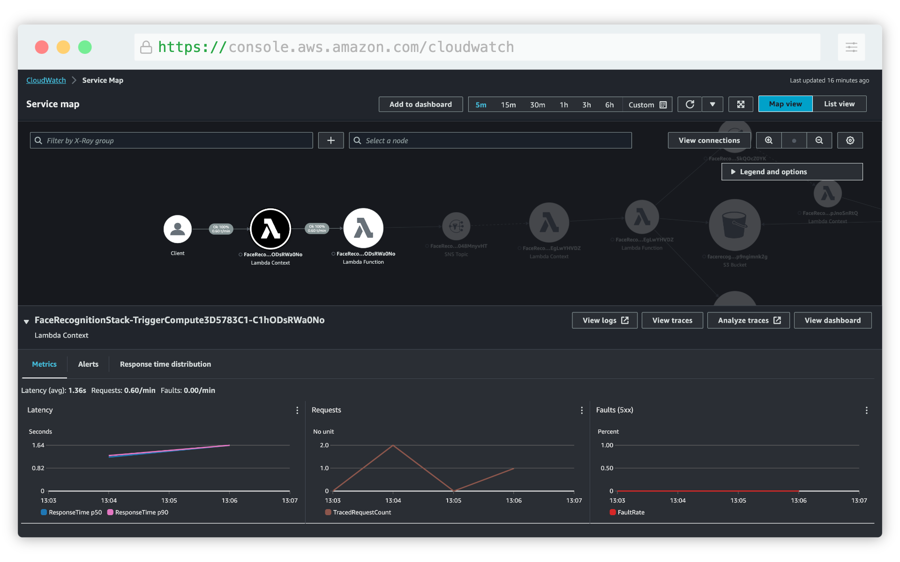
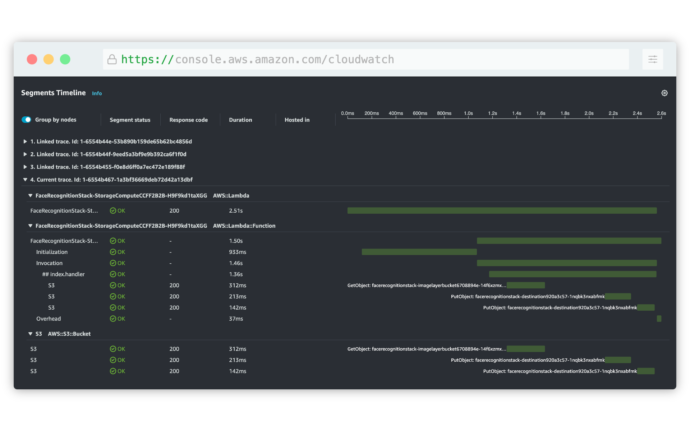

Observability refers to the ability to understand the current state of a system at any time, pinpoint and monitor failures, assess performance, and understand how to fix issues when they arise. Project Lakechain implements *some* observability features that we describe in this section.

### 📄 Structured Logs

Every built-in middleware in Lakechain integrates with the [AWS PowerTools](https://docs.powertools.aws.dev/lambda/python/latest/) library for both TypeScript and Python based middlewares. AWS PowerTools provide middlewares with many capabilities such as the ability to produce [structured logs](https://docs.powertools.aws.dev/lambda/python/latest/core/logger/) automatically sent to AWS CloudWatch Logs.

When running pipelines, we recommend selecting the AWS CloudWatch log groups associated with the running middlewares in the console, and use the [Live Tail](https://docs.aws.amazon.com/AmazonCloudWatch/latest/logs/CloudWatchLogs_LiveTail.html) feature of CloudWatch to monitor the execution of pipelines in real-time.

During a pipeline execution, each middleware's associated compute (Lambda functions, Containers, etc.) will emit structured logs to CloudWatch that you can monitor.

> ℹ️ In Lakechain, you can control the log retention period for each middleware by using the [Middleware API](/guides/api). This helps meet customers compliance, while being able to limit cost.

 

---

### 👓 Tracing

Most middlewares in Lakechain natively integrate with [AWS X-Ray](https://docs.aws.amazon.com/xray/latest/devguide/aws-xray.html) to enable customers to rapidly pinpoint issues in pipelines and identify components that encounter failures.

> ℹ️ AWS X-Ray is a service that collects data about requests that application serves, and provides tools that you can use to view, filter, and gain insights into that data to identify issues and opportunities for optimization.

When running pipelines, you can access the AWS X-Ray console and view the service map associated with your current region in order to monitor each running middleware.

Using X-Ray you can also dive into the traces generated by middleware executions. For example, list latencies associated with method invocations, API calls to AWS services, cold start information for Lambda functions, etc.

---

### 📈 CloudWatch Insights

Lakechain makes it possible to integrate middlewares based on Lambda with [Lambda Insights](https://docs.aws.amazon.com/AmazonCloudWatch/latest/monitoring/Lambda-Insights.html), and middlewares based on Containers with [Container Insights](https://docs.aws.amazon.com/AmazonCloudWatch/latest/monitoring/ContainerInsights.html). These features provide a way to monitor more granularly the performance of your pipelines in real-time, and also to dive into the execution of each middleware.

#### Lambda Insights

With Lambda Insights integration, customers gain more visibility into Lambda system-level metrics, such as CPU time, memory, disk, and network usage. It also collects, aggregates, and summarizes diagnostic information such as cold starts and Lambda worker shutdowns to help you isolate issues with your Lambda functions and resolve them quickly.

#### Container Insights

Container Insights apply to container based middlewares, and provide a similar level of integration as Lambda Insights, featuring system-level metric collection for containers, and performance log events using [embedded metric format](https://docs.aws.amazon.com/AmazonCloudWatch/latest/monitoring/CloudWatch_Embedded_Metric_Format.html).

> ℹ️ CloudWatch Insights are turned off by default. But you can use the [Middleware API](/guides/api) to enable Lambda and Container Insights for each of your middlewares.
