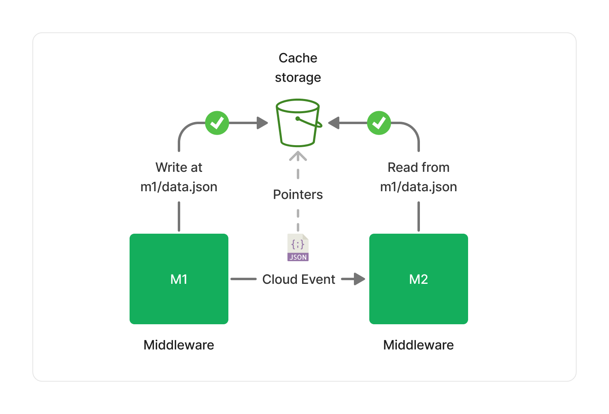
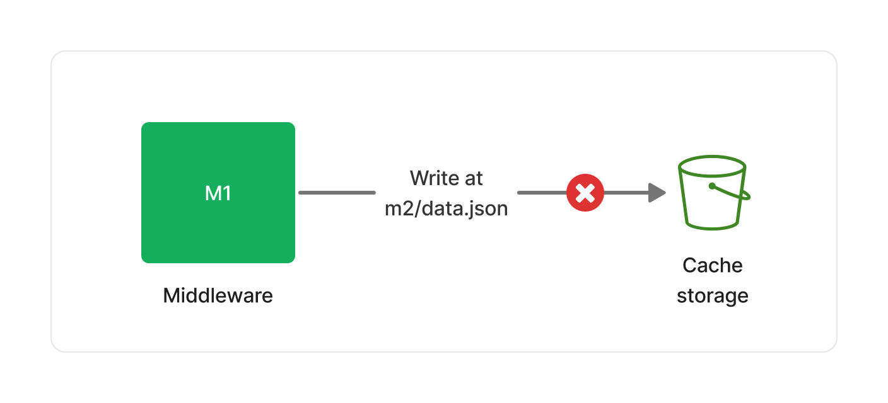

In this section, we describe the security model implemented by the Lakechain framework that applies to any document processing pipeline.

### 👮 Least-Privilege Principle

In Lakechain, middlewares are only granted IAM read access to documents provided by their *immediate predecessors* in the pipeline.

To illustrate how this principle applies in practice, let's take a simple visual example. Below is an illustration of a pipeline composed of 2 middlewares (M1 and M2) triggered by document events from S3. We highlight on the below diagram the IAM grants of each middleware relative to the documents they are processing.


M1 has read-only access to the initial document in the S3 bucket. It can read the document, but not modify it. Similarly, M2 has read-only access to the document produced by M1. However, M2 does **not** have access to the original document in the bucket, nor M1 does have access to documents produced by M2.

<br>

---

#### Cache Access Policy

While middlewares can only access documents provided by their immediate predecessors, they can still share metadata with each other using the Lakechain cache storage. This storage is implemented on top of S3, and is used to store metadata that are too large to fit in a [Cloud Event](/project-lakechain/general/events).

The cache storage is readable by all middlewares in a pipeline. However, each middleware is only given write access to its own specific prefix within the cache storage, and cannot modify or delete metadata produced by other middlewares.

Below is an example of a middleware (M1) storing metadata in the cache storage within its own prefix, and a middleware (M2) reading it.



> 👮 If M1 attempts to write in a different location than its own dedicated prefix, the write operation will fail.



---

### 🔒 Encryption

Lakechain enforces best-practices in terms of encryption for data at rest and in transit. Below is a summary of the encryption models implemented per component.

#### Default Encryption

By default, Lakechain attempts to use AWS managed keys for encryption at rest, and in transit capabilities provided by AWS services. The table below describes the encryption defaults associated with each type of services used by middlewares when no Customer Managed Key (CMK) is provided.

Service       | Encryption at Rest | Encryption in Transit
------------- | ------------------ | ---------------------
SQS           | ✅ SSE-SQS          | ✅ TLS 1.2+
SNS           | ❌ (1)              | ✅ TLS 1.2+
EFS           | ❌ (2)              | ✅ TLS 1.2+
DynamoDB      | ✅ SSE              | ✅ TLS 1.2+
Logs          | ✅ SSE              | ✅ TLS 1.2+
Cache Storage | ✅ SSE-S3           | ✅ TLS 1.2+
Middleware Storage | ✅ SSE-S3       | ✅ TLS 1.2+
Environment Variables | ❌ (3)    | N/A

*(1) SNS does not support default encryption at rest (SSE-SNS) in all AWS regions.*
*(2) EFS does not support encryption with AWS managed keys in all AWS regions.*
*(3) Environment variables in AWS Lambda require a CMK to be encrypted.*

#### CMK Encryption

Lakechain also supports the use of [Customer Managed Keys (CMK)](https://docs.aws.amazon.com/kms/latest/developerguide/concepts.html#customer-cmk) to encrypt data at rest and create end-to-end encrypted pipelines. When a CMK is provided, Lakechain will use it to encrypt data at rest for all services that support CMK encryption.

Service       | Encryption at Rest | Encryption in Transit
------------- | ------------------ | ---------------------
SQS           | ✅ KMS              | ✅ TLS 1.2+
SNS           | ✅ KMS              | ✅ TLS 1.2+
EFS           | ✅ KMS              | ✅ TLS
DynamoDB      | ✅ KMS              | ✅ TLS 1.2+
Logs          | ✅ KMS              | ✅ TLS 1.2+
Cache Storage | ✅ KMS              | ✅ TLS 1.2+
Middleware Storage | ✅ KMS          | ✅ TLS 1.2+
Environment Variables | ✅ KMS       | N/A

<br>

---

### 🚧 VPC Endpoints

Customers with specific security and compliance requirements can place any Lakechain middleware in a customer-provided VPC with the appropriate VPC endpoints, subnets, and route tables configuration to ensure that traffic between the middleware and AWS services does not leave the AWS network.

> 💁 Customers are responsible for configuring their VPC, and can pass an instance of an [`IVpc`](https://docs.aws.amazon.com/cdk/api/v2/docs/aws-cdk-lib.aws_ec2.IVpc.html) to the middleware construct to let it know in which network its compute resources should be placed.

```typescript
const middleware = new ExampleMiddleware.Builder()
  .withScope(this)
  .withIdentifier('Example')
  .withCacheStorage(cache)
  .withVpc(vpc) // 👈 Pass the VPC
  .build();
```

#### Endpoint Types

The VPC endpoints that you need to enable on your VPC depend on the AWS services used by the middlewares in your pipeline. Below is a list of VPC endpoints associated with AWS services commonly used by all middlewares.

Service       | Endpoint Type
------------- | -------------
AWS SQS       | Interface Endpoint
AWS SNS       | Interface Endpoint
AWS CloudWatch Logs | Interface Endpoint
AWS S3        | Interface or Gateway Endpoint

> 💁 Please read the documentation page associated with each middlewares part of your pipeline to understand which AWS service they use and what associated VPC endpoint is required.
