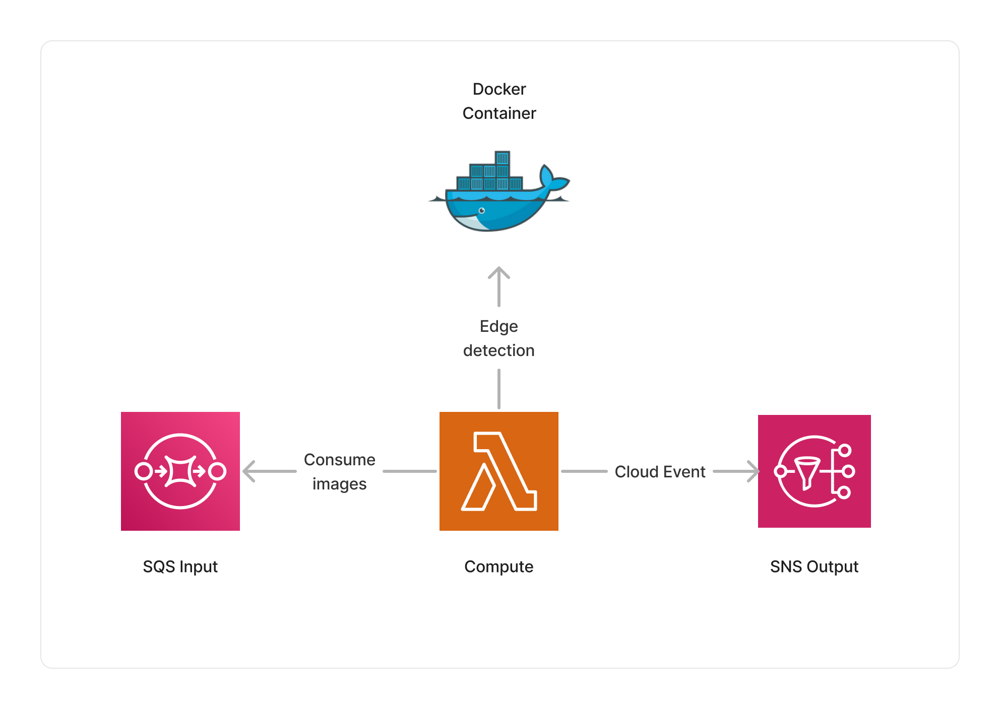

import { Image } from 'astro:assets';
import originalImage from '../../../assets/canny-edge-detector-original.jpg';
import resultImage from '../../../assets/canny-edge-detector-result.png';

<span title="Label: Pro" data-view-component="true" class="Label Label--api text-uppercase">
  Unstable API
</span>
<span title="Label: Pro" data-view-component="true" class="Label Label--version text-uppercase">
  0.7.0
</span>
<span title="Label: Pro" data-view-component="true" class="Label Label--package">
  <a target="_blank" href="https://www.npmjs.com/package/@project-lakechain/canny-edge-detector">
    @project-lakechain/canny-edge-detector
  </a>
</span>
<span class="language-icon">
  <svg role="img" viewBox="0 0 24 24" width="30" xmlns="http://www.w3.org/2000/svg" style="fill: #3178C6;"><title>TypeScript</title><path d="M1.125 0C.502 0 0 .502 0 1.125v21.75C0 23.498.502 24 1.125 24h21.75c.623 0 1.125-.502 1.125-1.125V1.125C24 .502 23.498 0 22.875 0zm17.363 9.75c.612 0 1.154.037 1.627.111a6.38 6.38 0 0 1 1.306.34v2.458a3.95 3.95 0 0 0-.643-.361 5.093 5.093 0 0 0-.717-.26 5.453 5.453 0 0 0-1.426-.2c-.3 0-.573.028-.819.086a2.1 2.1 0 0 0-.623.242c-.17.104-.3.229-.393.374a.888.888 0 0 0-.14.49c0 .196.053.373.156.529.104.156.252.304.443.444s.423.276.696.41c.273.135.582.274.926.416.47.197.892.407 1.266.628.374.222.695.473.963.753.268.279.472.598.614.957.142.359.214.776.214 1.253 0 .657-.125 1.21-.373 1.656a3.033 3.033 0 0 1-1.012 1.085 4.38 4.38 0 0 1-1.487.596c-.566.12-1.163.18-1.79.18a9.916 9.916 0 0 1-1.84-.164 5.544 5.544 0 0 1-1.512-.493v-2.63a5.033 5.033 0 0 0 3.237 1.2c.333 0 .624-.03.872-.09.249-.06.456-.144.623-.25.166-.108.29-.234.373-.38a1.023 1.023 0 0 0-.074-1.089 2.12 2.12 0 0 0-.537-.5 5.597 5.597 0 0 0-.807-.444 27.72 27.72 0 0 0-1.007-.436c-.918-.383-1.602-.852-2.053-1.405-.45-.553-.676-1.222-.676-2.005 0-.614.123-1.141.369-1.582.246-.441.58-.804 1.004-1.089a4.494 4.494 0 0 1 1.47-.629 7.536 7.536 0 0 1 1.77-.201zm-15.113.188h9.563v2.166H9.506v9.646H6.789v-9.646H3.375z"/></svg>
</span>
<div style="margin-top: 26px"></div>

---

The Canny edge detector makes it possible to extract the edges of images using the Canny edge algorithm. 
To do so, it takes images as an input, and produces images with the edges extracted as an output.
This can be very useful for a variety of machine-learning applications, including image conditioning in image generation.

<br />
<p align="center">
  <table style="display: table; margin: auto">
    <tr>
      <th>Original Image</th>
      <th>Result Image</th>
    </tr>
    <tr>
      <td style="padding-top: 0.8em; padding-bottom: 1em">
        <Image width="220" src={originalImage} alt="Original Image" />
      </td>
      <td style="padding-top: 0.8em; padding-bottom: 1em">
        <Image width="220" src={resultImage} alt="Result Image" />
      </td>
    </tr>
  </table>
</p>
<br />

---

### 📏 Edge Extraction

To use this middleware, you import it in your CDK stack and instantiate it as part of a pipeline.

```typescript
import { CannyEdgeDetector } from '@project-lakechain/canny-edge-detector';
import { CacheStorage } from '@project-lakechain/core';

class Stack extends cdk.Stack {
  constructor(scope: cdk.Construct, id: string) {
    const cache = new CacheStorage(this, 'Cache');
    
    // Extracts the edges of images.
    const detector = new CannyEdgeDetector.Builder()
      .withScope(this)
      .withIdentifier('CannyEdgeDetector')
      .withCacheStorage(cache)
      .withSource(source) // 👈 Specify a data source
      .build();
  }
}
```

<br />

---

#### Thresholds

You can customize the lower and upper threshold values of the hysterisis procedure used in the Canny edge detection algorithm.

> 💁 The default values are `100` for the lower threshold and `200` for the upper thresholds.

```typescript
import { CannyEdgeDetector } from '@project-lakechain/canny-edge-detector';

const detector = new CannyEdgeDetector.Builder()
  .withScope(this)
  .withIdentifier('CannyEdgeDetector')
  .withCacheStorage(cache)
  .withSource(source)
  .withLowerThreshold(150)
  .withUpperThreshold(250)
  .build();
```

<br />

---

#### Aperture size

The aperture size represents the size of the Sobel kernel used for edge detection.
You can customize it using the `withApertureSize` API.

> 💁 The default value is set to `3`.

```typescript
import { CannyEdgeDetector } from '@project-lakechain/canny-edge-detector';

const laplacianProcessor = new CannyEdgeDetector.Builder()
  .withScope(this)
  .withIdentifier('LaplacianProcessor')
  .withCacheStorage(cache)
  .withSource(source)
  .withApertureSize(5)
  .build();
```

<br />

---

#### L2 Gradient

The L2 gradient is a boolean value that specifies whether to use the equation for finding gradient magnitude.
You can customize it using the `withL2Gradient` API.

> 💁 The default value is set to `false`.

```typescript
import { CannyEdgeDetector } from '@project-lakechain/canny-edge-detector';

const detector = new CannyEdgeDetector.Builder()
  .withScope(this)
  .withIdentifier('CannyEdgeDetector')
  .withCacheStorage(cache)
  .withSource(source)
  .withL2Gradient(true)
  .build();
```

<br />

---

### 🏗️ Architecture

This middleware runs within a Lambda compute, and packages OpenCV to perform the Canny edge detection.



<br />

---

### 🏷️ Properties

<br />

##### Supported Inputs

|  Mime Type  | Description
| ----------- | -----------
| `image/jpeg` | JPEG image
| `image/png` | PNG image
| `image/bmp` | BMP image
| `image/webp` | WebP image

##### Supported Outputs

|  Mime Type  | Description
| ----------- | -----------
| `image/png` | PNG image

##### Supported Compute Types

| Type  | Description |
| ----- | ----------- |
| `CPU` | This middleware only supports CPU compute. |

<br />

---

### 📖 Examples

- [Canny Edge Detection Pipeline](https://github.com/awslabs/project-lakechain/tree/main/examples/simple-pipelines/image-processing-pipelines/canny-edge-detection-pipeline) - An example showcasing how to perform canny edge detection on images.
