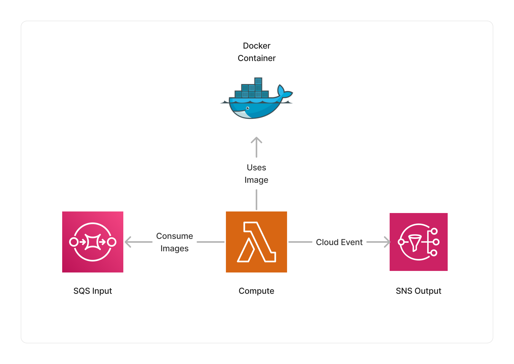

import { Image } from 'astro:assets';
import exampleImage from '../../../assets/image-hashing-example.png';

<span title="Label: Pro" data-view-component="true" class="Label Label--api text-uppercase">
  Unstable API
</span>
<span title="Label: Pro" data-view-component="true" class="Label Label--version text-uppercase">
  0.7.0
</span>
<span title="Label: Pro" data-view-component="true" class="Label Label--package">
  <a target="_blank" href="https://www.npmjs.com/package/@project-lakechain/hashing-image-processor">
    @project-lakechain/hashing-image-processor
  </a>
</span>
<span class="language-icon">
  <svg role="img" viewBox="0 0 24 24" width="30" xmlns="http://www.w3.org/2000/svg" style="fill: #3178C6;"><title>TypeScript</title><path d="M1.125 0C.502 0 0 .502 0 1.125v21.75C0 23.498.502 24 1.125 24h21.75c.623 0 1.125-.502 1.125-1.125V1.125C24 .502 23.498 0 22.875 0zm17.363 9.75c.612 0 1.154.037 1.627.111a6.38 6.38 0 0 1 1.306.34v2.458a3.95 3.95 0 0 0-.643-.361 5.093 5.093 0 0 0-.717-.26 5.453 5.453 0 0 0-1.426-.2c-.3 0-.573.028-.819.086a2.1 2.1 0 0 0-.623.242c-.17.104-.3.229-.393.374a.888.888 0 0 0-.14.49c0 .196.053.373.156.529.104.156.252.304.443.444s.423.276.696.41c.273.135.582.274.926.416.47.197.892.407 1.266.628.374.222.695.473.963.753.268.279.472.598.614.957.142.359.214.776.214 1.253 0 .657-.125 1.21-.373 1.656a3.033 3.033 0 0 1-1.012 1.085 4.38 4.38 0 0 1-1.487.596c-.566.12-1.163.18-1.79.18a9.916 9.916 0 0 1-1.84-.164 5.544 5.544 0 0 1-1.512-.493v-2.63a5.033 5.033 0 0 0 3.237 1.2c.333 0 .624-.03.872-.09.249-.06.456-.144.623-.25.166-.108.29-.234.373-.38a1.023 1.023 0 0 0-.074-1.089 2.12 2.12 0 0 0-.537-.5 5.597 5.597 0 0 0-.807-.444 27.72 27.72 0 0 0-1.007-.436c-.918-.383-1.602-.852-2.053-1.405-.45-.553-.676-1.222-.676-2.005 0-.614.123-1.141.369-1.582.246-.441.58-.804 1.004-1.089a4.494 4.494 0 0 1 1.47-.629 7.536 7.536 0 0 1 1.77-.201zm-15.113.188h9.563v2.166H9.506v9.646H6.789v-9.646H3.375z"/></svg>
</span>
<div style="margin-top: 26px"></div>

---

The hashing image processor makes it possible to enrich the metadata of images with hash values associated with the visual representation of an image.
This middleware supports different hashing algorithms, including [average hashing](https://www.hackerfactor.com/blog/index.php?/archives/432-Looks-Like-It.html), [perceptual hashing](https://en.wikipedia.org/wiki/Perceptual_hashing), [difference hashing](https://github.com/Tom64b/dHash), [wavelet hashing](https://fullstackml.com/wavelet-image-hash-in-python-3504fdd282b5), and color hashing.

Thoses hashing algorithm can be used to compare how different images are from a visual standpoint.
They provide a more computationally efficient way to compare images, compared to vector embeddings which also take into account the semantic aspect of an image.

<br />
<p align="center">
  
</p>

<p align="center" style="font-size: 14px">
  <em>An example using average hashing.</em>
  <br />
  <em>Credits <a href="https://unsplash.com/fr/photos/une-chaise-avec-un-magazine-dessus-6Y4wlHeiGhM#:~:text=Remerciez-,Branislav%20Rodman,-sur%20les%20r%C3%A9seaux">Branislav Rodman</a> on <a href="https://unsplash.com/fr/photos/une-chaise-avec-un-magazine-dessus-6Y4wlHeiGhM">Unsplash</a></em>
</p>
<br />

<br />

---

### #️⃣ Computing Hashes

To use this middleware, you import it in your CDK stack and instantiate it as part of a pipeline.

```typescript
import { HashingImageProcessor } from '@project-lakechain/hashing-image-processor';
import { CacheStorage } from '@project-lakechain/core';

class Stack extends cdk.Stack {
  constructor(scope: cdk.Construct, id: string) {
    const cache = new CacheStorage(this, 'Cache');
    
    // Computes the different image hashes based on all supported algorithms.
    const hashing = new HashingImageProcessor.Builder()
      .withScope(this)
      .withIdentifier('HashingImageProcessor')
      .withCacheStorage(cache)
      .withSource(source) // 👈 Specify a data source
      .build();
  }
}
```

<br />

---

#### Selecting Algorithms

You can explicitely select which hashing algorithm to enable or not when enriching the document metadata with the different types of image hashes.

> 💁 By default, all hashing algorithms are enabled.

```typescript
import { HashingImageProcessor } from '@project-lakechain/hashing-image-processor';

const hashing = new HashingImageProcessor.Builder()
  .withScope(this)
  .withIdentifier('LaplacianProcessor')
  .withCacheStorage(cache)
  .withSource(source)
  // Optionally specify which algorithms to use.
  .withAverageHashing(true)
  .withPerceptualHashing(true)
  .withDifferenceHashing(false)
  .withWaveletHashing(false)
  .withColorHashing(false)
  .build();
```

<br />

---

### 📄 Output

The Hashing image processor does not modify or alter source images in any way. It instead enriches the metadata of processed documents by setting the hash values associated with each of the enabled hashing algorithms.

<details>
  <summary>💁 Click to expand example</summary>
  
  > ℹ️ Below is an example of a [CloudEvent](/project-lakechain/general/events) emitted by the Hashing image processor.

  ```json
  {
    "specversion": "1.0",
    "id": "1780d5de-fd6f-4530-98d7-82ebee85ea39",
    "type": "document-created",
    "time": "2023-10-22T13:19:10.657Z",
    "data": {
        "chainId": "6ebf76e4-f70c-440c-98f9-3e3e7eb34c79",
        "source": {
            "url": "s3://bucket/image.png",
            "type": "image/png",
            "size": 245328,
            "etag": "1243cbd6cf145453c8b5519a2ada4779"
        },
        "document": {
            "url": "s3://bucket/image.png",
            "type": "image/png",
            "size": 245328,
            "etag": "1243cbd6cf145453c8b5519a2ada4779"
        },
        "metadata": {
          "properties": {
            "kind": "image",
            "attrs": {
              "hashes": {
                "average": "00077ffbf2fefee0",
                "perceptual": "f53a175d6848d9c4",
                "difference": "1c4ccea3269084c8",
                "wavelet": "000707d1f2fefee0",
                "color": "06e00000040"
              }
            }
          }
        },
        "callStack": []
    }
  }
  ```

</details>

<br />

---

### 🏗️ Architecture

This middleware runs within a Lambda compute, and packages the [`imagehash`](https://github.com/JohannesBuchner/imagehash/tree/master) to compute the Laplacian variance of images.



<br />

---

### 🏷️ Properties

<br />

##### Supported Inputs

|  Mime Type  | Description |
| ----------- | ----------- |
| `image/jpeg` | JPEG image |
| `image/png` | PNG image |
| `image/bmp` | BMP image |
| `image/webp` | WebP image |

##### Supported Outputs

|  Mime Type  | Description |
| ----------- | ----------- |
| `image/jpeg` | JPEG image |
| `image/png` | PNG image |
| `image/bmp` | BMP image |
| `image/webp` | WebP image |

##### Supported Compute Types

| Type  | Description |
| ----- | ----------- |
| `CPU` | This middleware only supports CPU compute. |

<br />

---

### 📖 Examples

- [Image Hashing Pipeline](https://github.com/awslabs/project-lakechain/tree/main/examples/simple-pipelines/image-processing-pipelines/image-hashing-pipeline) - An example showcasing how to compute the hash of images.
