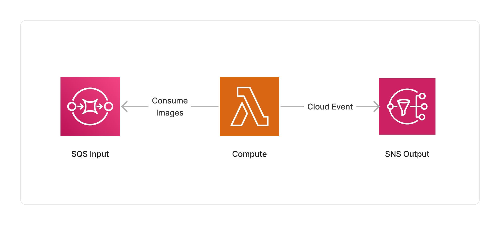

<span title="Label: Pro" data-view-component="true" class="Label Label--api text-uppercase">
  Unstable API
</span>
<span title="Label: Pro" data-view-component="true" class="Label Label--version text-uppercase">
  0.1.0
</span>
<span title="Label: Pro" data-view-component="true" class="Label Label--package">
  @project-lakechain/image-metadata-extractor
</span>
<br>

---

The image metadata extractor enriches document metadata with specific information about input images, such as their dimensions, dominant color, orientation, EXIF tags, and more. Those metadata can then be later used by subsequent middlewares in the pipeline, or stored in a database.

---

### 📷 Extracting Metadata

To use this middleware, you import it in your CDK stack and instantiate it as part of a pipeline.

```typescript
import { ImageMetadataExtractor } from '@project-lakechain/image-metadata-extractor';
import { CacheStorage } from '@project-lakechain/core';

class Stack extends cdk.Stack {
  constructor(scope: cdk.Construct, id: string) {
    const cache = new CacheStorage(this, 'Cache');
    
    // Extracts metadata from images.
    const imageMetadata = new ImageMetadataExtractor.Builder()
      .withScope(this)
      .withIdentifier('ImageMetadata')
      .withCacheStorage(cache)
      .withSource(source) // 👈 Specify a data source
      .build();
  }
}
```

<br>

---

### 📄 Output

The image metadata extraction middleware does not modify or alter source images in any way. It instead enriches the metadata of their document with captured information. Below is an example of metadata captured using this middleware.

<details>
  <summary>💁 Click to expand example</summary>

  ```json
  {
    "specversion": "1.0",
    "id": "1780d5de-fd6f-4530-98d7-82ebee85ea39",
    "type": "document-created",
    "time": "2023-10-22T13:19:10.657Z",
    "data": {
        "chainId": "6ebf76e4-f70c-440c-98f9-3e3e7eb34c79",
        "source": {
            "url": "s3://bucket/image.png",
            "type": "image/png",
            "size": 245328,
            "etag": "1243cbd6cf145453c8b5519a2ada4779"
        },
        "document": {
            "url": "s3://bucket/image.png",
            "type": "image/png",
            "size": 245328,
            "etag": "1243cbd6cf145453c8b5519a2ada4779"
        },
        "metadata": {
          "authors": [
            "John Doe"
          ],
          "title": "A winter in San Francisco",
          "properties": {
            "kind": "image",
            "attrs": {
              "width": 1920,
              "height": 1080,
              "exif": {
                "Make": "Canon",
                "Model": "Canon EOS 5D Mark IV"
              }
            }
          }
        },
        "callStack": []
    }
  }
  ```

</details>

<br>

---

### 🏗️ Architecture

This middleware runs within a Lambda compute based on the ARM64 architecture, and packages different libraries to extract the metadata of images.



<br>

---

### 🏷️ Properties

<br>

##### Supported Inputs

|  Mime Type  | Description |
| ----------- | ----------- |
| `image/gif` | GIF image |
| `image/jpeg` | JPEG image |
| `image/png` | PNG image |
| `image/tiff` | TIFF image |
| `image/webp` | WebP image |
| `image/avif` | AVIF image |

##### Supported Outputs

|  Mime Type  | Description |
| ----------- | ----------- |
| `image/gif` | GIF image |
| `image/jpeg` | JPEG image |
| `image/png` | PNG image |
| `image/tiff` | TIFF image |
| `image/webp` | WebP image |
| `image/avif` | AVIF image |

##### Supported Compute Types

| Type  | Description |
| ----- | ----------- |
| `CPU` | This middleware only supports CPU compute. |

<br>

---

### 📖 Examples

- [Metadata Extraction Pipeline](https://github.com/awslabs/project-lakechain/tree/main/examples/simple-pipelines/metadata-extraction-pipeline) - Builds a simple metadata extraction pipeline.
