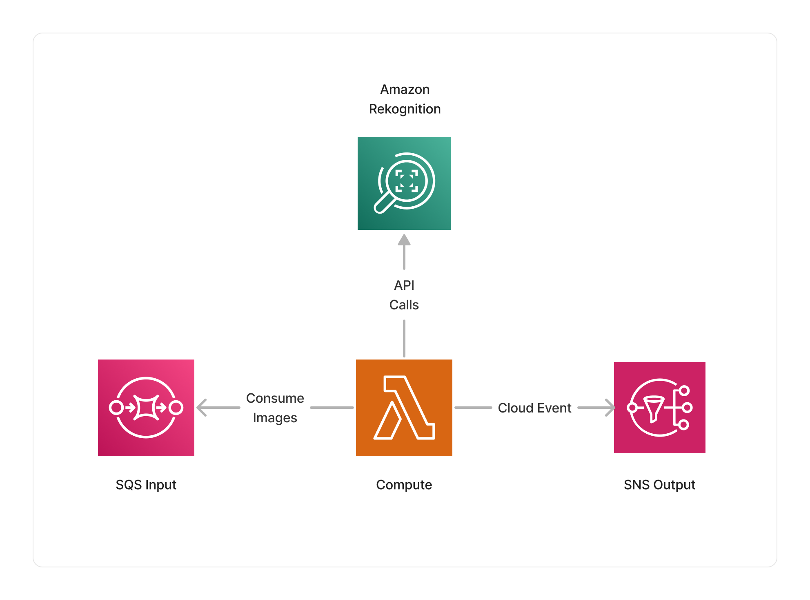

import { Image } from 'astro:assets';
import icon from '../../../assets/icon-rekognition.png';

<span title="Label: Pro" data-view-component="true" class="Label Label--api text-uppercase">
  Unstable API
</span>
<span title="Label: Pro" data-view-component="true" class="Label Label--version text-uppercase">
  0.8.0
</span>
<span title="Label: Pro" data-view-component="true" class="Label Label--package">
  <a target="_blank" href="https://www.npmjs.com/package/@project-lakechain/rekognition-image-processor">
    @project-lakechain/rekognition-image-processor
  </a>
</span>
<span class="language-icon">
  <svg role="img" viewBox="0 0 24 24" width="30" xmlns="http://www.w3.org/2000/svg" style="fill: #3178C6;"><title>TypeScript</title><path d="M1.125 0C.502 0 0 .502 0 1.125v21.75C0 23.498.502 24 1.125 24h21.75c.623 0 1.125-.502 1.125-1.125V1.125C24 .502 23.498 0 22.875 0zm17.363 9.75c.612 0 1.154.037 1.627.111a6.38 6.38 0 0 1 1.306.34v2.458a3.95 3.95 0 0 0-.643-.361 5.093 5.093 0 0 0-.717-.26 5.453 5.453 0 0 0-1.426-.2c-.3 0-.573.028-.819.086a2.1 2.1 0 0 0-.623.242c-.17.104-.3.229-.393.374a.888.888 0 0 0-.14.49c0 .196.053.373.156.529.104.156.252.304.443.444s.423.276.696.41c.273.135.582.274.926.416.47.197.892.407 1.266.628.374.222.695.473.963.753.268.279.472.598.614.957.142.359.214.776.214 1.253 0 .657-.125 1.21-.373 1.656a3.033 3.033 0 0 1-1.012 1.085 4.38 4.38 0 0 1-1.487.596c-.566.12-1.163.18-1.79.18a9.916 9.916 0 0 1-1.84-.164 5.544 5.544 0 0 1-1.512-.493v-2.63a5.033 5.033 0 0 0 3.237 1.2c.333 0 .624-.03.872-.09.249-.06.456-.144.623-.25.166-.108.29-.234.373-.38a1.023 1.023 0 0 0-.074-1.089 2.12 2.12 0 0 0-.537-.5 5.597 5.597 0 0 0-.807-.444 27.72 27.72 0 0 0-1.007-.436c-.918-.383-1.602-.852-2.053-1.405-.45-.553-.676-1.222-.676-2.005 0-.614.123-1.141.369-1.582.246-.441.58-.804 1.004-1.089a4.494 4.494 0 0 1 1.47-.629 7.536 7.536 0 0 1 1.77-.201zm-15.113.188h9.563v2.166H9.506v9.646H6.789v-9.646H3.375z"/></svg>
</span>
<span class="language-icon" style="margin-right: 10px">
  <a target="_blank" href="https://docs.aws.amazon.com/rekognition/latest/dg/what-is.html">
    <Image width="30" src={icon} alt="Icon" style="border-radius: 50%" />
  </a>
</span>
<div style="margin-top: 26px"></div>

---

The Rekognition image processor enables customers to leverage the power of [Amazon Rekognition](https://docs.aws.amazon.com/rekognition/latest/dg/what-is.html) and its computer vision capabilities within their image processing pipelines.
Easily integrate features such as face, object, label, or text detection on your images at scale.

---

### 💡 Intents

To use this middleware, you define an *intent* that specifies the type of processing you want to operate on images. Intents expose a powerful functional API making it easy to describe the Amazon Rekognition capabilities you want to leverage when processing images.

> In the following sections, we will explore several use-cases that demonstrate how to use intents.

<br />

---

#### Detecting Faces

Let's start with a simple example where we use Amazon Rekognition's ability to identify faces in images. In the below example, we define an intent that will extract face information from images and store them within the document metadata.

> 💁 We're using the intent domain-specific language (DSL) to express actions within an intent.

```typescript
import { RekognitionImageProcessor, dsl as r } from '@project-lakechain/rekognition-image-processor';
import { CacheStorage } from '@project-lakechain/core';

class Stack extends cdk.Stack {
  constructor(scope: cdk.Construct, id: string) {
    // The cache storage.
    const cache = new CacheStorage(this, 'Cache');

    // Create the Rekognition image processor.
    const rekognitionProcessor = new RekognitionImageProcessor.Builder()
      .withScope(this)
      .withIdentifier('ImageProcessor')
      .withCacheStorage(cache)
      .withSource(source) // 👈 Specify a data source
      .withIntent(
        r.detect().faces()
      )
      .build();
  }
}
```

> ℹ️ Please note that before using Amazon Rekognition's face detection capabilities, you should read the Amazon Rekognition [Guidelines on Face Attributes](https://docs.aws.amazon.com/rekognition/latest/dg/guidance-face-attributes.html).

<br />

---

#### Detecting Labels

Another powerful feature of Amazon Rekognition is its ability to detect the labels and the objects associated with an image. You can format your intent to identify labels and objects as follows.

```typescript
import { RekognitionImageProcessor, dsl as r } from '@project-lakechain/rekognition-image-processor';

const rekognitionProcessor = new RekognitionImageProcessor.Builder()
  .withScope(this)
  .withIdentifier('ImageProcessor')
  .withCacheStorage(cache)
  .withSource(source)
  .withIntent(
    r.detect().labels()
  )
  .build();
```

<br />

---

#### Detecting Text

Amazon Rekognition can also detect text within images. Format your intent as follows to enable text detection.

```typescript
import { RekognitionImageProcessor, dsl as r } from '@project-lakechain/rekognition-image-processor';

const rekognitionProcessor = new RekognitionImageProcessor.Builder()
  .withScope(this)
  .withIdentifier('ImageProcessor')
  .withCacheStorage(cache)
  .withSource(source)
  .withIntent(
    r.detect().text()
  )
  .build();
```

<br />

---

#### PPE Detection

To detect personal protective equipment (PPE) within images, you can express your intent as follows.

```typescript
import { RekognitionImageProcessor, dsl as r } from '@project-lakechain/rekognition-image-processor';

const rekognitionProcessor = new RekognitionImageProcessor.Builder()
  .withScope(this)
  .withIdentifier('ImageProcessor')
  .withCacheStorage(cache)
  .withSource(source)
  .withIntent(
    r.detect().ppe()
  )
  .build();
```

<br />

---

#### Combining Actions

All actions can be combined within a single intent, and the Rekognition image processor will execute them in the order in which they are defined.

```typescript
import { RekognitionImageProcessor, dsl as r } from '@project-lakechain/rekognition-image-processor';

const rekognitionProcessor = new RekognitionImageProcessor.Builder()
  .withScope(this)
  .withIdentifier('ImageProcessor')
  .withCacheStorage(cache)
  .withSource(source)
  .withIntent(
    r.detect()
      .faces()
      .labels()
      .text()
      .ppe()
  )
  .build();
```

<br />

---

### 📑 Using Filters

Each action within the DSL supports one or more filters that you can apply to it. For example, the `faces` action part of the `detect` verb supports different filters.

> ℹ️ The below example uses the `MinConfidence` filter to detect faces with a confidence level of 90% or higher.

```typescript
import { RekognitionImageProcessor, dsl as r } from '@project-lakechain/rekognition-image-processor';

const rekognitionProcessor = new RekognitionImageProcessor.Builder()
  .withScope(this)
  .withIdentifier('ImageProcessor')
  .withCacheStorage(cache)
  .withSource(source)
  .withIntent(
    r.detect()
      .faces(r.confidence(90))
  )
  .build();
```

<br />

---

#### Chaining Filters

You can also chain multiple filters together to express more complex intent actions.

> ℹ️ The below example detects faces having a confidence of at least 90%, having a `smile` attribute, and limits results to a maximum of 10 faces.

```typescript
import { RekognitionImageProcessor, dsl as r } from '@project-lakechain/rekognition-image-processor';

const rekognitionProcessor = new RekognitionImageProcessor.Builder()
  .withScope(this)
  .withIdentifier('ImageProcessor')
  .withCacheStorage(cache)
  .withSource(source)
  .withIntent(
    r.detect()
      .faces(
        r.confidence(90),
        r.attributes(r.smile()),
        r.limit(10)
      )
  )
  .build();
```

<br />

---

### 🏗️ Architecture

The Rekognition image processor uses AWS Lambda as its compute, using an ARM64 architecture. The Lambda function is integrated with the Amazon Rekognition service, and issues the appropriate API calls to process images given the intent defined by the user.



<br />

---

### 🏷️ Properties

<br />

##### Supported Inputs

|  Mime Type  | Description |
| ----------- | ----------- |
| `image/jpeg` | JPEG images. |
| `image/png` | PNG images. |

##### Supported Outputs

*This middleware supports as outputs the same types as the supported inputs.*

##### Supported Compute Types

| Type  | Description |
| ----- | ----------- |
| `CPU` | This middleware only supports CPU compute. |

<br />

---

### 📖 Examples

- [Face Detection Pipeline](https://github.com/awslabs/project-lakechain/tree/main/examples/simple-pipelines/image-processing-pipelines/face-detection-pipeline) - An example showcasing how to build face detection pipelines using Project Lakechain.
- [Document Indexing Pipeline](https://github.com/awslabs/project-lakechain/tree/main/examples/end-to-end-use-cases/building-a-document-index) - End-to-end document metadata extraction with OpenSearch.
- [Image Moderation Pipeline](https://github.com/awslabs/project-lakechain/tree/main/examples/simple-pipelines/image-processing-pipelines/image-moderation-pipeline) - A pipeline demonstrating how to classify moderated images.
