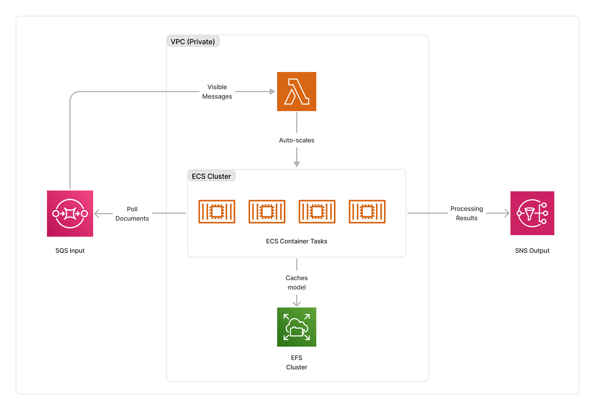

<span title="Label: Pro" data-view-component="true" class="Label Label--api text-uppercase">
  Unstable API
</span>
<span title="Label: Pro" data-view-component="true" class="Label Label--version text-uppercase">
  0.5.0
</span>
<span title="Label: Pro" data-view-component="true" class="Label Label--package">
  <a target="_blank" href="https://www.npmjs.com/package/@project-lakechain/rembg-image-processor">
    @project-lakechain/rembg-image-processor
  </a>
</span>
<span class="language-icon">
  <svg role="img" viewBox="0 0 24 24" width="30" xmlns="http://www.w3.org/2000/svg" style="fill: #3178C6;"><title>TypeScript</title><path d="M1.125 0C.502 0 0 .502 0 1.125v21.75C0 23.498.502 24 1.125 24h21.75c.623 0 1.125-.502 1.125-1.125V1.125C24 .502 23.498 0 22.875 0zm17.363 9.75c.612 0 1.154.037 1.627.111a6.38 6.38 0 0 1 1.306.34v2.458a3.95 3.95 0 0 0-.643-.361 5.093 5.093 0 0 0-.717-.26 5.453 5.453 0 0 0-1.426-.2c-.3 0-.573.028-.819.086a2.1 2.1 0 0 0-.623.242c-.17.104-.3.229-.393.374a.888.888 0 0 0-.14.49c0 .196.053.373.156.529.104.156.252.304.443.444s.423.276.696.41c.273.135.582.274.926.416.47.197.892.407 1.266.628.374.222.695.473.963.753.268.279.472.598.614.957.142.359.214.776.214 1.253 0 .657-.125 1.21-.373 1.656a3.033 3.033 0 0 1-1.012 1.085 4.38 4.38 0 0 1-1.487.596c-.566.12-1.163.18-1.79.18a9.916 9.916 0 0 1-1.84-.164 5.544 5.544 0 0 1-1.512-.493v-2.63a5.033 5.033 0 0 0 3.237 1.2c.333 0 .624-.03.872-.09.249-.06.456-.144.623-.25.166-.108.29-.234.373-.38a1.023 1.023 0 0 0-.074-1.089 2.12 2.12 0 0 0-.537-.5 5.597 5.597 0 0 0-.807-.444 27.72 27.72 0 0 0-1.007-.436c-.918-.383-1.602-.852-2.053-1.405-.45-.553-.676-1.222-.676-2.005 0-.614.123-1.141.369-1.582.246-.441.58-.804 1.004-1.089a4.494 4.494 0 0 1 1.47-.629 7.536 7.536 0 0 1 1.77-.201zm-15.113.188h9.563v2.166H9.506v9.646H6.789v-9.646H3.375z"/></svg>
</span>
<div style="margin-top: 26px"></div>

---

import { Image } from 'astro:assets';
import originalImage from '../../../assets/rembg-original-image.jpg';
import processedImage from '../../../assets/rembg-processed-image.png';

The `RemBg` image processor packages the [RemBg](https://github.com/danielgatis/rembg) algorithm and suite of machine-learning models on AWS for easy background removal on images. This middleware is a good fit when processing images that have a foreground entity you would like to extract from the background.

The algorithm is implemented as different steps which produce a list of binary masks representing the foreground objects in the image, which are then post-processed and combined to create a final cutout image.

<br />
<br />
<p align="center">
  <table style="display: table; margin: auto">
    <tr>
      <th>Original Image</th>
      <th>Processed Image</th>
    </tr>
    <tr>
      <td style="padding-top: 0.8em; padding-bottom: 1em">
        <Image width="260" src={originalImage} alt="Original Image" />
      </td>
      <td style="padding-top: 0.8em; padding-bottom: 1em">
        <Image width="260" src={processedImage} alt="Processed Image" />
      </td>
    </tr>
  </table>
</p>
<p align="center" style="font-size: 12px">
  <em>Credits <a href="https://unsplash.com/fr/photos/cheval-brun-et-blanc-0F9oVQ3x2ak?utm_content=creditShareLink&utm_medium=referral&utm_source=unsplash">Silje Midtgård</a> on <a href="https://unsplash.com/fr/photos/cheval-brun-et-blanc-0F9oVQ3x2ak">Unsplash</a></em>
</p>
<br />
<br />

---

### 🖼️ Removing Backgrounds

To use this middleware, you import it in your CDK stack and connect it to a data source providing images. You also need to specify a VPC in which the middleware will be deployed as it deploys an EFS file-system to cache the models used by `RemBg`.

```typescript
import { RembgImageProcessor } from '@project-lakechain/rembg-image-processor';
import { CacheStorage } from '@project-lakechain/core';

class Stack extends cdk.Stack {
  constructor(scope: cdk.Construct, id: string) {
    // The cache storage.
    const cache = new CacheStorage(this, 'Cache');
    
    // Create the RemBg image processor.
    const processor = new RembgImageProcessor.Builder()
      .withScope(this)
      .withIdentifier('Processor')
      .withCacheStorage(cache)
      .withVpc(vpc)
      .withSource(source) // 👈 Specify a data source
      .build();
  }
}
```

<br />

---

#### Alpha Matting

The `Rembg` algorithm can perform alpha matting on cutout results to improve the quality of the results. This is done by creating a soft transition between the foreground and the background, which can be useful when overlaying the cutout on a different background.

> ⛔ **Important** -  Alpha matting is a memory intensive process. If you use the `CPU` compute type which is the default compute type, an exception will be raised when you enable this option. You will be prompted to manually adjust the maximum memory size to 10GB on a `CPU` compute type using the `.withMaxMemorySize` method. This is because Lambda functions having 10GB of memory have a cost implication, and this is a safety measure to require users to manually adjust the memory size.

##### CPU Example

```typescript
const processor = new RembgImageProcessor.Builder()
  .withScope(this)
  .withIdentifier('Processor')
  .withCacheStorage(cache)
  .withVpc(vpc)
  .withSource(source)
  .withMaxMemorySize(10240) // 👈 Set the memory size to 10GB
  .withAlphaMatting(true) // 👈 Enable alpha matting
  .build();
```

##### GPU Example

> 💁 GPU instances don't have the same memory limitations as Lambda functions. It is safe to keep the default maximum memory size.

```typescript
import { ComputeType } from '@project-lakechain/core';

const processor = new RembgImageProcessor.Builder()
  .withScope(this)
  .withIdentifier('Processor')
  .withCacheStorage(cache)
  .withVpc(vpc)
  .withSource(source)
  .withComputeType(ComputeType.GPU)
  .withAlphaMatting(true) // 👈 Enable alpha matting
  .build();
```

##### Additional Options

Alpha matting supports 3 additional options you can optionally customize when alpha matting is enabled.

- `alphaMattingForegroundThreshold` - Foreground threshold for alpha matting. Defaults to `240`.
- `alphaMattingBackgroundThreshold` - Background threshold for alpha matting. Defaults to `10`.
- `alphaMattingErosionSize` - Erosion size for alpha matting. Defaults to `10`.

> 👇 The example below uses the appropriate methods to customize those values.

```typescript
const processor = new RembgImageProcessor.Builder()
  .withScope(this)
  .withIdentifier('Processor')
  .withCacheStorage(cache)
  .withVpc(vpc)
  .withSource(source)
  .withAlphaMatting(true)
  .withAlphaMattingForegroundThreshold(240)
  .withAlphaMattingBackgroundThreshold(10)
  .withAlphaMattingErosionSize(10)
  .build();
```

<br />

---

#### Post-processing

To further improve the results of the cutout, you can enable mask post-processing on the `Rembg` algorithm for a smooth boundary by applying morphological operations.

> ℹ️ See this [paper](https://www.sciencedirect.com/science/article/pii/S2352914821000757) on the method used for post-processing.

```typescript
const processor = new RembgImageProcessor.Builder()
  .withScope(this)
  .withIdentifier('Processor')
  .withCacheStorage(cache)
  .withVpc(vpc)
  .withSource(source)
  .withMaskPostProcessing(true) // 👈 Enable post-processing
  .build();
```

<br />

---

### 🏗️ Architecture

This middleware supports both `CPU` and `GPU` compute types. We implemented 2 different architectures, one that's GPU based and using ECS, the other which is CPU based and serverless, based on AWS Lambda. You can use the [`.withComputeType`](/project-lakechain/guides/api#compute-types) API to select the compute type you want to use.

> 💁 By default, this implementation will run on the `CPU` compute type.

#### GPU Architecture

The GPU architecture leverages AWS ECS to run the summarization process on [`g4dn.xlarge`](https://aws.amazon.com/ec2/instance-types/g4/) instances. The GPU instance is part of a ECS cluster, and the cluster is part of a VPC, running within its private subnets.



#### CPU Architecture

The CPU architecture leverages AWS Lambda to run the background removal process on serverless compute. The Lambda function runs as part of a VPC and is integrated with AWS EFS to cache the models used by `RemBg`.


<br />

---

### 🏷️ Properties

<br />

##### Supported Inputs

|  Mime Type  | Description |
| ----------- | ----------- |
| `image/jpeg` | JPEG images. |
| `image/png` | PNG images. |

##### Supported Outputs

|  Mime Type  | Description |
| ----------- | ----------- |
| `image/png` | PNG images. |

##### Supported Compute Types

| Type  | Description |
| ----- | ----------- |
| `CPU` | This middleware supports CPU compute. |
| `GPU` | This middleware supports GPU compute. |

<br />

---

### 📖 Examples

- [Image Background Removal](https://github.com/awslabs/project-lakechain/tree/main/examples/simple-pipelines/image-background-removal) - Builds a pipeline demonstrating automatic image background removal using Rembg.
