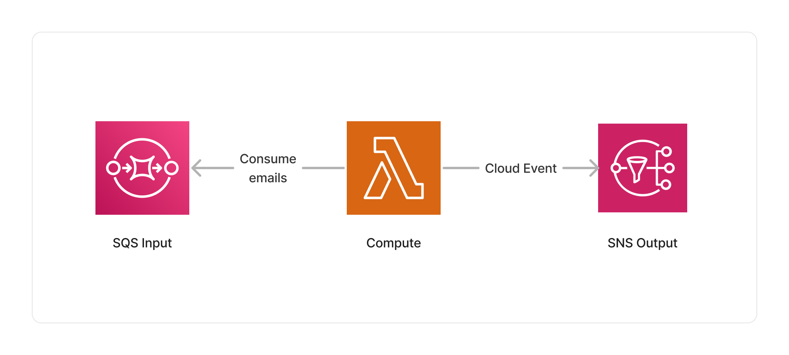

<span title="Label: Pro" data-view-component="true" class="Label Label--api text-uppercase">
  Unstable API
</span>
<span title="Label: Pro" data-view-component="true" class="Label Label--version text-uppercase">
  0.8.0
</span>
<span title="Label: Pro" data-view-component="true" class="Label Label--package">
  <a target="_blank" href="https://www.npmjs.com/package/@project-lakechain/email-text-processor">
    @project-lakechain/email-text-processor
  </a>
</span>
<span class="language-icon">
  <svg role="img" viewBox="0 0 24 24" width="30" xmlns="http://www.w3.org/2000/svg" style="fill: #3178C6;"><title>TypeScript</title><path d="M1.125 0C.502 0 0 .502 0 1.125v21.75C0 23.498.502 24 1.125 24h21.75c.623 0 1.125-.502 1.125-1.125V1.125C24 .502 23.498 0 22.875 0zm17.363 9.75c.612 0 1.154.037 1.627.111a6.38 6.38 0 0 1 1.306.34v2.458a3.95 3.95 0 0 0-.643-.361 5.093 5.093 0 0 0-.717-.26 5.453 5.453 0 0 0-1.426-.2c-.3 0-.573.028-.819.086a2.1 2.1 0 0 0-.623.242c-.17.104-.3.229-.393.374a.888.888 0 0 0-.14.49c0 .196.053.373.156.529.104.156.252.304.443.444s.423.276.696.41c.273.135.582.274.926.416.47.197.892.407 1.266.628.374.222.695.473.963.753.268.279.472.598.614.957.142.359.214.776.214 1.253 0 .657-.125 1.21-.373 1.656a3.033 3.033 0 0 1-1.012 1.085 4.38 4.38 0 0 1-1.487.596c-.566.12-1.163.18-1.79.18a9.916 9.916 0 0 1-1.84-.164 5.544 5.544 0 0 1-1.512-.493v-2.63a5.033 5.033 0 0 0 3.237 1.2c.333 0 .624-.03.872-.09.249-.06.456-.144.623-.25.166-.108.29-.234.373-.38a1.023 1.023 0 0 0-.074-1.089 2.12 2.12 0 0 0-.537-.5 5.597 5.597 0 0 0-.807-.444 27.72 27.72 0 0 0-1.007-.436c-.918-.383-1.602-.852-2.053-1.405-.45-.553-.676-1.222-.676-2.005 0-.614.123-1.141.369-1.582.246-.441.58-.804 1.004-1.089a4.494 4.494 0 0 1 1.47-.629 7.536 7.536 0 0 1 1.77-.201zm-15.113.188h9.563v2.166H9.506v9.646H6.789v-9.646H3.375z"/></svg>
</span>
<div style="margin-top: 26px"></div>

---

The e-mail text processor makes it easy to extract the textual content of e-mail documents and pipe it to other middlewares for further processing. This middleware can extract text, HTML, and structured JSON from e-mail documents. It also optionally supports the extraction of attachments and forwarding them as new documents to other middlewares.

---

### 📨 Parsing E-mails

To use this middleware, you import it in your CDK stack and instantiate it as part of a pipeline.

```typescript
import { EmailTextProcessor } from '@project-lakechain/email-text-processor';
import { CacheStorage } from '@project-lakechain/core';

class Stack extends cdk.Stack {
  constructor(scope: cdk.Construct, id: string) {
    // The cache storage.
    const cache = new CacheStorage(this, 'Cache');
    
    // Create the e-mail text processor.
    const emailProcessor = new EmailTextProcessor.Builder()
      .withScope(this)
      .withIdentifier('EmailProcessor')
      .withCacheStorage(cache)
      .withSource(source) // 👈 Specify a data source
      .build();
  }
}
```

<br>

---

#### Output Formats

The e-mail text processor can extract the following formats from e-mail documents:

- `text`: Extracts only the textual body of the e-mail.
- `html`: Extracts the body of the e-mail as HTML.
- `json`: Extracts the body and the attributes of the e-mail as JSON.

> 💁 You can specify the output format by using the `withFormat` method. By default, the output format is `text`.

```typescript
const emailProcessor = new EmailTextProcessor.Builder()
  .withScope(this)
  .withIdentifier('EmailProcessor')
  .withCacheStorage(cache)
  .withSource(source)
  .withFormat('html') // 👈 Specify the output format
  .build();
```

<br>

---

#### Include Attachments

The e-mail text processor can optionally extract attachments from e-mail documents and forward them as new documents to other middlewares. You can enable the processing of attachments using the `.withIncludeAttachments` API.

```typescript
const emailProcessor = new EmailTextProcessor.Builder()
  .withScope(this)
  .withIdentifier('EmailProcessor')
  .withCacheStorage(cache)
  .withSource(source)
  .withIncludeAttachments(true) // 👈 Enable the processing of attachments
  .build();
```

<br>

---

#### Include Image Links

This middleware supports converting CID attachments to data URL images. You can enable this feature using the `.withIncludeImageLinks` API.

```typescript
const emailProcessor = new EmailTextProcessor.Builder()
  .withScope(this)
  .withIdentifier('EmailProcessor')
  .withCacheStorage(cache)
  .withSource(source)
  .withIncludeImageLinks(true) // 👈 Enable the processing of image links
  .build();
```

<br>

---

### 📄 Metadata

The e-mail text processor transforms input e-mail documents in the desired output format. It also enriches the metadata of documents with different information. Below is an example of the metadata created by this middleware.

<details>
  <summary>💁 Click to expand example</summary>
  
  ```json
  {
    "specversion": "1.0",
    "id": "1780d5de-fd6f-4530-98d7-82ebee85ea39",
    "type": "document-created",
    "time": "2023-10-22T13:19:10.657Z",
    "data": {
      "chainId": "6ebf76e4-f70c-440c-98f9-3e3e7eb34c79",
      "source": {
          "url": "s3://bucket/email.eml",
          "type": "message/rfc822",
          "size": 24532,
          "etag": "1243cbd6cf145453c8b5519a2ada4779"
      },
      "document": {
          "url": "s3://bucket/email.txt",
          "type": "text/plain",
          "size": 125,
          "etag": "1243cbd6cf145453c8b5519a2ada4779"
      },
      "metadata": {
        "title": "Re: Hello World",
        "createdAt": "2023-10-22T13:19:10.657Z",
        "authors": [
          "John Doe"
        ],
        "properties": {
          "kind": "text",
          "attrs": {}
        }
      },
      "callStack": []
    }
  }
  ```

</details>

<br>

---

### 🏗️ Architecture

This middleware is based on a Lambda ARM64 compute, and packages the [`mailparser`](https://www.npmjs.com/package/mailparser) library to parse e-mail documents.



<br>

---

### 🏷️ Properties

<br>

##### Supported Inputs

|  Mime Type  | Description |
| ----------- | ----------- |
| `message/rfc822` | E-mail documents. |
| `application/vnd.ms-outlook` | Outlook e-mail documents. |

##### Supported Outputs

The supported output types for this middleware consist of a variant that depends on whether or not the inclusion of attachments is enabled. If attachments are included, the output type is `*/*` as attachments can consist of any type, otherwise the output type is associated with the defined output format.

| Output Format | With Attachment | Mime Type | Description |
| ------------- | ------------------- | --------- | ----------- |
| `text` | No | `text/plain` | Plain text document. |
| `text` | Yes | `*/*` | Any document. |
| `html` | No | `text/html` | HTML document. |
| `html` | Yes | `*/*` | Any document. |
| `json` | No | `application/json` | JSON document. |
| `json` | Yes | `*/*` | Any document. |

##### Supported Compute Types

| Type  | Description |
| ----- | ----------- |
| `CPU` | This middleware only supports CPU compute. |

<br>

---

### 📖 Examples

- [E-mail NLP Pipeline](https://github.com/awslabs/project-lakechain/tree/main/examples/simple-pipelines/text-processing-pipelines/email-nlp-pipeline/) - An example showcasing how to analyze e-mails.
