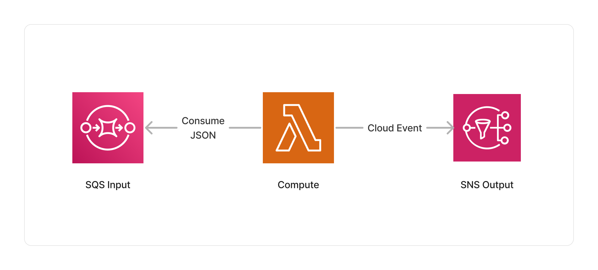

<span title="Label: Pro" data-view-component="true" class="Label Label--api text-uppercase">
  Unstable API
</span>
<span title="Label: Pro" data-view-component="true" class="Label Label--version text-uppercase">
  0.1.0
</span>
<span title="Label: Pro" data-view-component="true" class="Label Label--package">
  @project-lakechain/jmespath-processor
</span>
<br>

---

The JMESPath processor makes it easy to process and transform JSON documents using [JMESPath expressions](https://jmespath.org/). JMESPath is a query language for JSON that allows you to extract and transform elements from JSON documents. This middleware brings the power of JMESPath to your pipelines to apply them at scale.

---

### 🔎 Querying JSON

To use this middleware, you import it in your CDK stack and instantiate it as part of a pipeline.

> 💁 The below example takes JSON documents uploaded into a source S3 bucket, and extracts the `name` field part of an array.

```typescript
import { S3EventTrigger } from '@project-lakechain/s3-event-trigger';
import { JMESPathProcessor } from '@project-lakechain/jmespath-processor';
import { CacheStorage } from '@project-lakechain/core';

class Stack extends cdk.Stack {
  constructor(scope: cdk.Construct, id: string) {
    // The cache storage.
    const cache = new CacheStorage(this, 'Cache');
    
    // Create the S3 event trigger.
    const trigger = new S3EventTrigger.Builder()
      .withScope(this)
      .withIdentifier('Trigger')
      .withCacheStorage(cache)
      .withBucket(bucket)
      .build();
    
    // Apply JMESPath expression on uploaded JSON documents.
    trigger.pipe(new JMESPathProcessor.Builder()
      .withScope(this)
      .withIdentifier('JMESPathProcessor')
      .withCacheStorage(cache)
      .withSource(trigger)
      .withExpression('array[*].name') // 👈 JMESPath expression
      .build());
  }
}
```

<br>

---

### 📄 Output

This middleware applies the given JMESPath expression to each processed JSON document and publishes the output of the expression to the next middlewares in the pipeline.

If the expression returns an object (i.e object literal, array, etc.), the result document will have the `application/json` mime type, otherwise we consider the result as a scalar and its mime type will be `text/plain`.

<br>

---

### 🏗️ Architecture

This middleware is based on a Lambda compute running the JMESPath Node.js library to process JSON documents.



<br>

---

### 🏷️ Properties

<br>

##### Supported Inputs

|  Mime Type  | Description |
| ----------- | ----------- |
| `application/json` | JSON documents. |

##### Supported Outputs

|  Mime Type  | Description |
| ----------- | ----------- |
| `application/json` | JSON documents. |
| `text/plain` | Plain text documents. |

##### Supported Compute Types

| Type  | Description |
| ----- | ----------- |
| `CPU` | This middleware only supports CPU compute. |

<br>

---

### 📖 Examples

- [JMESPath Parsing Pipeline](https://github.com/awslabs/project-lakechain/tree/main/examples/simple-pipelines/jmespath-parsing-pipeline/) - An example showcasing how parse JSON documents at scale.
