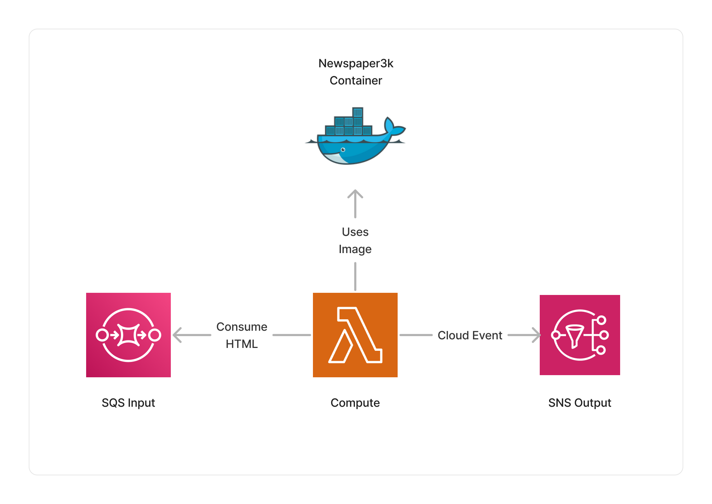

<span title="Label: Pro" data-view-component="true" class="Label Label--api text-uppercase">
  Unstable API
</span>
<span title="Label: Pro" data-view-component="true" class="Label Label--version text-uppercase">
  0.3.4
</span>
<span title="Label: Pro" data-view-component="true" class="Label Label--package">
  @project-lakechain/newspaper3k
</span>
<br>

---

The Newspaper3k middleware is based on the [Newspaper3k](https://newspaper.readthedocs.io/en/latest/) library which provides an NLP model that is optimized for HTML article text extraction. It provides capability to analyze and extract the substance of HTML documents on the Web and use that text as an input to other middlewares in your pipeline.

---

### 📰 Extracting Text

To use this middleware, you import it in your CDK stack and instantiate it as part of a pipeline.

```typescript
import { Newspaper3kParser } from '@project-lakechain/newspaper3k';
import { CacheStorage } from '@project-lakechain/core';

class Stack extends cdk.Stack {
  constructor(scope: cdk.Construct, id: string) {
    // The cache storage.
    const cache = new CacheStorage(this, 'Cache');
    
    // The newspaper3k parser.
    const newspaper3k = new Newspaper3kParser.Builder()
      .withScope(this)
      .withIdentifier('Newspaper3k')
      .withCacheStorage(cache)
      .withSource(source) // 👈 Specify a data source
      .build();
  }
}
```

<br>

---

### 🏗️ Architecture

This middleware is based on a Lambda compute running the Newspaper3k library is packaged as a Docker container.



<br>

---

### 🏷️ Properties

<br>

##### Supported Inputs

|  Mime Type  | Description |
| ----------- | ----------- |
| `text/html` | HTML documents. |

##### Supported Outputs

|  Mime Type  | Description |
| ----------- | ----------- |
| `text/plain` | Plain text documents. |

##### Supported Compute Types

| Type  | Description |
| ----- | ----------- |
| `CPU` | This middleware only supports CPU compute. |

<br>

---

### 📖 Examples

- [Article Curation Pipeline](https://github.com/awslabs/project-lakechain/tree/main/examples/simple-pipelines/article-curation-pipeline/) - Builds a pipeline converting HTML articles into plain text.
