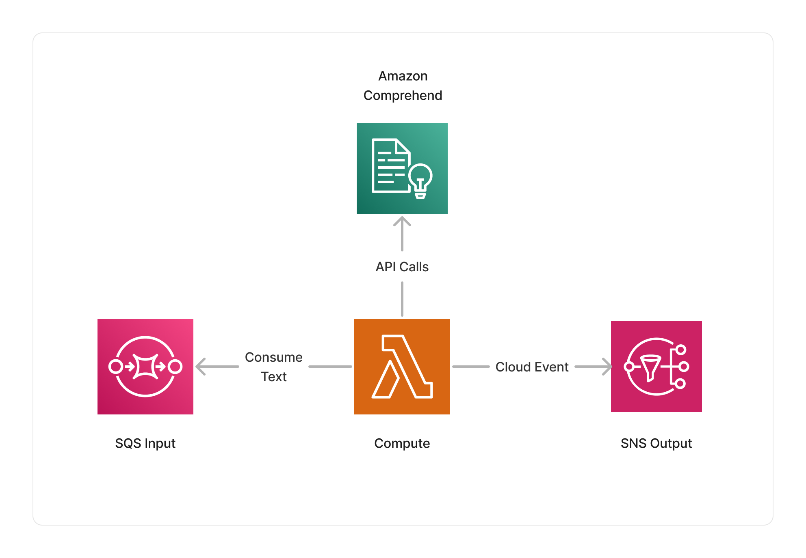

<span title="Label: Pro" data-view-component="true" class="Label Label--api text-uppercase">
  Unstable API
</span>
<span title="Label: Pro" data-view-component="true" class="Label Label--version text-uppercase">
  0.7.0
</span>
<span title="Label: Pro" data-view-component="true" class="Label Label--package">
  <a target="_blank" href="https://www.npmjs.com/package/@project-lakechain/nlp-text-processor">
    @project-lakechain/nlp-text-processor
  </a>
</span>
<span class="language-icon">
  <svg role="img" viewBox="0 0 24 24" width="30" xmlns="http://www.w3.org/2000/svg" style="fill: #3178C6;"><title>TypeScript</title><path d="M1.125 0C.502 0 0 .502 0 1.125v21.75C0 23.498.502 24 1.125 24h21.75c.623 0 1.125-.502 1.125-1.125V1.125C24 .502 23.498 0 22.875 0zm17.363 9.75c.612 0 1.154.037 1.627.111a6.38 6.38 0 0 1 1.306.34v2.458a3.95 3.95 0 0 0-.643-.361 5.093 5.093 0 0 0-.717-.26 5.453 5.453 0 0 0-1.426-.2c-.3 0-.573.028-.819.086a2.1 2.1 0 0 0-.623.242c-.17.104-.3.229-.393.374a.888.888 0 0 0-.14.49c0 .196.053.373.156.529.104.156.252.304.443.444s.423.276.696.41c.273.135.582.274.926.416.47.197.892.407 1.266.628.374.222.695.473.963.753.268.279.472.598.614.957.142.359.214.776.214 1.253 0 .657-.125 1.21-.373 1.656a3.033 3.033 0 0 1-1.012 1.085 4.38 4.38 0 0 1-1.487.596c-.566.12-1.163.18-1.79.18a9.916 9.916 0 0 1-1.84-.164 5.544 5.544 0 0 1-1.512-.493v-2.63a5.033 5.033 0 0 0 3.237 1.2c.333 0 .624-.03.872-.09.249-.06.456-.144.623-.25.166-.108.29-.234.373-.38a1.023 1.023 0 0 0-.074-1.089 2.12 2.12 0 0 0-.537-.5 5.597 5.597 0 0 0-.807-.444 27.72 27.72 0 0 0-1.007-.436c-.918-.383-1.602-.852-2.053-1.405-.45-.553-.676-1.222-.676-2.005 0-.614.123-1.141.369-1.582.246-.441.58-.804 1.004-1.089a4.494 4.494 0 0 1 1.47-.629 7.536 7.536 0 0 1 1.77-.201zm-15.113.188h9.563v2.166H9.506v9.646H6.789v-9.646H3.375z"/></svg>
</span>
<div style="margin-top: 26px"></div>

---

The NLP text processor middleware uses [Amazon Comprehend](https://docs.aws.amazon.com/comprehend/latest/dg/what-is.html) to provide natural language processing (NLP) capabilities to your pipeline. It provides capability to analyze and extract the substance of text documents and use that text as an input to other middlewares in your pipeline. For example, running sentiment analysis, part-of-speech tagging, and named entity recognition on your text documents.

---

### 💡 Intents

To use this middleware, you define an *intent* that specifies the type of processing you want to operate on text. Intents expose a powerful functional API making it easy to describe the processing you want to leverage when processing text documents.

> In the following sections, we will explore several use-cases that demonstrate how to use intents.

<br>

---

#### Language Detection

Let's start with a simple example where we use Amazon Comprehend's ability to detect the language of text documents. In the below example, we define an intent that will extract language information from text documents and store it within the document metadata.

> 💁 We're using the intent domain-specific language (DSL) to express actions within an intent.

```typescript
import { NlpTextProcessor, dsl as l } from '@project-lakechain/nlp-text-processor';
import { CacheStorage } from '@project-lakechain/core';

class Stack extends cdk.Stack {
  constructor(scope: cdk.Construct, id: string) {
    const cache = new CacheStorage(this, 'Cache');

    // Create the NLP text processor.
    const nlpProcessor = new NlpTextProcessor.Builder()
      .withScope(this)
      .withIdentifier('TextProcessor')
      .withCacheStorage(cache)
      .withSource(source)
      .withIntent(
        l.nlp().language() // 👈 Intent
      )
      .build();
  }
}
```

<br>

---

#### Sentiment Analysis

Amazon Comprehend can also be used to [perform sentiment analysis](https://docs.aws.amazon.com/comprehend/latest/dg/how-sentiment.html) on text documents.

> 💁 We're using the `language` intent action before the `sentiment` action as the sentiment action needs to know the language of the document first. We're doing this by chaining both actions together.

```typescript
const nlpProcessor = new NlpTextProcessor.Builder()
  .withScope(this)
  .withIdentifier('TextProcessor')
  .withCacheStorage(cache)
  .withSource(source)
  .withIntent(
    l.nlp().language().sentiment() // 👈 Intent
  )
  .build();
```

<br>

---

#### PII Detection

Amazon Comprehend can [identify personally identifiable information (PII)](https://docs.aws.amazon.com/comprehend/latest/dg/how-pii.html) entities in text documents. You can enable PII detection using the NLP text processor by using the `pii` intent action.

> 💁 We're using the `language` intent action before the `pii` action as the PII action needs to know the language of the document first. We're doing this by chaining both actions together.

```typescript
const nlpProcessor = new NlpTextProcessor.Builder()
  .withScope(this)
  .withIdentifier('TextProcessor')
  .withCacheStorage(cache)
  .withSource(source)
  .withIntent(
    l.nlp().language().pii() // 👈 Intent
  )
  .build();
```

<br>

---

#### Part-of-Speech Tagging

Leveraging Comprehend's ability to [perform part-of-speech tagging](https://docs.aws.amazon.com/comprehend/latest/APIReference/API_PartOfSpeechTag.html) on text documents is as simple as using the `pos` intent action. POS tagging identifies the grammatical parts of speech in a sentence, such as verbs, nouns, adjectives, adverbs, etc.

> 💁 We're using the `language` intent action before the `pos` action as the POS action needs to know the language of the document first. We're doing this by chaining both actions together.

```typescript
const nlpProcessor = new NlpTextProcessor.Builder()
  .withScope(this)
  .withIdentifier('TextProcessor')
  .withCacheStorage(cache)
  .withSource(source)
  .withIntent(
    l.nlp().language().pos() // 👈 Intent
  )
  .build();
```

<br>

---

#### Entity Recognition

To use Amazon Comprehend's [ability to recognize entities](https://docs.aws.amazon.com/comprehend/latest/dg/how-entities.html), such as events, locations, dates, and more, within your text documents, you can use the `entities` intent action.

> 💁 We're using the `language` intent action before the `entities` action as the entities action needs to know the language of the document first. We're doing this by chaining both actions together.

```typescript
const nlpProcessor = new NlpTextProcessor.Builder()
  .withScope(this)
  .withIdentifier('TextProcessor')
  .withCacheStorage(cache)
  .withSource(source)
  .withIntent(
    l.nlp().language().entities() // 👈 Intent
  )
  .build();
```

<br>

---

#### Reading Time

You can use the `readingTime` intent action to calculate the estimated reading time of a text document. The estimated reading time will be stored within the document metadata.

```typescript
const nlpProcessor = new NlpTextProcessor.Builder()
  .withScope(this)
  .withIdentifier('TextProcessor')
  .withCacheStorage(cache)
  .withSource(source)
  .withIntent(
    l.nlp().readingTime() // 👈 Intent
  )
  .build();
```

<br>

---

#### Sentence Tokenization

To tokenize sentences from text documents, you can use the `sentences` intent action. This will reference the tokenized sentences in the document metadata.

```typescript
const nlpProcessor = new NlpTextProcessor.Builder()
  .withScope(this)
  .withIdentifier('TextProcessor')
  .withCacheStorage(cache)
  .withSource(source)
  .withIntent(
    l.nlp().sentences() // 👈 Intent
  )
  .build();
```

<br>

---

#### Statistics

To extract other statistics from text documents, such as the count of the number of sentences and words in the document, you can use the `statistics` intent action.

```typescript
const nlpProcessor = new NlpTextProcessor.Builder()
  .withScope(this)
  .withIdentifier('TextProcessor')
  .withCacheStorage(cache)
  .withSource(source)
  .withIntent(
    l.nlp().statistics() // 👈 Intent
  )
  .build();
```

<br>

---

#### Combining Actions

All actions can be combined within a single intent, and the NLP text processor will execute them in the order in which they are defined.

```typescript
const nlpProcessor = new NlpTextProcessor.Builder()
  .withScope(this)
  .withIdentifier('TextProcessor')
  .withCacheStorage(cache)
  .withSource(source)
  .withIntent(
    l.nlp()
      .language()
      .sentiment()
      .pii()
      .entities()
      .readingTime()
      .sentences()
  )
  .build();
```

<br>

---

### 📑 Using Filters

Each action within the DSL supports one or more filters that you can apply to it. For example, the `pii`, `entities`, and `pos` actions support different filters.

> 💁 The below intent extracts PII with 90% or more confidence, entities associated with `PEOPLE` tags, and part-of-speech tags associated with adjectives and nouns with 90% or more confidence.

```typescript
const nlpProcessor = new NlpTextProcessor.Builder()
  .withScope(this)
  .withIdentifier('TextProcessor')
  .withCacheStorage(cache)
  .withSource(source)
  .withIntent(
    l.nlp()
      .language()
      .pii(l.confidence(0.9))
      .entities(l.filter('PERSON'))
      .pos(l.confidence(0.9), l.filter('ADJ', 'NOUN'))
  )
  .build();
```

<br>

---

### 🏗️ Architecture

The NLP text processor uses AWS Lambda as its compute, using an ARM64 architecture. The Lambda function is integrated with the Amazon Comprehend service, and issues the appropriate API calls to process images given the intent defined by the user.



<br>

---

### 🏷️ Properties

<br>

##### Supported Inputs

|  Mime Type  | Description |
| ----------- | ----------- |
| `text/plain` | This middleware supports plain text as input. |

##### Supported Outputs

|  Mime Type  | Description |
| ----------- | ----------- |
| `text/plain` | This middleware supports plain text as output. |

##### Supported Compute Types

| Type  | Description |
| ----- | ----------- |
| `CPU` | This middleware only supports CPU compute. |

<br>

---

### 📖 Examples

- [NLP Pipeline](https://github.com/awslabs/project-lakechain/tree/main/examples/simple-pipelines/nlp-pipeline) - Builds a pipeline for extracting metadata from text-oriented documents.
- [PII Redaction Pipeline](https://github.com/awslabs/project-lakechain/tree/main/examples/simple-pipelines/pii-redaction-pipeline) - A PII redaction pipeline using Project Lakechain.
