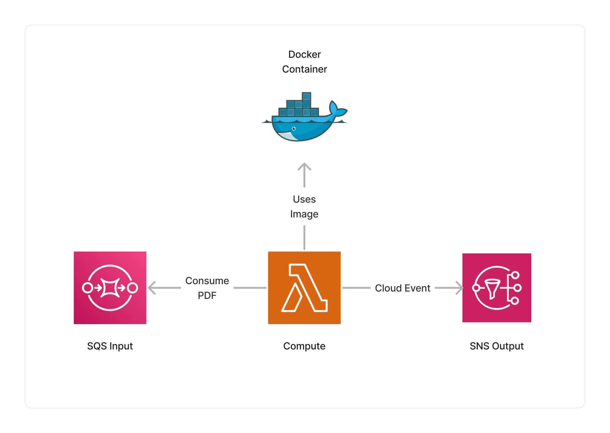

<span title="Label: Pro" data-view-component="true" class="Label Label--api text-uppercase">
  Unstable API
</span>
<span title="Label: Pro" data-view-component="true" class="Label Label--version text-uppercase">
  0.7.0
</span>
<span title="Label: Pro" data-view-component="true" class="Label Label--package">
  <a target="_blank" href="https://www.npmjs.com/package/@project-lakechain/pdf-text-converter">
    @project-lakechain/pdf-text-converter
  </a>
</span>
<span class="language-icon">
  <svg role="img" viewBox="0 0 24 24" width="30" xmlns="http://www.w3.org/2000/svg" style="fill: #3178C6;"><title>TypeScript</title><path d="M1.125 0C.502 0 0 .502 0 1.125v21.75C0 23.498.502 24 1.125 24h21.75c.623 0 1.125-.502 1.125-1.125V1.125C24 .502 23.498 0 22.875 0zm17.363 9.75c.612 0 1.154.037 1.627.111a6.38 6.38 0 0 1 1.306.34v2.458a3.95 3.95 0 0 0-.643-.361 5.093 5.093 0 0 0-.717-.26 5.453 5.453 0 0 0-1.426-.2c-.3 0-.573.028-.819.086a2.1 2.1 0 0 0-.623.242c-.17.104-.3.229-.393.374a.888.888 0 0 0-.14.49c0 .196.053.373.156.529.104.156.252.304.443.444s.423.276.696.41c.273.135.582.274.926.416.47.197.892.407 1.266.628.374.222.695.473.963.753.268.279.472.598.614.957.142.359.214.776.214 1.253 0 .657-.125 1.21-.373 1.656a3.033 3.033 0 0 1-1.012 1.085 4.38 4.38 0 0 1-1.487.596c-.566.12-1.163.18-1.79.18a9.916 9.916 0 0 1-1.84-.164 5.544 5.544 0 0 1-1.512-.493v-2.63a5.033 5.033 0 0 0 3.237 1.2c.333 0 .624-.03.872-.09.249-.06.456-.144.623-.25.166-.108.29-.234.373-.38a1.023 1.023 0 0 0-.074-1.089 2.12 2.12 0 0 0-.537-.5 5.597 5.597 0 0 0-.807-.444 27.72 27.72 0 0 0-1.007-.436c-.918-.383-1.602-.852-2.053-1.405-.45-.553-.676-1.222-.676-2.005 0-.614.123-1.141.369-1.582.246-.441.58-.804 1.004-1.089a4.494 4.494 0 0 1 1.47-.629 7.536 7.536 0 0 1 1.77-.201zm-15.113.188h9.563v2.166H9.506v9.646H6.789v-9.646H3.375z"/></svg>
</span>
<div style="margin-top: 26px"></div>

---

The PDF processor makes it possible to handle PDF documents, and convert them into different formats. This can be helpful when extracting the text substance of PDF documents to analyze them, create vector embeddings, or use them as input to other NLP models.

---

### 🖨️ Converting to Text

To use this middleware, you import it in your CDK stack and instantiate it as part of a pipeline.

> 💁 The below example takes PDF documents uploaded into a source S3 bucket, and converts them to plain text.

```typescript
import { S3EventTrigger } from '@project-lakechain/s3-event-trigger';
import { PdfTextConverter } from '@project-lakechain/pdf-text-converter';
import { CacheStorage } from '@project-lakechain/core';

class Stack extends cdk.Stack {
  constructor(scope: cdk.Construct, id: string) {
    const cache = new CacheStorage(this, 'Cache');
    
    // Create the S3 event trigger.
    const trigger = new S3EventTrigger.Builder()
      .withScope(this)
      .withIdentifier('Trigger')
      .withCacheStorage(cache)
      .withBucket(bucket)
      .build();
    
    // Convert uploaded PDF documents to plain text.
    trigger.pipe(new PdfTextConverter.Builder()
      .withScope(this)
      .withIdentifier('PdfTextConverter')
      .withCacheStorage(cache)
      .withSource(trigger)
      .build());
  }
}
```

<br>

---

#### Converting Documents

The PDF processor makes it possible to specify a specific task to be performed to the middleware. By default, as seen in the previous example, the PDF processor converts the entire document to plain text. However, you can specify a task to convert the document to a different format. Below is a table describing the supported output types for document level.

| Output Type | Description |
| ----------- | ----------- |
| `text` | Convert the entire document to text. |
| `image` | Convert the entire document as a JPEG image. |

> 💁 In the below example, we convert an entire PDF document as a stitched image containing all pages of the document.

```typescript
import { PdfTextConverter, ExtractDocumentTask } from '@project-lakechain/pdf-text-converter';

const pdf = new PdfTextConverter.Builder()
  .withScope(this)
  .withIdentifier('PdfTextConverter')
  .withCacheStorage(cache)
  .withSource(source)
  .withTask(new ExtractDocumentTask.Builder()
    .withOutputType('image') 
    .build()
  )
  .build();
```

<br>

---

#### Layout Detection

The `ExtractDocumentTask` supports layout detection to detect the number of tables and images present across the entire PDF document, these information are added as metadata to the output documents. To enable layout extraction, you use the `withLayoutExtraction` method.

```typescript
import { PdfTextConverter, ExtractDocumentTask } from '@project-lakechain/pdf-text-converter';

const pdf = new PdfTextConverter.Builder()
  .withScope(this)
  .withIdentifier('PdfTextConverter')
  .withCacheStorage(cache)
  .withSource(trigger)
  .withTask(new ExtractDocumentTask.Builder()
    .withOutputType('text')
    .withLayoutExtraction(true) // 👈 Enable layout extraction
    .build()
  )
  .build();
```

<br>

---

### 📄 Extracting Pages

In addition to being able to process an entire PDF document, the PDF processor can act on the *page* level, rather than on the entire document.

> 💁 In the below example we configure the PDF processor to extract each pages from the PDF document as a separate document, and forward each of them to the next middlewares in the pipeline.

```typescript
import { PdfTextConverter, ExtractPagesTask } from '@project-lakechain/pdf-text-converter';

const pdf = new PdfTextConverter.Builder()
  .withScope(this)
  .withIdentifier('PdfTextConverter')
  .withCacheStorage(cache)
  .withSource(trigger)
  .withTask(new ExtractPagesTask.Builder()
    .withOutputType('pdf') 
    .build()
  )
  .build();
```

By using the `ExtractPagesTask`, you can act on a page level and request the middleware to convert each pages to different formats. Below is a table describing the supported output types for each pages.

| Output Type | Description |
| ----------- | ----------- |
| `pdf` | Convert each page to a PDF document. |
| `text` | Convert each page to a plain text document. |
| `image` | Convert each page as a JPEG image. |

<br>

---

#### Layout Detection

The `ExtractPagesTask` supports layout detection to detect the number of tables and images present in each page, these information are added as metadata to the output documents. To enable layout extraction, you use the `withLayoutExtraction` method.

```typescript
import { PdfTextConverter, ExtractPagesTask } from '@project-lakechain/pdf-text-converter';

const pdf = new PdfTextConverter.Builder()
  .withScope(this)
  .withIdentifier('PdfTextConverter')
  .withCacheStorage(cache)
  .withSource(trigger)
  .withTask(new ExtractPagesTask.Builder()
    .withOutputType('pdf')
    .withLayoutExtraction(true) // 👈 Enable layout extraction
    .build()
  )
  .build();
```

<br>

---

### 📝 Parsing Method

Converting the content of PDF documents into plain text is a difficult exercise as the PDF format has been initially designed to be a display format optimized for printing. Therefore, PDFs typically contain vector graphics and text is not stored in a linear fashion.

To optimize the results, the PDF text converter implements a 3-step parsing method that we document below.


The first step is to extract the raw text out of the document using the [`pdfminer.six`](https://pdfminersix.readthedocs.io/en/latest/) library. We then clean the text to remove invalid lines, and run the entire document through Pandoc to leverage its document formatting capabilities.

<br>

---

### 🏗️ Architecture

This middleware is based on a Lambda compute running the `pdfminer.six` library and Pandoc packaged as a Lambda Docker container.



<br>

---

### 🏷️ Properties

<br>

##### Supported Inputs

|  Mime Type  | Description |
| ----------- | ----------- |
| `application/pdf` | PDF documents. |

##### Supported Outputs

|  Mime Type  | Description |
| ----------- | ----------- |
| `text/plain` | Plain text if output type is `text`. |
| `image/jpeg` | JPEG images if output type is `image`. |
| `application/pdf` | PDF documents if output type is `pdf`. |

##### Supported Compute Types

| Type  | Description |
| ----- | ----------- |
| `CPU` | This middleware only supports CPU compute. |

<br>

---

### 📖 Examples

- [Building a RAG Pipeline](https://github.com/awslabs/project-lakechain/tree/main/examples/end-to-end-use-cases/building-a-rag-pipeline/) - End-to-end RAG pipeline using Amazon Bedrock and Amazon OpenSearch.
- [PDF Vision Pipeline](https://github.com/awslabs/project-lakechain/tree/main/examples/simple-pipelines/pdf-vision-pipeline) - A pipeline transcribing PDF documents to text using a vision model.
