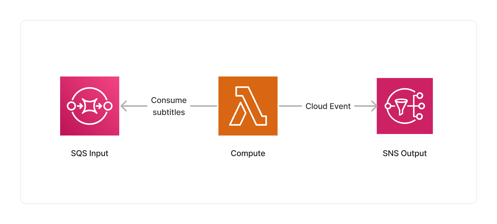

<span title="Label: Pro" data-view-component="true" class="Label Label--api text-uppercase">
  Unstable API
</span>
<span title="Label: Pro" data-view-component="true" class="Label Label--version text-uppercase">
  0.5.0
</span>
<span title="Label: Pro" data-view-component="true" class="Label Label--package">
  <a target="_blank" href="https://www.npmjs.com/package/@project-lakechain/subtitle-processor">
    @project-lakechain/subtitle-processor
  </a>
</span>
<span class="language-icon">
  <svg role="img" viewBox="0 0 24 24" width="30" xmlns="http://www.w3.org/2000/svg" style="fill: #3178C6;"><title>TypeScript</title><path d="M1.125 0C.502 0 0 .502 0 1.125v21.75C0 23.498.502 24 1.125 24h21.75c.623 0 1.125-.502 1.125-1.125V1.125C24 .502 23.498 0 22.875 0zm17.363 9.75c.612 0 1.154.037 1.627.111a6.38 6.38 0 0 1 1.306.34v2.458a3.95 3.95 0 0 0-.643-.361 5.093 5.093 0 0 0-.717-.26 5.453 5.453 0 0 0-1.426-.2c-.3 0-.573.028-.819.086a2.1 2.1 0 0 0-.623.242c-.17.104-.3.229-.393.374a.888.888 0 0 0-.14.49c0 .196.053.373.156.529.104.156.252.304.443.444s.423.276.696.41c.273.135.582.274.926.416.47.197.892.407 1.266.628.374.222.695.473.963.753.268.279.472.598.614.957.142.359.214.776.214 1.253 0 .657-.125 1.21-.373 1.656a3.033 3.033 0 0 1-1.012 1.085 4.38 4.38 0 0 1-1.487.596c-.566.12-1.163.18-1.79.18a9.916 9.916 0 0 1-1.84-.164 5.544 5.544 0 0 1-1.512-.493v-2.63a5.033 5.033 0 0 0 3.237 1.2c.333 0 .624-.03.872-.09.249-.06.456-.144.623-.25.166-.108.29-.234.373-.38a1.023 1.023 0 0 0-.074-1.089 2.12 2.12 0 0 0-.537-.5 5.597 5.597 0 0 0-.807-.444 27.72 27.72 0 0 0-1.007-.436c-.918-.383-1.602-.852-2.053-1.405-.45-.553-.676-1.222-.676-2.005 0-.614.123-1.141.369-1.582.246-.441.58-.804 1.004-1.089a4.494 4.494 0 0 1 1.47-.629 7.536 7.536 0 0 1 1.77-.201zm-15.113.188h9.563v2.166H9.506v9.646H6.789v-9.646H3.375z"/></svg>
</span>
<div style="margin-top: 26px"></div>

---

The Subtitle processor allows to parse subtitles in the [WebVTT](https://en.wikipedia.org/wiki/WebVTT) and [SubRip](https://en.wikipedia.org/wiki/SubRip) formats, and transform them into text or structured data. This allows you to process subtitle documents using other middlewares requiring pure text formats — for example, using the [Translate](/project-lakechain/text-processing/translate-text-processor) middleware to translate subtitles into multiple languages.

It can also be a good choice when you need to format subtitles of various formats into a common JSON description, highlighting the attributes of each text block within the subtitles.

---

### 💬 Parsing Subtitles

To use this middleware, you import it in your CDK stack and instantiate it as part of a pipeline.

```typescript
import { SubtitleProcessor } from '@project-lakechain/subtitle-processor';
import { CacheStorage } from '@project-lakechain/core';

class Stack extends cdk.Stack {
  constructor(scope: cdk.Construct, id: string) {
    const cache = new CacheStorage(this, 'Cache');
    
    // Create the subtitle processor, and define the desired output formats.
    const parser = new SubtitleProcessor.Builder()
      .withScope(this)
      .withIdentifier('SubtitleProcessor')
      .withCacheStorage(cache)
      .withSource(source) // 👈 Specify a data source
      .withOutputFormats('text')
      .build();
  }
}
```

<br>

---

#### Output Formats

You can select the output formats that the subtitle processor will produce for each subtitle document using the `.withOutputFormats` method.

> 💁 If you select more than one output format, the subtitle processor will emit one document per output format. You can select between `text` and `json`.

```typescript
const parser = new SubtitleProcessor.Builder()
  .withScope(this)
  .withIdentifier('SubtitleProcessor')
  .withCacheStorage(cache)
  .withSource(source)
  .withOutputFormats('text', 'json') // 👈 Output formats
  .build();
```

<br>

---

### 📄 Output

The Subtitle processor supports extracting subtitles as plain text, or as structured JSON data. Below are examples of each output format.

#### Plain Text

The plain text format outputs the subtitles as new line separated text blocks, with each new line consisting of the `\r\n\r\n` characters. It is safe to assume that you can isolate each text block by splitting the text on those characters.

<details>
  <summary>💁 Click to expand example</summary>

  ```text
  Welcome, everyone, to our annual gathering. As the clock strikes midnight, let us share our tales, the ones whispered in the shadows, the ones that dance with the stars.

  I shall begin. It was a night much like this, under a crescent moon's embrace, when I ventured beyond the known paths. There, in the heart of the forest, I heard a voice, soft and melancholic, narrating the forest's ancient lore.

  Intriguing, do continue. What did the voice speak of?

  It spoke of ages past, of forgotten civilizations that once flourished beneath these very boughs. It told of joy, of sorrow, and of the eternal cycle that binds us all.
  ```

</details>

#### JSON

The JSON format outputs each text block from the subtitles, as a common JSON description.

<details>
  <summary>💁 Click to expand example</summary>

  ```json
  [
    {
      "id": 1,
      "startTime": "00:00:00.000",
      "startSeconds": 0,
      "endTime": "00:00:10.000",
      "endSeconds": 10.0,
      "text": "Welcome, everyone, to our annual gathering. As the clock strikes midnight, let us share our tales, the ones whispered in the shadows, the ones that dance with the stars."
    },
    {
      "id": 2,
      "startTime": "00:00:10.000",
      "startSeconds": 10.0,
      "endTime": "00:00:20.000",
      "endSeconds": 20.0,
      "text": "I shall begin. It was a night much like this, under a crescent moon's embrace, when I ventured beyond the known paths. There, in the heart of the forest, I heard a voice, soft and melancholic, narrating the forest's ancient lore."
    },
    {
      "id": 3,
      "startTime": "00:00:20.000",
      "startSeconds": 20.0,
      "endTime": "00:00:30.000",
      "endSeconds": 30.0,
      "text": "Intriguing, do continue. What did the voice speak of?"
    },
    {
      "id": 4,
      "startTime": "00:00:30.000",
      "startSeconds": 30.0,
      "endTime": "00:00:40.000",
      "endSeconds": 40.0,
      "text": "It spoke of ages past, of forgotten civilizations that once flourished beneath these very boughs. It told of joy, of sorrow, and of the eternal cycle that binds us all."
    }
  ]
  ```

</details>

<br>

---

### 🏗️ Architecture

This middleware is based on a Lambda compute based on the ARM64 architecture, using the [node-webvtt](https://www.npmjs.com/package/node-webvtt) and [srt-parser-2](https://www.npmjs.com/package/srt-parser-2) libraries to parse WebVTT and SubRip subtitles, respectively.



<br>

---

### 🏷️ Properties

<br>

##### Supported Inputs

|  Mime Type  | Description |
| ----------- | ----------- |
| `text/vtt` | WebVTT subtitles. |
| `text/srt` | SubRip subtitles. |

##### Supported Outputs

|  Mime Type  | Description |
| ----------- | ----------- |
| `text/plain` | Plain text documents. |
| `application/json` | JSON documents. |

##### Supported Compute Types

| Type  | Description |
| ----- | ----------- |
| `CPU` | This middleware only supports CPU compute. |

<br>

---

### 📖 Examples

[Building a Video Subtitling Service](https://github.com/awslabs/project-lakechain/tree/main/examples/end-to-end-use-cases/building-a-video-subtitling-service/) - An example showcasing how to build a video subtitling service using Project Lakechain.
