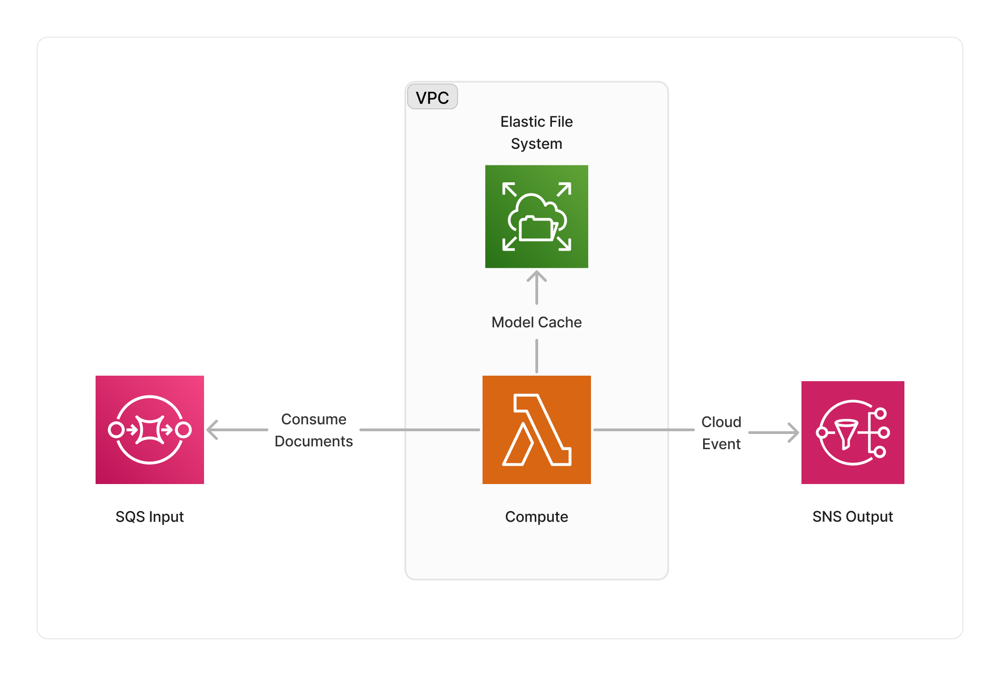

<span title="Label: Pro" data-view-component="true" class="Label Label--api text-uppercase">
  Unstable API
</span>
<span title="Label: Pro" data-view-component="true" class="Label Label--version text-uppercase">
  0.1.4
</span>
<span title="Label: Pro" data-view-component="true" class="Label Label--package">
  @project-lakechain/transformers-text-summarizer
</span>
<br>

---

The Transformers summarizer allows to run [Huggingface summarizer models](https://huggingface.co/models?pipeline_tag=summarization) on AWS performing abstractive summarization on text documents.

> 💁 Abstractive summarization is the task of summarizing a text document by generating a shorter version of it that captures the most important information from the original document. It is different from extractive summarization, which selects passages from the original document to create the summary.

---

### 📝 Summarizing Text

To use this middleware, you import it in your CDK stack and connect it to a data source that provides text documents, such as the [S3 Trigger](/project-lakechain/triggers/s3-event-trigger) if your text documents are stored in S3.

> ℹ️ The below example shows how to create a pipeline that summarizes text documents uploaded to an S3 bucket.

```typescript
import { S3EventTrigger } from '@project-lakechain/s3-event-trigger';
import { TransformersTextSummarizer } from '@project-lakechain/transformers-text-summarizer';
import { CacheStorage } from '@project-lakechain/core';

class Stack extends cdk.Stack {
  constructor(scope: cdk.Construct, id: string) {
    // Sample VPC.
    const vpc = new ec2.Vpc(this, 'VPC', {});

    // The cache storage.
    const cache = new CacheStorage(this, 'Cache');
    
    // Create the S3 event trigger.
    const trigger = new S3EventTrigger.Builder()
      .withScope(this)
      .withIdentifier('Trigger')
      .withCacheStorage(cache)
      .withBucket(bucket)
      .build();
    
    // Summarize uploaded text documents.
    trigger.pipe(new TransformersTextSummarizer.Builder()
      .withScope(this)
      .withIdentifier('TransformersTextSummarizer')
      .withCacheStorage(cache)
      .withSource(trigger)
      .withVpc(vpc)
      .build());
  }
}
```

<br>

---

#### Summarizer Model

By default, this middleware runs the [`facebook/bart-large-cnn`](https://huggingface.co/facebook/bart-large-cnn) summarizer model. You can however customize the summarizer model that is going to be used using the `.withModel` API.

```typescript
import { TransformersTextSummarizer, SummarizationTransformersModel } from '@project-lakechain/transformers-text-summarizer';

const summarizer = new TransformersTextSummarizer.Builder()
  .withScope(this)
  .withIdentifier('TransformersTextSummarizer')
  .withCacheStorage(cache)
  .withSource(source)
  .withVpc(vpc)
  .withModel(
    SummarizationTransformersModel.DISTILBART_CNN_12_6
  )
  .build();
```

<br>

---

#### Escape Hatches

Several HuggingFace models are already referenced in the `SummarizationTransformersModel` class. You can however reference an arbitrary Huggingface model as well.

```typescript
import { TransformersTextSummarizer, SummarizationTransformersModel } from '@project-lakechain/transformers-text-summarizer';

const summarizer = new TransformersTextSummarizer.Builder()
  .withScope(this)
  .withIdentifier('TransformersTextSummarizer')
  .withCacheStorage(cache)
  .withSource(source)
  .withVpc(vpc)
  .withModel(SummarizationTransformersModel.of(
    'google/bigbird-pegasus-large-arxiv'
  ))
  .build();
```

<br>

---

#### Chunk Size

This middleware will automatically split the text documents into chunks of specific size, and will summarize each chunk individually to stay within the attention limits of the summarizer model. You can customize the chunk size that is passed to the summarizer model using the `.withChunkSize` API.

> 💁 The default chunk size is `4000` bytes.

```typescript
import { TransformersTextSummarizer } from '@project-lakechain/transformers-text-summarizer';

const summarizer = new TransformersTextSummarizer.Builder()
  .withScope(this)
  .withIdentifier('TransformersTextSummarizer')
  .withCacheStorage(cache)
  .withSource(source)
  .withVpc(vpc)
  .withChunkSize(512) // 👈 Specify a chunk size
  .build();
```

<br>

---

### 🏗️ Architecture

This middleware supports both `CPU` and `GPU` compute types. We implemented 2 different architectures, one that's GPU based and using ECS, the other which is CPU based and serverless, based on AWS Lambda. You can use the [`.withComputeType`](/project-lakechain/guides/api#compute-types) API to select the compute type you want to use.

> 💁 By default, this implementation will run on the `CPU` compute type.

#### GPU Architecture

The GPU architecture leverages AWS ECS to run the summarization process on [`g4dn.xlarge`](https://aws.amazon.com/ec2/instance-types/g4/) instances. The GPU instance is part of a ECS cluster, and the cluster is part of a VPC, running within its private subnets.


#### CPU Architecture

The CPU architecture leverages AWS Lambda to run the summarization process on serverless compute. The Lambda function runs as part of a VPC and is integrated with AWS EFS to cache the Transformers model(s).



<br>

---

### 🏷️ Properties

<br>

##### Supported Inputs

|  Mime Type  | Description |
| ----------- | ----------- |
| `text/plain` | UTF-8 text documents. |

##### Supported Outputs

|  Mime Type  | Description |
| ----------- | ----------- |
| `text/plain` | UTF-8 text documents. |

##### Supported Compute Types

| Type  | Description |
| ----- | ----------- |
| `CPU` | This middleware supports CPU compute. |
| `GPU` | This middleware supports GPU compute. |

<br>

---

### 📖 Examples

- [Abstractive Summarization Pipeline](https://github.com/awslabs/project-lakechain/tree/main/examples/simple-pipelines/summarization-pipelines/abstractive-summarization-pipeline/) - Builds a pipeline for text summarization using Transformers models.
