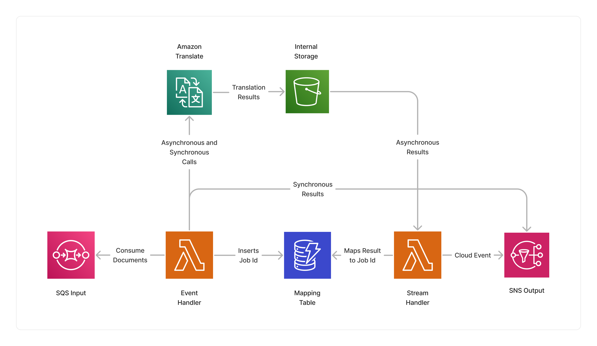

<span title="Label: Pro" data-view-component="true" class="Label Label--api text-uppercase">
  Unstable API
</span>
<span title="Label: Pro" data-view-component="true" class="Label Label--version text-uppercase">
  0.1.0
</span>
<span title="Label: Pro" data-view-component="true" class="Label Label--package">
  @project-lakechain/translate-text-processor
</span>
<br>

---

The Translate text processor makes it possible to asynchronously translate documents from one language to a set of output languages using the [Amazon Translate](https://aws.amazon.com/translate/) service at scale.

This middleware leverages the [batch translation capabilities](https://docs.aws.amazon.com/translate/latest/dg/async.html) of Amazon Translate to translate documents. Batch translations are slower than synchronous translations, but support larger documents and formats. This middleware can translate `.txt`, `.html`, `.docx`, `.pptx`, `.xlsx`, and `.xliff` documents.

---

### 💬 Translating Documents

To use this middleware, you import it in your CDK stack and instantiate it as part of a pipeline.

> 💁 The below example takes supported input document uploaded into a source S3 bucket, and translates them to French and Spanish.

```typescript
import { S3EventTrigger } from '@project-lakechain/s3-event-trigger';
import { TranslateTextProcessor } from '@project-lakechain/translate-text-processor';
import { CacheStorage } from '@project-lakechain/core';

class Stack extends cdk.Stack {
  constructor(scope: cdk.Construct, id: string) {
    // The cache storage.
    const cache = new CacheStorage(this, 'Cache');
    
    // Create the S3 event trigger.
    const trigger = new S3EventTrigger.Builder()
      .withScope(this)
      .withIdentifier('Trigger')
      .withCacheStorage(cache)
      .withBucket(bucket)
      .build();
    
    // Translate uploaded text documents.
    trigger.pipe(new TranslateTextProcessor.Builder()
      .withScope(this)
      .withIdentifier('TranslateTextProcessor')
      .withCacheStorage(cache)
      .withSource(trigger)
      .withOutputLanguages(['fr', 'es'])
      .build());
  }
}
```

<br>

---

#### Profanity Detection

Amazon Translate supports [masking profane words and sentences](https://docs.aws.amazon.com/translate/latest/dg/customizing-translations-profanity.html) from translation results. To enable profanity detection, you can use the `.withProfanityRedaction` method.

```typescript
const translate = new TranslateTextProcessor.Builder()
  .withScope(this)
  .withIdentifier('TranslateTextProcessor')
  .withCacheStorage(cache)
  .withSource(source)
  .withOutputLanguages(['fr', 'es'])
  .withProfanityRedaction(true) // 👈 Enable profanity detection
  .build();
```

<br>

---

#### Tone Formality

You can also adapt the tone formality of the translation results using the `.withFormality` method across `FORMAL` and `INFORMAL` tones.

```typescript
const translate = new TranslateTextProcessor.Builder()
  .withScope(this)
  .withIdentifier('TranslateTextProcessor')
  .withCacheStorage(cache)
  .withSource(source)
  .withOutputLanguages(['fr', 'es'])
  .withFormalityTone('FORMAL') // 👈 Set the tone formality
  .build();
```

<br>

---

### 🏗️ Architecture

This middleware implements an event-driven architecture leveraging Amazon Translate batch jobs, and runs several Lambda computes based on the ARM64 architecture to orchestrate the translation jobs.

This means that this middleware does not spend time waiting for the translations to be completed, but instead asynchronously keeps tracks of each translation jobs and forwards them to the next middlewares in the pipeline once they are completed.



<br>

---

### 🏷️ Properties

<br>

##### Supported Inputs

|  Mime Type  | Description |
| ----------- | ----------- |
| `text/plain` | Plain text documents. |
| `text/html` | HTML documents. |
| `application/vnd.openxmlformats-officedocument.wordprocessingml.document` | Word documents. |
| `application/vnd.openxmlformats-officedocument.presentationml.presentation` | PowerPoint documents. |
| `application/vnd.openxmlformats-officedocument.spreadsheetml.sheet` | Excel documents. |
| `application/x-xliff+xml` | XLIFF documents. |

##### Supported Outputs

*This middleware supports the same output types as its input types.*

##### Supported Compute Types

| Type  | Description |
| ----- | ----------- |
| `CPU` | This middleware only supports CPU compute. |

<br>

---

### 📖 Examples

- [Text Translation Pipeline](https://github.com/awslabs/project-lakechain/tree/main/examples/simple-pipelines/text-translation-pipeline/) - An example showcasing how to translate documents using Amazon Translate.
