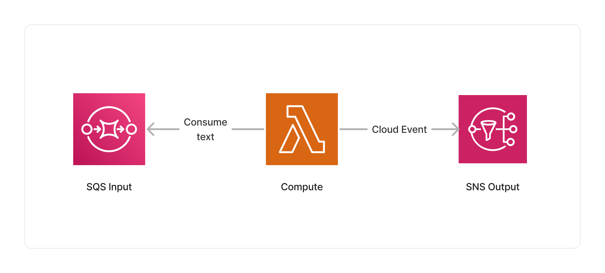

<span title="Label: Pro" data-view-component="true" class="Label Label--api text-uppercase">
  Unstable API
</span>
<span title="Label: Pro" data-view-component="true" class="Label Label--version text-uppercase">
  0.4.0
</span>
<span title="Label: Pro" data-view-component="true" class="Label Label--package">
  @project-lakechain/tiling-text-splitter
</span>
<br>

---

The tiling text splitter can be used to split text documents at scale based on the [NLTK tiling algorithm](https://www.nltk.org/_modules/nltk/tokenize/texttiling.html) which tokenizes a document into topical sections. The algorithm detects subtopic shifts based on the analysis of lexical co-occurrence patterns.

The process starts by tokenizing the text into pseudo-sentences of a fixed size `w`. Then, depending on the method used, similarity scores are assigned at sentence gaps. The algorithm proceeds by detecting the peak differences between these scores and marking them as boundaries. The boundaries are normalized to the closest
paragraph break and the segmented text is returned.

---

### 📝 Splitting Text

To use this middleware, you import it in your CDK stack, and connect it to a data source providing text documents, such as the [S3 Trigger](/project-lakechain/triggers/s3-event-trigger).

```typescript
import { TilingTextSplitter } from '@project-lakechain/tiling-text-splitter';
import { CacheStorage } from '@project-lakechain/core';

class Stack extends cdk.Stack {
  constructor(scope: cdk.Construct, id: string) {
    // The cache storage.
    const cache = new CacheStorage(this, 'Cache');

    // Create the tiling text splitter.
    const splitter = new TilingTextSplitter.Builder()
      .withScope(this)
      .withIdentifier('Splitter')
      .withCacheStorage(cache)
      .withSource(source) // 👈 Specify a data source
      .build();
  }
}
```

<br>

---

#### Options

You can customize the way that the text splitter will split text documents by specifying an optional pseudo sentence size.

> ℹ️ The pseudo sentence size is to `50` by default.

```typescript
const splitter = new TilingTextSplitter.Builder()
  .withScope(this)
  .withIdentifier('Splitter')
  .withCacheStorage(cache)
  .withSource(source)
  .withPseudoSentenceSize(50)
  .build();
```

The default values for this middleware options are documented below.

| Option | Default | Description |
| ------ | ------- | --- |
| `pseudoSentenceSize` | 50 | The size of the pseudo sentences. |

<br>

---

### 📄 Output

This middleware takes as an input text documents of a given size, and outputs *multiple* text documents that are the result of the text splitting process. This allows to process each chunk of text in parallel in downstream middlewares.

In addition to producing new text documents, this middleware also associates metadata with each chunk, such as the chunk identifier and order relative to the original document. Below is an example of `CloudEvent` produced by this middleware.

<details>
  <summary>💁 Click to expand example</summary>

  ```json
  {
    "specversion": "1.0",
    "id": "1780d5de-fd6f-4530-98d7-82ebee85ea39",
    "type": "document-created",
    "time": "2023-10-22T13:19:10.657Z",
    "data": {
        "chainId": "6ebf76e4-f70c-440c-98f9-3e3e7eb34c79",
        "source": {
            "url": "s3://bucket/text.txt",
            "type": "text/plain",
            "size": 24536,
            "etag": "1243cbd6cf145453c8b5519a2ada4779"
        },
        "document": {
            "url": "s3://bucket/text.txt",
            "type": "text/plain",
            "size": 24536,
            "etag": "1243cbd6cf145453c8b5519a2ada4779"
        },
        "metadata": {
          "properties": {
            "kind": "text",
            "attrs": {
              "chunk": {
                "id": "4a5b6c7d8e9fd21dacb",
                "order": 0
              }
            }
          }
        },
        "callStack": []
    }
  }
  ```

</details>

<br>

---

### 🏗️ Architecture

This middleware runs within a Lambda compute based on the ARM64 architecture, and packages the `NLTK` library to run the text splitting process.



<br>

---

### 🏷️ Properties

<br>

##### Supported Inputs

|  Mime Type  | Description |
| ----------- | ----------- |
| `text/plain` | UTF-8 text documents. |

##### Supported Outputs

|  Mime Type  | Description |
| ----------- | ----------- |
| `text/plain` | UTF-8 text documents. |

##### Supported Compute Types

| Type  | Description |
| ----- | ----------- |
| `CPU` | This middleware only supports CPU compute. |

<br>

---

### 📖 Examples

- [Text Splitting Pipeline](https://github.com/awslabs/project-lakechain/tree/main/examples/simple-pipelines/text-splitting-pipeline) - Builds a pipeline for splitting text documents using different text splitting algorithms.
