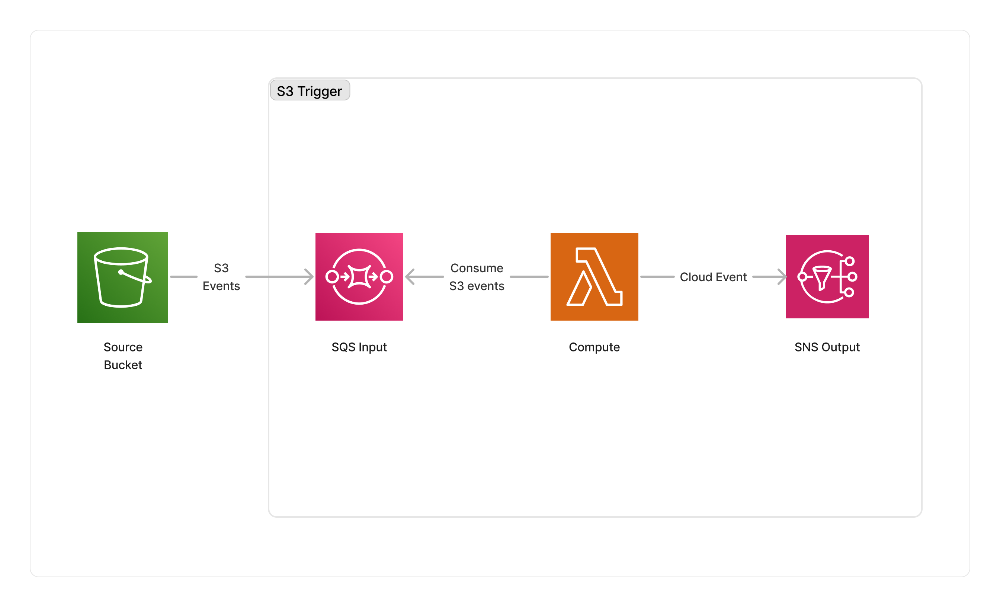

<span title="Label: Pro" data-view-component="true" class="Label Label--api text-uppercase">
  Unstable API
</span>
<span title="Label: Pro" data-view-component="true" class="Label Label--version text-uppercase">
  0.7.0
</span>
<span title="Label: Pro" data-view-component="true" class="Label Label--package">
  <a target="_blank" href="https://www.npmjs.com/package/@project-lakechain/s3-event-trigger">
    @project-lakechain/s3-event-trigger
  </a>
</span>
<span class="language-icon">
  <svg role="img" viewBox="0 0 24 24" width="30" xmlns="http://www.w3.org/2000/svg" style="fill: #3178C6;"><title>TypeScript</title><path d="M1.125 0C.502 0 0 .502 0 1.125v21.75C0 23.498.502 24 1.125 24h21.75c.623 0 1.125-.502 1.125-1.125V1.125C24 .502 23.498 0 22.875 0zm17.363 9.75c.612 0 1.154.037 1.627.111a6.38 6.38 0 0 1 1.306.34v2.458a3.95 3.95 0 0 0-.643-.361 5.093 5.093 0 0 0-.717-.26 5.453 5.453 0 0 0-1.426-.2c-.3 0-.573.028-.819.086a2.1 2.1 0 0 0-.623.242c-.17.104-.3.229-.393.374a.888.888 0 0 0-.14.49c0 .196.053.373.156.529.104.156.252.304.443.444s.423.276.696.41c.273.135.582.274.926.416.47.197.892.407 1.266.628.374.222.695.473.963.753.268.279.472.598.614.957.142.359.214.776.214 1.253 0 .657-.125 1.21-.373 1.656a3.033 3.033 0 0 1-1.012 1.085 4.38 4.38 0 0 1-1.487.596c-.566.12-1.163.18-1.79.18a9.916 9.916 0 0 1-1.84-.164 5.544 5.544 0 0 1-1.512-.493v-2.63a5.033 5.033 0 0 0 3.237 1.2c.333 0 .624-.03.872-.09.249-.06.456-.144.623-.25.166-.108.29-.234.373-.38a1.023 1.023 0 0 0-.074-1.089 2.12 2.12 0 0 0-.537-.5 5.597 5.597 0 0 0-.807-.444 27.72 27.72 0 0 0-1.007-.436c-.918-.383-1.602-.852-2.053-1.405-.45-.553-.676-1.222-.676-2.005 0-.614.123-1.141.369-1.582.246-.441.58-.804 1.004-1.089a4.494 4.494 0 0 1 1.47-.629 7.536 7.536 0 0 1 1.77-.201zm-15.113.188h9.563v2.166H9.506v9.646H6.789v-9.646H3.375z"/></svg>
</span>
<div style="margin-top: 26px"></div>

---

The S3 trigger starts processing pipelines based on [Amazon S3](https://docs.aws.amazon.com/AmazonS3/latest/userguide/Welcome.html) object events. Specifically, it monitors the creation, modification and deletion of objects in monitored bucket(s).

---

### 🪣 Monitoring Buckets

To use this middleware, you import it in your CDK stack and specify the bucket(s) you want to monitor.

> ℹ️ The below example monitors a single bucket.

```typescript
import { S3EventTrigger } from '@project-lakechain/s3-event-trigger';
import { CacheStorage } from '@project-lakechain/core';

class Stack extends cdk.Stack {
  constructor(scope: cdk.Construct, id: string) {
    // Sample bucket.
    const bucket = new s3.Bucket(this, 'Bucket', {});

    // The cache storage.
    const cache = new CacheStorage(this, 'Cache');

    // Create the S3 event trigger.
    const trigger = new S3EventTrigger.Builder()
      .withScope(this)
      .withIdentifier('Trigger')
      .withCacheStorage(cache)
      .withBucket(bucket)
      .build();
  }
}
```

You can also specify multiple buckets to be monitored by the S3 trigger by passing an array of S3 buckets to the `.withBuckets` method.

```typescript
const trigger = new S3EventTrigger.Builder()
  .withScope(this)
  .withIdentifier('Trigger')
  .withCacheStorage(cache)
  .withBuckets([bucket1, bucket2])
  .build();
```

<br />

---

#### Filtering

It is also possible to provide finer grained filtering instructions to the `withBucket` method to monitor specific *prefixes* and/or *suffixes*.

```typescript
const trigger = new S3EventTrigger.Builder()
  .withScope(this)
  .withIdentifier('Trigger')
  .withCacheStorage(cache)
  .withBucket({
    bucket,
    prefix: 'data/',
    suffix: '.csv',
  })
  .build();
```

<br />

---

### 🗂️ Metadata

The S3 event trigger middleware makes it optionally possible to fetch the [metadata](https://docs.aws.amazon.com/AmazonS3/latest/userguide/UsingMetadata.html) associated with the S3 object, and enrich the created cloud event with the object metadata.

> 💁 Metadata retrieval is disabled by default, and can be enabled by using the `.withFetchMetadata` API.

```typescript
const trigger = new S3EventTrigger.Builder()
  .withScope(this)
  .withIdentifier('Trigger')
  .withCacheStorage(cache)
  .withBucket(bucket)
  .withFetchMetadata(true)
  .build();
```

<br />

---

### 👨‍💻 Algorithm

The S3 event trigger middleware converts S3 native events into the [CloudEvents](/project-lakechain/general/events) specification and enriches the document description with required metadata, such as the mime-type, the size, and the Etag associated with the document.

All those information cannot be inferred from the S3 event alone, and to efficiently compile those metadata, this middleware uses the following algorithm.

1. The **Size**, **Etag**, and **URL** of the S3 object are taken from the S3 event and added to the Cloud Event.
2. If the object is a directory, it is ignored, as this middleware only processes documents.
3. The middleware tries to infer the mime-type of the document from the object extension.
4. If the mime-type cannot be inferred from the extension, we try to infer it from the S3 reported content type.
5. If the mime-type cannot be inferred from the S3 reported content type, we try to infer it from the first bytes of the document using a chunked request.
6. If the mime-type cannot be inferred at all, we set the mime-type to `application/octet-stream`.
7. If [S3 object metadata retrieval](#%EF%B8%8F-metadata) is enabled, the middleware will issue a request to S3 and enrich the Cloud Event with the object metadata.

<br />

---

### 📤 Events

This middleware emits [Cloud Events](/project-lakechain/general/events) whenever an object is created, modified, or deleted in the monitored bucket(s). Below is an example of events emitted by the S3 trigger middleware upon a creation (or modification), and a deletion of an object.

<details>
  <summary>💁 Click to expand example</summary>
<table>
<tr>
<td>Event Type</td>
<td>Example</td>
</tr>
<tr>
<td>Document Creation or Update</td>
<td>

```json
{
  "specversion": "1.0",
  "id": "1780d5de-fd6f-4530-98d7-82ebee85ea39",
  "type": "document-created",
  "time": "2023-10-22T13:19:10.657Z",
  "data": {
      "chainId": "6ebf76e4-f70c-440c-98f9-3e3e7eb34c79",
      "source": {
          "url": "s3://bucket/document.txt",
          "type": "text/plain",
          "size": 26378,
          "etag": "1243cbd6cf145453c8b5519a2ada4779"
      },
      "document": {
          "url": "s3://bucket/document.txt",
          "type": "text/plain",
          "size": 26378,
          "etag": "1243cbd6cf145453c8b5519a2ada4779"
      },
      "metadata": {},
      "callStack": [
        "s3-event-trigger"
      ]
  }
}
```

</td>
</tr>
<tr>
<td>Document Deletion</td>
<td>

```json
{
  "specversion": "1.0",
  "id": "2f20a29d-c96f-4e2f-a64e-855a9c1e14bb",
  "type": "document-deleted",
  "time": "2023-10-22T13:20:00.657Z",
  "data": {
      "chainId": "dd50a7f2-4263-4266-bb5f-dea2ab8970c3",
      "source": {
          "url": "s3://bucket/document.txt",
          "type": "text/plain"
      },
      "document": {
          "url": "s3://bucket/document.txt",
          "type": "text/plain"
      },
      "metadata": {},
      "callStack": [
        "s3-event-trigger"
      ]
  }
}
```

</td>
</tr>
</table>
</details>

<br />

---

### 🏗️ Architecture

The S3 trigger receives S3 events from subscribed buckets on its SQS input queue. They are consumed by a Lambda function used to translate S3 events into a [CloudEvent](/project-lakechain/general/events). The Lambda function also takes care of identifying the mime-type of a document based on its extension, the S3 reported mime-type, or the content of the document itself.



<br />

---

### 🏷️ Properties

<br />

##### Supported Inputs

*This middleware does not accept any inputs from other middlewares.*

##### Supported Outputs

| Mime Type | Description |
| --------- | ----------- |
| `*/*`     | The S3 event trigger middleware can produce any type of document. |

##### Supported Compute Types

| Type  | Description |
| ----- | ----------- |
| `CPU` | This middleware is based on a Lambda architecture. |

<br />

---

### 📖 Examples

- [Face Detection Pipeline](https://github.com/awslabs/project-lakechain/tree/main/examples/simple-pipelines/image-processing-pipelines/face-detection-pipeline) - An example showcasing how to build face detection pipelines using Project Lakechain.
- [NLP Pipeline](https://github.com/awslabs/project-lakechain/tree/main/examples/simple-pipelines/text-processing-pipelines/nlp-pipeline) - Builds a pipeline for extracting metadata from text-oriented documents.
- [E-mail NLP Pipeline](https://github.com/awslabs/project-lakechain/tree/main/examples/simple-pipelines/text-processing-pipelines/email-nlp-pipeline) - An example showcasing how to analyze e-mails using E-mail parsing and Amazon Comprehend.
