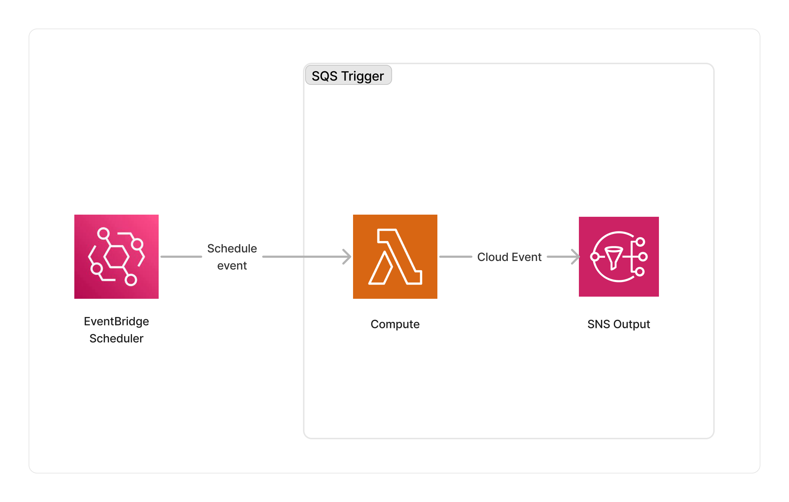

<span title="Label: Pro" data-view-component="true" class="Label Label--api text-uppercase">
  Unstable API
</span>
<span title="Label: Pro" data-view-component="true" class="Label Label--version text-uppercase">
  0.1.0
</span>
<span title="Label: Pro" data-view-component="true" class="Label Label--package">
  @project-lakechain/scheduler-event-trigger
</span>
<br>

---

The Scheduler trigger allows developers to schedule the execution of document processing pipelines on a recurring or one-time schedule.

---

### 🗓️ One-time Schedules

To use this middleware as part of your pipeline, you have to import it in your CDK stack and specify a [Schedule Expression](https://docs.aws.amazon.com/cdk/api/v2/docs/@aws-cdk_aws-scheduler-alpha.ScheduleExpression.html) that defines when to schedule the pipeline.

> ℹ️ In the below example, we schedule the pipeline to start in 24 hours.

```typescript
import * as scheduler from '@aws-cdk/aws-scheduler-alpha';
import { SchedulerEventTrigger } from '@project-lakechain/scheduler-event-trigger';
import { CacheStorage } from '@project-lakechain/core';

/**
 * @returns a date object representing the date
 * and time 24 hours from now.
 */
const tomorrow = (): Date => {
  const date = new Date();
  date.setDate(date.getDate() + 1);
  return (date);
};

class Stack extends cdk.Stack {
  constructor(scope: cdk.Construct, id: string) {
    // Create the Scheduler event trigger.
    const trigger = new SchedulerEventTrigger.Builder()
      .withScope(this)
      .withIdentifier('Trigger')
      .withCacheStorage(cache)
      .withScheduleExpression(
        scheduler.ScheduleExpression.at(tomorrow())
      )
      .build();
  }
}
```

<br>

---

### 🔖 Cron Expressions

You can also use cron expressions to define when to schedule a pipeline.

> ℹ️ In the below example, we schedule the pipeline to run at 8:00PM UTC every Monday through Friday.

```typescript
const trigger = new SchedulerEventTrigger.Builder()
  .withScope(this)
  .withIdentifier('Trigger')
  .withCacheStorage(cache)
  .withScheduleExpression(
    scheduler.ScheduleExpression.expression('cron(0 20 ? * MON-FRI *)')
  )
  .build();
```

<br>

---

### ⏰ Rate Expressions

Another way to create a recurring schedule is to use a rate expression.

> ℹ️ In the below example, we schedule the pipeline to run every 5 minutes.

```typescript
const trigger = new SchedulerEventTrigger.Builder()
  .withScope(this)
  .withIdentifier('Trigger')
  .withCacheStorage(cache)
  .withScheduleExpression(
    scheduler.ScheduleExpression.rate(cdk.Duration.minutes(5))
  )
  .build();
```

<br>

---

### ⚠️ Important Note

This middleware does not act as a data source, but rather as a simple trigger because it does not yield any document by default. However, every middleware must provide a valid document that can be interpreted by the next middlewares.

To solve this issue, the Scheduler will send a placeholder document with the `application/json+scheduler` mime-type when the schedule is reached. This means that subsequent middlewares have to be explicitly configured to accept this mime-type, and know how to react when triggered by the scheduler.

#### Providing Documents

In some cases, it can be useful to provide input documents on a schedule. A common use-case for this is to create a recurrent pipeline that will fetch information from an external system on a regular basis.

The Scheduler API allows developers to pass an array of URIs identifying documents to use as an input for a scheduled pipeline using the `withDocuments` method.

> ℹ️ The below example will trigger the pipeline every 5 minutes, and create 2 different events for each document.

```typescript
const trigger = new SchedulerEventTrigger.Builder()
  .withScope(this)
  .withIdentifier('Trigger')
  .withCacheStorage(cache)
  .withScheduleExpression(
    scheduler.ScheduleExpression.rate(cdk.Duration.minutes(5))
  )
  .withDocuments([
    'https://aws.amazon.com/builders-library/dependency-isolation/',
    's3://my-bucket/my-document.json'
  ])
  .build();
```

When specifying documents, the scheduler will attempt to infer their mime-type automatically. In the previous example, the scheduler would send a document with a mime-type of `text/html` for the first document, and `application/json` for the second.

<br>

---

### 🏗️ Architecture

The Scheduler trigger uses the [AWS EventBridge Scheduler](https://aws.amazon.com/fr/blogs/compute/introducing-amazon-eventbridge-scheduler/) service to trigger a Lambda function. The Lambda function publishes the appropriate document to its output topic to be consumed by the next middleware in the pipeline.



<br>

---

### 🏷️ Properties

<br>

##### Supported Inputs

*This middleware does not accept any inputs from other middlewares.*

##### Supported Outputs

| Mime Type | Description |
| --------- | ----------- |
| *Variant* | When specifying documents to the Scheduler, it will attempt to infer the mime-types associated with these documents. If no documents are specified, the Scheduler will send a placeholder document to the next middlewares having a mime-type of `application/json+scheduler`. |

##### Supported Compute Types

| Type  | Description |
| ----- | ----------- |
| `CPU` | This middleware is based on a Lambda architecture. |

<br>

---

### 📖 Examples

- [Article Curation Pipeline](https://github.com/awslabs/project-lakechain/tree/main/examples/simple-pipelines/article-curation-pipeline) - Builds a pipeline converting HTML articles into plain text.
- [Text Generation Pipeline](https://github.com/awslabs/project-lakechain/tree/main/examples/simple-pipelines/text-generation-pipeline) - An example showcasing how to generate text with Bedrock models.
