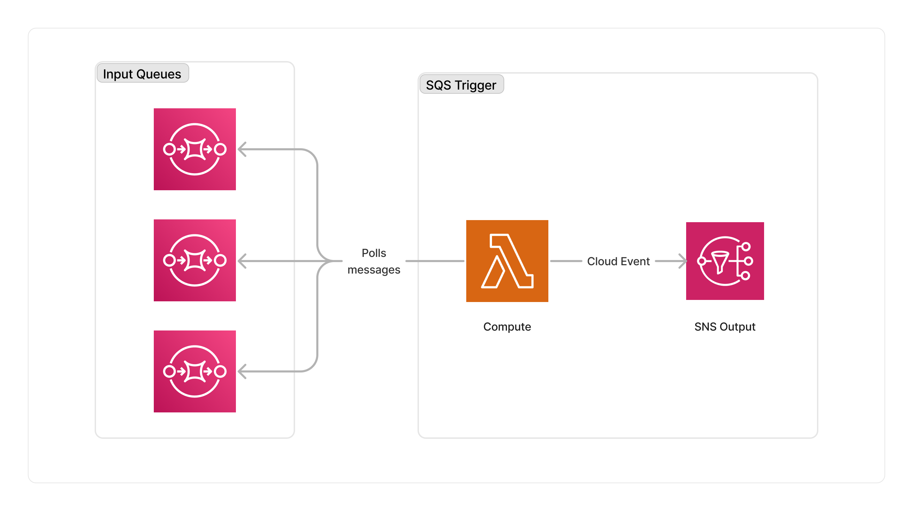

<span title="Label: Pro" data-view-component="true" class="Label Label--api text-uppercase">
  Unstable API
</span>
<span title="Label: Pro" data-view-component="true" class="Label Label--version text-uppercase">
  0.5.0
</span>
<span title="Label: Pro" data-view-component="true" class="Label Label--package">
  <a target="_blank" href="https://www.npmjs.com/package/@project-lakechain/sqs-event-trigger">
    @project-lakechain/sqs-event-trigger
  </a>
</span>
<span class="language-icon">
  <svg role="img" viewBox="0 0 24 24" width="30" xmlns="http://www.w3.org/2000/svg" style="fill: #3178C6;"><title>TypeScript</title><path d="M1.125 0C.502 0 0 .502 0 1.125v21.75C0 23.498.502 24 1.125 24h21.75c.623 0 1.125-.502 1.125-1.125V1.125C24 .502 23.498 0 22.875 0zm17.363 9.75c.612 0 1.154.037 1.627.111a6.38 6.38 0 0 1 1.306.34v2.458a3.95 3.95 0 0 0-.643-.361 5.093 5.093 0 0 0-.717-.26 5.453 5.453 0 0 0-1.426-.2c-.3 0-.573.028-.819.086a2.1 2.1 0 0 0-.623.242c-.17.104-.3.229-.393.374a.888.888 0 0 0-.14.49c0 .196.053.373.156.529.104.156.252.304.443.444s.423.276.696.41c.273.135.582.274.926.416.47.197.892.407 1.266.628.374.222.695.473.963.753.268.279.472.598.614.957.142.359.214.776.214 1.253 0 .657-.125 1.21-.373 1.656a3.033 3.033 0 0 1-1.012 1.085 4.38 4.38 0 0 1-1.487.596c-.566.12-1.163.18-1.79.18a9.916 9.916 0 0 1-1.84-.164 5.544 5.544 0 0 1-1.512-.493v-2.63a5.033 5.033 0 0 0 3.237 1.2c.333 0 .624-.03.872-.09.249-.06.456-.144.623-.25.166-.108.29-.234.373-.38a1.023 1.023 0 0 0-.074-1.089 2.12 2.12 0 0 0-.537-.5 5.597 5.597 0 0 0-.807-.444 27.72 27.72 0 0 0-1.007-.436c-.918-.383-1.602-.852-2.053-1.405-.45-.553-.676-1.222-.676-2.005 0-.614.123-1.141.369-1.582.246-.441.58-.804 1.004-1.089a4.494 4.494 0 0 1 1.47-.629 7.536 7.536 0 0 1 1.77-.201zm-15.113.188h9.563v2.166H9.506v9.646H6.789v-9.646H3.375z"/></svg>
</span>
<div style="margin-top: 26px"></div>

---

The SQS trigger starts new pipeline executions using SQS queue(s) as a data source. This can be especially useful when you want to start a pipeline execution based on an event emitted by a third-party system.

> 💁 The events consumed by the SQS event trigger from the source queue(s) must be valid [CloudEvents](/project-lakechain/general/events), otherwise they will be dismissed.

---

### 🗳️ Monitoring Queues

To use this middleware, you have to import it in your CDK stack and specify the SQS queue you want to monitor.

```typescript
import { SqsEventTrigger } from '@project-lakechain/sqs-event-trigger';
import { CacheStorage } from '@project-lakechain/core';

class Stack extends cdk.Stack {
  constructor(scope: cdk.Construct, id: string) {
    // Sample queue.
    const queue = new sqs.Queue(this, 'Queue', {});

    // The cache storage.
    const cache = new CacheStorage(this, 'Cache');

    // Create the SQS event trigger.
    const trigger = new SqsEventTrigger.Builder()
      .withScope(this)
      .withIdentifier('Trigger')
      .withCacheStorage(cache)
      .withQueue(queue)
      .build();
  }
}
```

You can also pass multiple queues to the SQS event trigger.

```typescript
const trigger = new SqsEventTrigger.Builder()
  .withScope(this)
  .withIdentifier('Trigger')
  .withCacheStorage(cache)
  .withQueues([queue1, queue2])
  .build();
```

<br>

---

### 🏗️ Architecture

The SQS trigger consumes messages from the monitored SQS queues. Messages are consumed by a Lambda function that checks whether input events are valid CloudEvents, and forwards them to the next middlewares in the pipeline.



<br>

---

### 🏷️ Properties

<br>

##### Supported Inputs

*This middleware does not accept any inputs from other middlewares.*

##### Supported Outputs

| Mime Type | Description |
| --------- | ----------- |
| `*/*`     | The SQS event trigger middleware can produce any type of document. |

##### Supported Compute Types

| Type  | Description |
| ----- | ----------- |
| `CPU` | This middleware is based on a Lambda architecture. |
