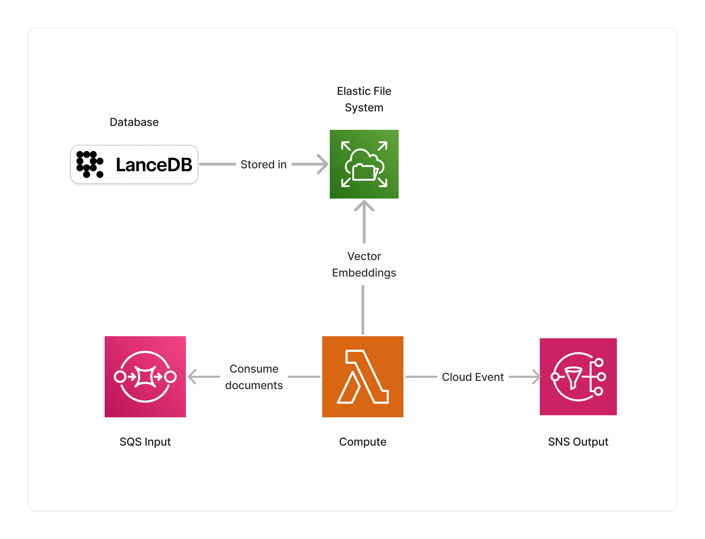

import { Image } from 'astro:assets';
import icon from '../../../assets/icon-lancedb.png';

<span title="Label: Pro" data-view-component="true" class="Label Label--api text-uppercase">
  Unstable API
</span>
<span title="Label: Pro" data-view-component="true" class="Label Label--version text-uppercase">
  0.7.0
</span>
<span title="Label: Pro" data-view-component="true" class="Label Label--package">
  <a target="_blank" href="https://www.npmjs.com/package/@project-lakechain/lancedb-storage-connector">
    @project-lakechain/lancedb-storage-connector
  </a>
</span>
<span class="language-icon">
  <svg role="img" viewBox="0 0 24 24" width="30" xmlns="http://www.w3.org/2000/svg" style="fill: #3178C6;"><title>TypeScript</title><path d="M1.125 0C.502 0 0 .502 0 1.125v21.75C0 23.498.502 24 1.125 24h21.75c.623 0 1.125-.502 1.125-1.125V1.125C24 .502 23.498 0 22.875 0zm17.363 9.75c.612 0 1.154.037 1.627.111a6.38 6.38 0 0 1 1.306.34v2.458a3.95 3.95 0 0 0-.643-.361 5.093 5.093 0 0 0-.717-.26 5.453 5.453 0 0 0-1.426-.2c-.3 0-.573.028-.819.086a2.1 2.1 0 0 0-.623.242c-.17.104-.3.229-.393.374a.888.888 0 0 0-.14.49c0 .196.053.373.156.529.104.156.252.304.443.444s.423.276.696.41c.273.135.582.274.926.416.47.197.892.407 1.266.628.374.222.695.473.963.753.268.279.472.598.614.957.142.359.214.776.214 1.253 0 .657-.125 1.21-.373 1.656a3.033 3.033 0 0 1-1.012 1.085 4.38 4.38 0 0 1-1.487.596c-.566.12-1.163.18-1.79.18a9.916 9.916 0 0 1-1.84-.164 5.544 5.544 0 0 1-1.512-.493v-2.63a5.033 5.033 0 0 0 3.237 1.2c.333 0 .624-.03.872-.09.249-.06.456-.144.623-.25.166-.108.29-.234.373-.38a1.023 1.023 0 0 0-.074-1.089 2.12 2.12 0 0 0-.537-.5 5.597 5.597 0 0 0-.807-.444 27.72 27.72 0 0 0-1.007-.436c-.918-.383-1.602-.852-2.053-1.405-.45-.553-.676-1.222-.676-2.005 0-.614.123-1.141.369-1.582.246-.441.58-.804 1.004-1.089a4.494 4.494 0 0 1 1.47-.629 7.536 7.536 0 0 1 1.77-.201zm-15.113.188h9.563v2.166H9.506v9.646H6.789v-9.646H3.375z"/></svg>
</span>
<span class="language-icon" style="margin-right: 10px">
  <a target="_blank" href="https://lancedb.github.io/lancedb/">
    <Image width="28" src={icon} alt="Icon" style="border-radius: 40%" />
  </a>
</span>
<div style="margin-top: 26px"></div>

---

The LanceDB connector makes it possible for developers to leverage the embedded nature of [LanceDB](https://lancedb.github.io/lancedb/) databases to store document descriptions and their associated vector embeddings.
This can be a particularly good choice for applications that don't require ultra-low latency for indexing and retrieval, and are not I/O sensitive.

> 💁 By leveraging LanceDB as a vector store, developers can store 10's of thousands of vectors at a very low cost, benefiting from the serverless nature of LanceDB.

<br />

---

### 💾 Indexing Documents

To use the LanceDB storage connector, you import it in your CDK stack, and connect it to a data source providing document embeddings.
You also define a storage provider such as S3 or EFS that will serve as the storage backend for the LanceDB database.

> ℹ️ The below example showcases how to create a LanceDB connector leveraging the S3 storage provider.

```typescript
import { LanceDbStorageConnector, S3StorageProvider } from '@project-lakechain/lancedb-storage-connector';
import { CacheStorage } from '@project-lakechain/core';

class Stack extends cdk.Stack {
  constructor(scope: cdk.Construct, id: string) {
    const cache = new CacheStorage(this, 'Cache');

    // The bucket used to store the LanceDB database.
    const bucket = new s3.Bucket(this, 'Bucket', {
      encryption: s3.BucketEncryption.S3_MANAGED,
      blockPublicAccess: s3.BlockPublicAccess.BLOCK_ALL
    });

    // Create the LanceDB storage connector.
    const connector = new LanceDbStorageConnector.Builder()
      .withScope(this)
      .withIdentifier('LanceDbStorageConnector')
      .withCacheStorage(cache)
      .withSource(source)
      .withVectorSize(1024)
      .withStorageProvider(new S3StorageProvider.Builder()
        .withScope(this)
        .withIdentifier('S3Storage')
        .withBucket(bucket)
        .build()
      )
      .build();
  }
}
```

<br />

---

### 🗃️ Storage Providers

The LanceDB storage connector supports 2 different storage providers allowing you to balance the needs between cost, performance, durability and latency.

#### S3 Storage

The S3 storage provider uses an S3 bucket to store the LanceDB database using a standard storage class.

> 💁 The provider does not create the S3 bucket, but uses a customer provided bucket, as well as an optional path prefix to store the database.

<br />

```typescript
const connector = new LanceDbStorageConnector.Builder()
  .withScope(this)
  .withIdentifier('LanceDbStorageConnector')
  .withCacheStorage(cache)
  .withSource(source)
  .withVectorSize(1024)
  .withStorageProvider(new S3StorageProvider.Builder()
    .withScope(this)
    .withIdentifier('S3Storage')
    .withBucket(bucket) // 👈 Specify the S3 bucket
    .build()
  )
  .build();
```

<br />

---

#### EFS Storage

The EFS storage provider leverages AWS EFS to store the LanceDB database, providing lower latency and higher IOPS compared to S3.

> 💁 The provider does not create the EFS file system, but uses a customer provided file system placed in a VPC, as well as an optional path prefix to store the database.

<br />

```typescript
const connector = new LanceDbStorageConnector.Builder()
  .withScope(this)
  .withIdentifier('LanceDbStorageConnector')
  .withCacheStorage(cache)
  .withSource(source)
  .withVectorSize(1024)
  .withStorageProvider(new EfsStorageProvider.Builder()
    .withScope(this)
    .withIdentifier('EfsStorage')
    .withFileSystem(fileSystem) // 👈 Specify the EFS
    .withVpc(vpc) // 👈 Specify the EFS VPC
    .build()
  )
  .build();
```

<br />

---

#### Include Text

When the document being processed is a text document, you can choose to include the text of the document associated with the embeddings in the LanceDB table.
This allows you to retrieve the text associated with the embeddings when executing a similarity search without having to retrieve the original text from a separate database.

To do so, you can use the `withIncludeText` API. If the document is not a text, this option is ignored.

> 💁 By default, the text is not included in the index.

```typescript
const connector = new LanceDbStorageConnector.Builder()
  .withScope(this)
  .withIdentifier('LanceDbStorageConnector')
  .withCacheStorage(cache)
  .withSource(source)
  .withVectorSize(1024)
  .withStorageProvider(storageProvider)
  .withIncludeText(true) // 👈 Include text
  .build();
```

<br />

---

### 🏗️ Architecture

The architecture implemented by the LanceDB storage connector is based on a Lambda ARM64 compute to index document embeddings provided by source middlewares into the LanceDB database.
The connector uses an AWS Lambda Layer to include the LanceDB library within the Lambda environment.

> 💁 The architecture depends on the selected storage provider. Below is a description of the architecture for each storage provider.

#### S3 Storage Provider

The S3 storage provider uses a user provided S3 bucket to store the LanceDB database.


#### EFS Storage Provider

The EFS storage provider uses a user provided EFS file system to store the LanceDB database.



<br />

---

### 🏷️ Properties

<br />

##### Supported Inputs

|  Mime Type  | Description |
| ----------- | ----------- |
| `*/*` | This middleware supports any type of documents. Note that if no embeddings are specified in the document metadata, the document is filtered out. |

##### Supported Outputs

*This middleware does not produce any output.*

##### Supported Compute Types

| Type  | Description |
| ----- | ----------- |
| `CPU` | This middleware only supports CPU compute. |

<br />

---

### 📖 Examples

- [Bedrock + LanceDB](https://github.com/awslabs/project-lakechain/tree/main/examples/simple-pipelines/embedding-pipelines/bedrock-lancedb-pipeline) - An example showcasing an embedding pipeline using Amazon Bedrock and LanceDB.
