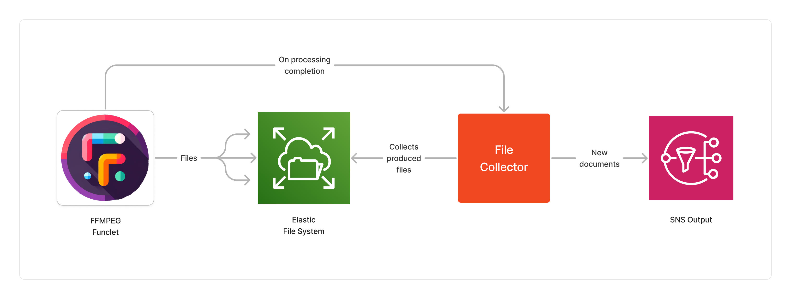
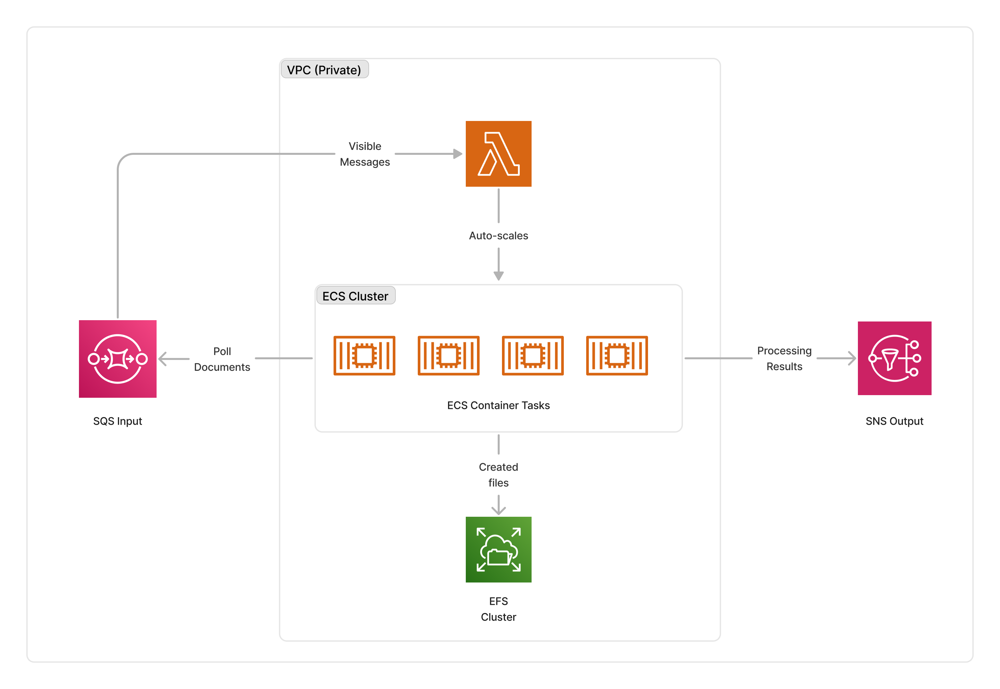

<span title="Label: Pro" data-view-component="true" class="Label Label--api text-uppercase">
  Unstable API
</span>
<span title="Label: Pro" data-view-component="true" class="Label Label--version text-uppercase">
  0.4.0
</span>
<span title="Label: Pro" data-view-component="true" class="Label Label--package">
  <a target="_blank" href="https://www.npmjs.com/package/@project-lakechain/ffmpeg-processor">
    @project-lakechain/ffmpeg-processor
  </a>
</span>
<span class="language-icon">
  <svg role="img" viewBox="0 0 24 24" width="30" xmlns="http://www.w3.org/2000/svg" style="fill: #3178C6;"><title>TypeScript</title><path d="M1.125 0C.502 0 0 .502 0 1.125v21.75C0 23.498.502 24 1.125 24h21.75c.623 0 1.125-.502 1.125-1.125V1.125C24 .502 23.498 0 22.875 0zm17.363 9.75c.612 0 1.154.037 1.627.111a6.38 6.38 0 0 1 1.306.34v2.458a3.95 3.95 0 0 0-.643-.361 5.093 5.093 0 0 0-.717-.26 5.453 5.453 0 0 0-1.426-.2c-.3 0-.573.028-.819.086a2.1 2.1 0 0 0-.623.242c-.17.104-.3.229-.393.374a.888.888 0 0 0-.14.49c0 .196.053.373.156.529.104.156.252.304.443.444s.423.276.696.41c.273.135.582.274.926.416.47.197.892.407 1.266.628.374.222.695.473.963.753.268.279.472.598.614.957.142.359.214.776.214 1.253 0 .657-.125 1.21-.373 1.656a3.033 3.033 0 0 1-1.012 1.085 4.38 4.38 0 0 1-1.487.596c-.566.12-1.163.18-1.79.18a9.916 9.916 0 0 1-1.84-.164 5.544 5.544 0 0 1-1.512-.493v-2.63a5.033 5.033 0 0 0 3.237 1.2c.333 0 .624-.03.872-.09.249-.06.456-.144.623-.25.166-.108.29-.234.373-.38a1.023 1.023 0 0 0-.074-1.089 2.12 2.12 0 0 0-.537-.5 5.597 5.597 0 0 0-.807-.444 27.72 27.72 0 0 0-1.007-.436c-.918-.383-1.602-.852-2.053-1.405-.45-.553-.676-1.222-.676-2.005 0-.614.123-1.141.369-1.582.246-.441.58-.804 1.004-1.089a4.494 4.494 0 0 1 1.47-.629 7.536 7.536 0 0 1 1.77-.201zm-15.113.188h9.563v2.166H9.506v9.646H6.789v-9.646H3.375z"/></svg>
</span>
<div style="margin-top: 26px"></div>

---

The FFMPEG processor brings the power of the [FFMPEG Project](https://ffmpeg.org/) within a Lakechain pipeline, allowing developers to process audio and video documents at scale. It makes it possible for developers to express their processing logic using a [Funclet](/project-lakechain/guides/funclets) in their CDK code, which gets executed in the cloud at runtime.

The FFMPEG processor uses the [`fluent-ffmpeg`](https://github.com/fluent-ffmpeg/node-fluent-ffmpeg/tree/master) library to describe the FFMPEG processing logic in a declarative syntax. Using this approach allows you to mock the processing logic in your local environment and replicate it within the funclet to execute it within a pipeline.

---

### 🎬 Using FFMPEG

To use this middleware, you import it in your CDK stack and instantiate it as part of a pipeline.

> 💁 Below is a simple example of using the FFMPEG processor to extract the audio track of an input video into a new document.

```typescript
import {
  FfmpegProcessor,
  CloudEvent,
  FfmpegUtils,
  Ffmpeg
} from '@project-lakechain/ffmpeg-processor';

class Stack extends cdk.Stack {
  constructor(scope: cdk.Construct, id: string) {
    const ffmpeg = new FfmpegProcessor.Builder()
      .withScope(this)
      .withIdentifier('FfmpegProcessor')
      .withCacheStorage(cache)
      .withVpc(vpc)
      .withSource(source)
      // 👇 FFMPEG funclet.
      .withIntent(async (events: CloudEvent[], ffmpeg: Ffmpeg, utils: FfmpegUtils) => {
        const videos = events.filter(
          (event) => event.data().document().mimeType() === 'video/mp4'
        );
        return (ffmpeg()
          .input(utils.file(videos[0]))
          .noVideo()
          .save('output.mp3')
        );
      })
      .build();
  }
}
```

<br>

---

### ✍️ Funclet Signature

Funclet expressions use the power of a full programming language to express a processing logic. They are asynchronous and can be defined as TypeScript named functions, anonymous functions, or arrow functions.

The funclet signature for the FFMPEG intent you want to execute is as follows.

```typescript
type FfmpegFunclet = (event: CloudEvent[], ffmpeg: Ffmpeg: FfmpegUtils) => Promise<Ffmpeg>;
```

<br>

---

#### Inputs

The FFMPEG funclet takes three arguments.

Type   | Description
------ | -----------
CloudEvent[] | An array of `CloudEvent`, each describing an input document. The FFMPEG middleware can take one or multiple documents as an input. This makes it particularly powerful to process multiple audio and video documents together.
Ffmpeg | The `Ffmpeg` object implements the same interface as the `fluent-ffmpeg` library which you can use locally in a bespoke application, and then replicate the logic within the funclet.
FfmpegUtils | The `FfmpegUtils` object provides utility functions to interact with the documents and the file system.

<br>

---

#### Outputs

A processing funclet must return a `Promise` that resolves to the `fluent-ffmpeg` instance created in the funclet. This allows the processing logic to be asynchronous, and ensures that the instance of the FFMPEG library is returned to the FFMPEG processor for collecting the produced files.

Each file created within the funclet by FFMPEG is written within a directory mounted on an AWS Elastic File System within the running container. At the end of the processing, all files are automatically collected by the FFMPEG processor, packaged into new documents, and passed to the next middlewares in the pipeline automatically!

> 💁 All files are also automatically removed from the EFS at the end of a funclet execution.



<br />

---

### ↔️ Auto-Scaling

The cluster of containers deployed by this middleware will auto-scale based on the number of documents that need to be processed. The cluster scales up to a maximum of 5 instances by default, and scales down to zero when there are no documents to process.

> ℹ️ You can configure the maximum amount of instances that the cluster can auto-scale to by using the `withMaxInstances` method.

```typescript
import { FfmpegProcessor } from '@project-lakechain/ffmpeg-processor';

const ffmpeg = new FfmpegProcessor.Builder()
  .withScope(this)
  .withIdentifier('FfmpegProcessor')
  .withCacheStorage(cache)
  .withVpc(vpc)
  .withSource(source)
  .withIntent(intent)
  .withMaxInstances(10) // 👈 Maximum amount of instances
  .build();
```

<br>

---

### 🌉 Infrastructure

You can customize the underlying infrastructure used by the FFMPEG processor by defining a custom infrastructure definition. You can opt to do so if you'd like to tweak the performance of the processor or the cost of running it.

> 💁 By default, the FFMPEG processor executes Docker containers on AWS ECS using `c6a.xlarge` instances.

```typescript
import * as ec2 from 'aws-cdk-lib/aws-ec2';
import { FfmpegProcessor, InfrastructureDefinition } from '@project-lakechain/ffmpeg-processor';

const ffmpeg = new FfmpegProcessor.Builder()
  .withScope(this)
  .withIdentifier('FfmpegProcessor')
  .withCacheStorage(cache)
  .withVpc(vpc)
  .withSource(source)
  .withIntent(intent)
  .withInfrastructure(new InfrastructureDefinition.Builder()
    .withMaxMemory(15 * 1024)
    .withGpus(0)
    .withInstanceType(ec2.InstanceType.of(
      ec2.InstanceClass.C6A,
      ec2.InstanceSize.XLARGE2
    ))
    .build())
  .build();
```

<br>

---

### 🏗️ Architecture

The FFMPEG processor runs on an ECS cluster of auto-scaled instances, and packages FFMPEG and the code required to integrate it with Lakechain into a Docker container.

The files created within the user-provided funclet are stored on an AWS Elastic File System (EFS) mounted on the container.



<br>

---

### 🏷️ Properties

<br>

##### Supported Inputs

| Mime Type | Description
| --------- | -----------
| `video/*` | The FFMPEG processor supports all video types supported by FFMPEG.
| `audio/*` | The FFMPEG processor supports all audio types supported by FFMPEG.
| `application/cloudevents+json` | The FFMPEG processor supports composite events.

##### Supported Outputs

| Mime Type | Description
| --------- | -----------
| `video/*` | The condition middleware can produce any video type supported by FFMPEG.
| `audio/*` | The condition middleware can produce any audio type supported by FFMPEG.

##### Supported Compute Types

| Type  | Description |
| ----- | ----------- |
| `CPU` | This middleware only supports CPU compute. |

<br>

---

### 📖 Examples

- [Building a Generative Podcast](https://github.com/awslabs/project-lakechain/tree/main/examples/end-to-end-use-cases/building-a-podcast-generator) - Builds a pipeline for creating a generative weekly AWS news podcast.
- [Building a Video Chaptering Service](https://github.com/awslabs/project-lakechain/tree/main/examples/end-to-end-use-cases/building-a-video-chaptering-service) - Builds a pipeline for automatic video chaptering generation.
