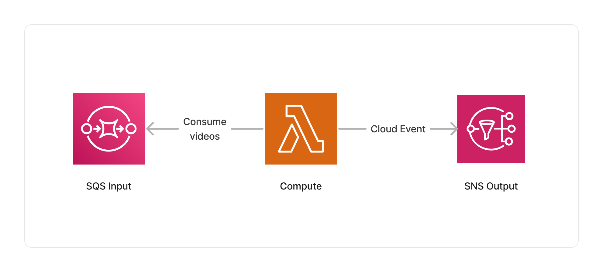

<span title="Label: Pro" data-view-component="true" class="Label Label--api text-uppercase">
  Unstable API
</span>
<span title="Label: Pro" data-view-component="true" class="Label Label--version text-uppercase">
  0.1.0
</span>
<span title="Label: Pro" data-view-component="true" class="Label Label--package">
  @project-lakechain/video-metadata-extractor
</span>
<br>

---

The video metadata extractor enriches document metadata with specific information about input videos, such as their duration, resolution, bitrate, codec, and more. Those metadata can then be later used by subsequent middlewares in the pipeline, or stored in a database.

---

### 🎥 Extracting Metadata

To use this middleware, you import it in your CDK stack and instantiate it as part of a pipeline.

```typescript
import { VideoMetadataExtractor } from '@project-lakechain/video-metadata-extractor';
import { CacheStorage } from '@project-lakechain/core';

class Stack extends cdk.Stack {
  constructor(scope: cdk.Construct, id: string) {
    // The cache storage.
    const cache = new CacheStorage(this, 'Cache');
    
    // Extracts metadata from videos.
    const videoMetadata = new VideoMetadataExtractor.Builder()
      .withScope(this)
      .withIdentifier('VideoMetadata')
      .withCacheStorage(cache)
      .withSource(source) // 👈 Specify a data source
      .build();
  }
}
```

<br>

---

### 📄 Output

The video metadata extraction middleware does not modify or alter source videos in any way. It instead enriches the metadata of their document with captured information. Below is an example of metadata captured using this middleware.

<details>
  <summary>💁 Click to expand example</summary>

  ```json
  {
    "specversion": "1.0",
    "id": "1780d5de-fd6f-4530-98d7-82ebee85ea39",
    "type": "document-created",
    "time": "2023-10-22T13:19:10.657Z",
    "data": {
        "chainId": "6ebf76e4-f70c-440c-98f9-3e3e7eb34c79",
        "source": {
            "url": "s3://bucket/video.mp4",
            "type": "video/mp4",
            "size": 2453282,
            "etag": "1243cbd6cf145453c8b5519a2ada4779"
        },
        "document": {
            "url": "s3://bucket/video.mp4",
            "type": "video/mp4",
            "size": 2453282,
            "etag": "1243cbd6cf145453c8b5519a2ada4779"
        },
        "metadata": {
          "properties": {
            "kind": "image",
            "attrs": {
              "fps": 30,
              "resolution": {
                "width": 1280,
                "height": 720
              },
              "codec": "h264",
              "audioTracks": [{
                "codec": "aac",
                "bitrate": 128000,
                "channels": 2,
                "sampleRate": 48000
              }]
            }
          }
        },
        "callStack": []
    }
  }
  ```

</details>

<br>

---

### 🏗️ Architecture

This middleware runs within a Lambda compute based on the ARM64 architecture, and packages libraries to extract the metadata of videos.



<br>

---

### 🏷️ Properties

<br>

##### Supported Inputs

|  Mime Type  | Description |
| ----------- | ----------- |
| `video/mpeg` | MPEG video. |
| `video/mp4` | MP4 video. |
| `video/x-m4v` | M4V video. |
| `video/quicktime` | QuickTime video. |
| `video/x-msvideo` | AVI video. |
| `video/x-matroska` | Matroska video. |
| `video/MP2T` | MPEG-2 transport stream video. |
| `video/x-ms-wmv` | Windows Media Video. |
| `video/x-flv` | Flash video. |

##### Supported Outputs

*This middleware supports as outputs the same types as the supported inputs.*

##### Supported Compute Types

| Type  | Description |
| ----- | ----------- |
| `CPU` | This middleware only supports CPU compute. |

<br>

---

### 📖 Examples

- [Metadata Extraction Pipeline](https://github.com/awslabs/project-lakechain/tree/main/examples/simple-pipelines/metadata-extraction-pipeline) - Builds a simple metadata extraction pipeline.
