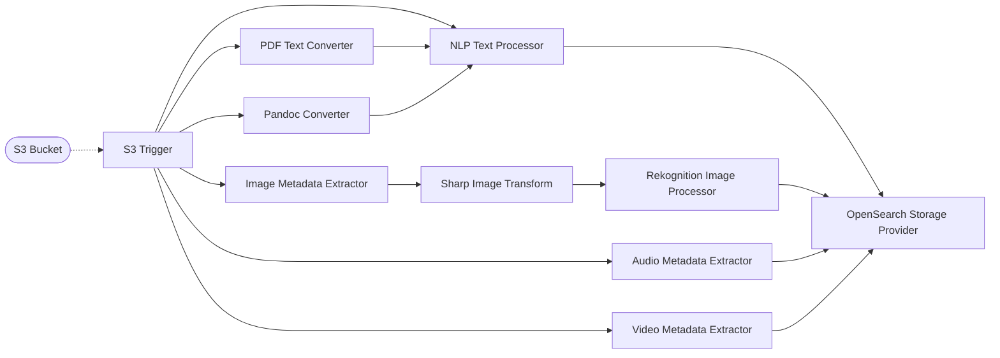
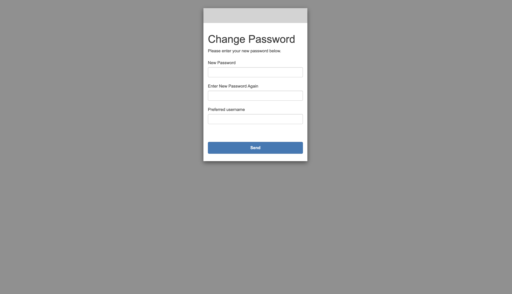
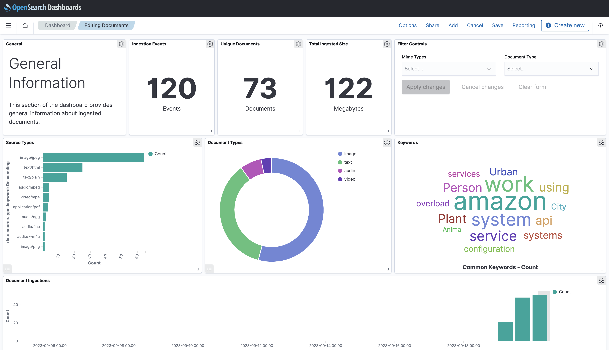
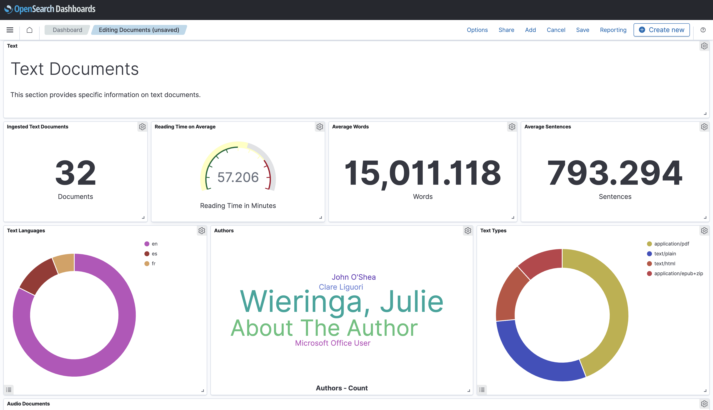
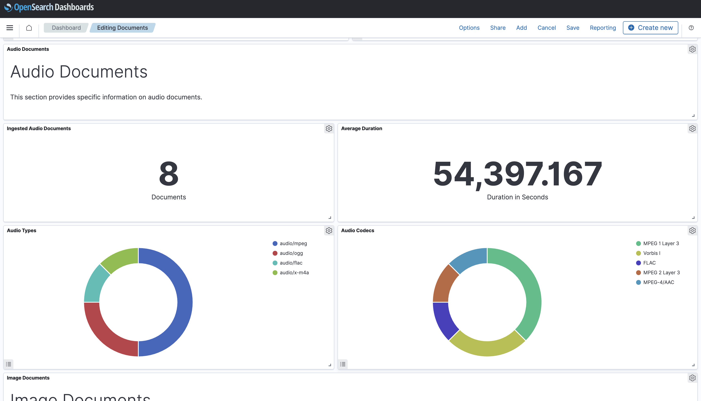
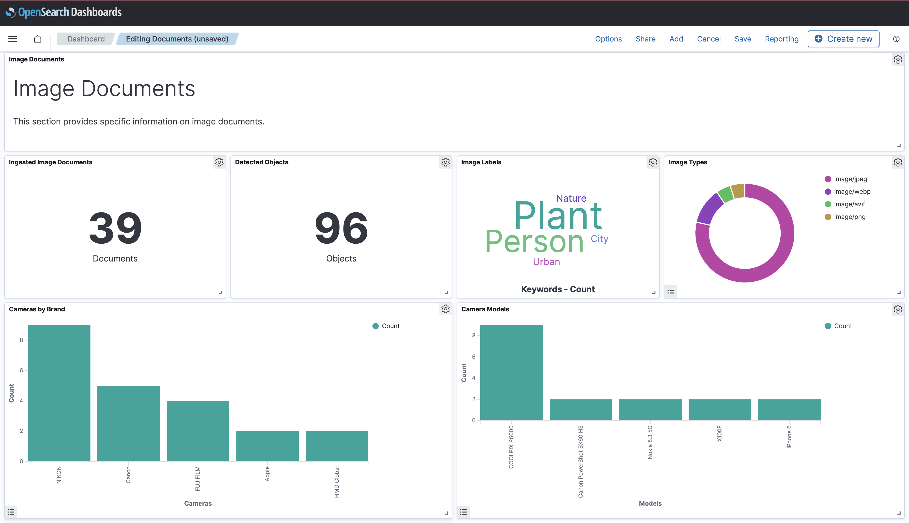

# 📖 Document Indexing Pipeline

> 👉 This example showcases how to build a simple, but powerful, document indexing pipeline using Project Lakechain. *Please note that this is only an example, and not a production-ready application.*

It demonstrates how to support a variety of document types as an input (PDFs, images, audio and video files), extract as much metadata about these documents as possible, and index the document metadata automatically into an OpenSearch index to make them searchable, run analytics query on them, and build dashboards to visualize the results.

## :dna: Pipeline



## ❓ What is Happening

In this pipeline, we are making use of multiple middlewares to extract metadata from a variety of document types and we store them into Amazon OpenSearch. We describe below the role of each middleware used in this example.

### Data Ingestion

Data ingestion providers pipe documents into a pipeline, and trigger a new _pipeline execution_ for each piped document.

| Middleware            | Description                                            | Trigger                                                          |
| --------------------- | ------------------------------------------------------ | ---------------------------------------------------------------- |
| S3 Trigger | Responsible for ingesting documents from an S3 bucket. | Triggers whenever a new object is uploaded to the source bucket. |

### Document Processors

The document processors take documents in a specific format and transforms them into a format that is more suitable for metadata extraction and general document understanding.

| Middleware            | Description                                                                                                                                                                                                                                   |
| --------------------- | --------------------------------------------------------------------------------------------------------------------------------------------------------------------------------------------------------------------------------------------- |
| Sharp Image Transform | Takes images as an input, converts them on-the-fly into PNG, resizes them to keep a smaller picture while maintaining its aspect ratio.                                                                                                       |
| PDF Text Converter    | Takes PDF documents as an input, extracts the text associated with the document, and transforms the document as plain text. Metadata are also extracted from the PDF document, such as the number of pages, the authors of the document, etc. |
| Pandoc Converter      | Takes documents in a variety of formats (e.g. Word, Markdown, HTML, etc.) and transforms them into plain text.                                                                                                                                |

### Metadata Extractors

The metadata extractors will take a document in a specific format and extract as much metadata as possible from it.

| Middleware                  | Description                                                                                                                                                                                                                                                     |
| --------------------------- | --------------------------------------------------------------------------------------------------------------------------------------------------------------------------------------------------------------------------------------------------------------- |
| Audio Metadata Extractor    | Takes audio files as an input and extracts their metadata such as the duration of the audio file, its sample rate, number of audio channels, thumbnails, artists, albums, etc. The extracted metadata are used to enrich the document metadata in the pipeline. |
| Image Metadata Extractor    | Takes image files as an input and extracts their metadata such as the width, height, dominant color etc.                                                                                                                                                        |
| Video Metadata Extractor    | Takes video files as an input and extracts their metadata such as the duration of the video, the frame rate, the number of channels, the audio tracks, etc.                                                                                                     |
| Rekognition Image Processor | This middleware is used in this context to detect labels from an image (such as "animal", "sports", "happy", "sad", etc.) to enrich the image metadata.                                                                                                         |
| NLP Text Processor          | Takes plain text as an input and extracts metadata such as the language of the text, the entities in the text, compute the average reading time, etc.                                                                                                           |

### Storage Providers

Storage providers take document metadata from previous middlewares and store them in a given storage system.

| Middleware                  | Description                                                               |
| --------------------------- | ------------------------------------------------------------------------- |
| OpenSearch Storage Provider | Takes the piped document metadata and stores them in an OpenSearch index. |

## 📝 Requirements

The following requirements are needed to deploy the infrastructure required to run this pipeline:

- You need access to a development AWS account.
- [AWS CDK](https://docs.aws.amazon.com/cdk/latest/guide/getting_started.html#getting_started_install) is required to deploy the infrastructure.
- [Docker](https://docs.docker.com/get-docker/) is required to be running to build middlewares.
- [Node.js](https://nodejs.org/en/download/) v18+ and NPM.
- [Python](https://www.python.org/downloads/) v3.8+ and [Pip](https://pip.pypa.io/en/stable/installation/).

## 🚀 Deploy

Head to the directory [`examples/end-to-end-use-cases/building-a-document-index`](/examples/end-to-end-use-cases/building-a-document-index) in the repository and first run `npm` to install the pipeline dependencies:

```bash
npm install
npm run build-pkg
```

You can then deploy the example to your account (ensure your AWS CDK is configured with the appropriate AWS credentials and AWS region):

```bash
npm run deploy
```

## 👨👩 Create a User

We apply two layer of security protection for accessing the OpenSearch dashboard, one is that we deploy the OpenSearch domain in an isolated VPC, the second is that the OpenSearch dashboard is protected by a user authentication mechanism using Amazon Cognito.

Once the CDK deployment is completed, you will see in the CDK outputs in your terminal a link to the Cognito User Pool console where you will need to create a new user by specifying a username and a temporary password (you will be asked to change the password on first login).

## 🏃 Access OpenSearch

You will also see in the CDK outputs a link to the OpenSearch dashboard. Since the OpenSearch domain deployed in this example resides in a new isolated VPC, you will need to use a bastion host in that VPC to access the OpenSearch dashboard from your local machine.

> 💁 You can use an EC2 bastion host along with [ssm-supercharged](https://github.com/HQarroum/ssm-supercharged) and [`sshuttle`](https://github.com/sshuttle/sshuttle) to establish a soft VPN connection to your VPC.

Once you have access to the OpenSearch dashboard, log in using your new user credentials, and update your password.

<p align="center">
  
</p>

## 📥 Ingest Documents

You can now start ingesting documents (Text, PDFs, Docx, HTML, Markdown, Images, Videos, Audios) into the pipeline by uploading them to the S3 bucket created by the CDK deployment. The source S3 bucket monitored by the pipeline is also available in the CDK outputs.

Once you upload documents, it can take up to 1 minute for the pipeline to process them and index them into OpenSearch.

## 📝 Dashboards

This deployment automatically creates a `Documents` dashboard in your OpenSearch domain that contains different widgets for visualizing information about the ingested documents.

### General Information

Here you can see high-level information about the ingested documents such as the number of documents ingested, their types, etc.

<p align="center">
  
</p>

### Text Documents

The dashboard contains a section dedicated to displaying more specific information about ingested text documents such as the average number of words across documents, the main detected languages, etc. Those information are provided by the different middlewares (such as the NLP Text Processor) in the pipeline.

<p align="center">
  
</p>

### Audio Documents

A section dedicated to audio documents allows you to visualize information about the audio formats and codecs used across your audio documents.

<p align="center">
  
</p>

### Image Documents

The image section of the dashboard provides valuable information about images that have been ingested, allowing you to see the main labels extracted by the Rekognition Image Processor, the different image formats, and even EXIF information such as the camera model used to take the picture.

<p align="center">
  
</p>

## 🧹 Clean up

Don't forget to clean up the resources created by this example by running the following command:

```bash
npm run destroy
```
