# 🎙️ Building a Generative Podcast

> 👉 This example showcases how to build an intelligent, multi-persona, generative AWS daily news podcast using Project Lakechain. _Please note that this is only an example of what can be built using Project Lakechain, and not a production-ready application._

<br />
<br />
<p align="center">
  
</p>
<br />

## :dna: Pipeline

```mermaid
flowchart LR
  Timer([Every 24 Hours]) -.-> Trigger[Scheduler Event Trigger]
  Trigger -. RSS Feed .-> RSS[Syndication Feed Processor]
  RSS -. HTML Articles .-> Condition{Published today?}
  RSS -. HTML Articles .-> Condition{Published today?}
  RSS -. HTML Articles .-> Condition{Published today?}
  Condition -- Yes --> Newspaper3k[Newspaper3k Parser]

  Newspaper3k -. Text Articles .-> Reducer[Reducer]
  Newspaper3k -. Text Articles .-> Reducer[Reducer]
  Newspaper3k -. Text Articles .-> Reducer[Reducer]
  Reducer -. Aggregated Articles .-> Anthropic[Anthropic Text Processor]

  Anthropic -. Podcast Script .-> Transform[Transform]
  Transform -. Host Scripts .-> HostSynthesizer[Polly Host Synthesizer]
  Transform -. Guest Scripts .-> GuestSynthesizer[Polly Guest Synthesizer]

  HostSynthesizer --> VoiceReducer[Reducer]
  GuestSynthesizer --> VoiceReducer

  VoiceReducer -. Voices .-> FFMPEG[FFMPEG Processor]
  FFMPEG -. MP3 .-> S3[S3 Bucket]
```



## 🌟 Example

The below example showcases the result of a generative AWS News podcast generation discussing the AWS releases on the 15th of Match 2024. This example uses the Amazon Polly long-form synthesis as the text-to-speech engine.

[podcast-15-03-2024.webm](https://github.com/awslabs/project-lakechain/assets/1384633/6a2629c2-823c-473c-9ef4-9a140d7dca9f)

## What does this example do ❓

This example showcases how to build an intelligent, multi-persona, generative podcast using Project Lakechain. Below is an explanation of the different steps implemented within the pipeline to generate podcasts automatically.

1. The pipeline is triggered every 24 hours and fetches the latest news articles from the official [AWS RSS feed](https://aws.amazon.com/blogs/aws/feed/).
2. It filters articles to only keep those that have been released today.
3. It then processes each article to extract the relevant text from each HTML page using the `Newspaper3k` parser.
4. The extracted articles are then processed by the Anthropic text processor to generate a podcast script.
5. The script is transformed into audio using the Polly synthesizer, which generates the audio for the host and guest speakers.
6. The audio files are then concatenated using FFMPEG and uploaded to an S3 bucket.

## 📝 Requirements

The following requirements are needed to deploy the infrastructure required to run this pipeline:

- You need access to a development AWS account.
- [AWS CDK](https://docs.aws.amazon.com/cdk/latest/guide/getting_started.html#getting_started_install) is required to deploy the infrastructure.
- [Docker](https://docs.docker.com/get-docker/) is required to be running to build middlewares.
- [Node.js](https://nodejs.org/en/download/) v20+ and NPM.
- [Python](https://www.python.org/downloads/) v3.8+ and [Pip](https://pip.pypa.io/en/stable/installation/).

## 🚀 Deploy

Head to the directory [`examples/end-to-end-use-cases/building-a-podcast-generator`](/examples/end-to-end-use-cases/building-a-podcast-generator) in the Project Lakechain repository and build the example and its dependencies.

```bash
npm install
npm run build-pkg
```

You can then deploy the example to your account (ensure your deployment machine is configured with the appropriate AWS credentials and AWS region).

```bash
npm run deploy
```

## 🧹 Clean up

Don't forget to clean up the resources created by this example by running the following command:

```bash
npm run destroy
```
