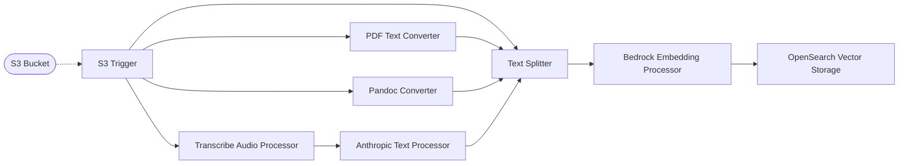
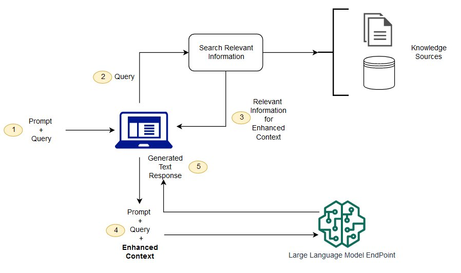
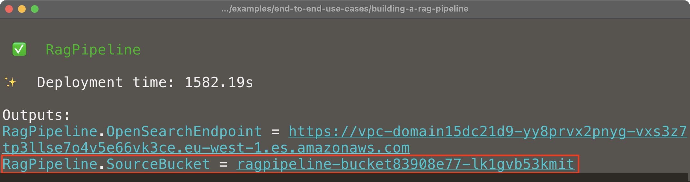
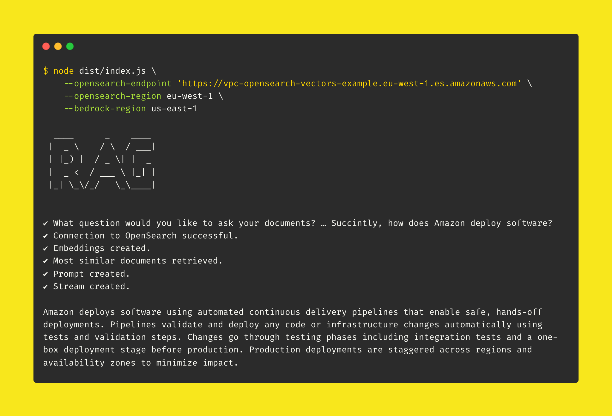

# 🤖 RAG Pipeline

> 👉 This example showcases how to build an end-to-end [Retrieval Augmented Generation (RAG)](https://docs.aws.amazon.com/sagemaker/latest/dg/jumpstart-foundation-models-customize-rag.html) on AWS using Project Lakechain and the different middlewares it makes available. _Please note that this is only an example of what can be built using Project Lakechain, and not a production-ready application._

## :dna: Pipeline



## What's RAG ❓

Retrieval Augmented Generation (RAG) is a technique that synergize the in-context learning capabilities of large language models (LLMs) with the power of dynamic information retrieval from a specialized corpus of documents. This approach enhances the LLMs ability to process and generate responses by feeding it chunks of relevant information directly into its prompt, thus enriching the context with external knowledge.

The process starts with a specialized retrieval mechanism that queries a curated corpus or knowledge base, employing semantic search techniques, such as dense vector search, to find documents that closely match the semantic context of the input query. This method ensures the retrieval of highly relevant documents, tailored to the specific needs of the query at hand.

<br />
<p align="center">
  
</p>
<br />

By incorporating these retrieved document chunks into the LLMs prompt, RAG effectively broadens the model's knowledge base on-the-fly, allowing it to leverage up-to-date or specific information not originally included in its training data.

<br />

---

<br />

## What does this example do ❓

This example showcases how to build an end-to-end RAG pipeline using a composition of middlewares that interact with different AWS services such as Amazon Transcribe, Amazon Bedrock, or Amazon OpenSearch to enable the following use cases out of the box :

- **Text Indexing** - Convert at scale PDFs, HTML, Markdown, Docx, documents into text, automatically chunk them, create vector embeddings, and index the embeddings along with the chunks in an OpenSearch vector index using the modularity of middlewares.
- **Audio Indexing** - Transcribe audio recordings into text and index the text in an OpenSearch vector index.
- **Retrieval** - Retrieve relevant chunks of text from a corpus of documents with semantic search using the [RAG CLI](./cli/) we created in this example.

<br />

---

<br />

## 📝 Requirements

The following requirements are needed to deploy the infrastructure required to run this pipeline:

- You need access to a development AWS account.
- [AWS CDK](https://docs.aws.amazon.com/cdk/latest/guide/getting_started.html#getting_started_install) is required to deploy the infrastructure.
- [Docker](https://docs.docker.com/get-docker/) is required to be running to build middlewares.
- [Node.js](https://nodejs.org/en/download/) v18+ and NPM.
- [Python](https://www.python.org/downloads/) v3.8+ and [Pip](https://pip.pypa.io/en/stable/installation/).

<br />

---

<br />

## 🚀 Deploy

Head to the directory [`examples/end-to-end-use-cases/building-a-rag-pipeline`](/examples/end-to-end-use-cases/building-a-rag-pipeline) in the Project Lakechain repository and build the example and its dependencies.

```bash
npm install
npm run build-pkg
```

You can then deploy the example to your account (ensure your deployment machine is configured with the appropriate AWS credentials and AWS region).

```bash
npm run deploy
```

<br />

---

<br />

## 📥 Ingest Documents

You start ingesting documents into the pipeline by uploading your documents to the S3 bucket created by the CDK deployment. The source S3 bucket monitored by the pipeline is displayed in the CDK outputs as `SourceBucket` 👇.

<br />
<p align="center">
  
</p>
<br />

Once you upload documents to that bucket, it can take up to 2 minutes for the pipeline to process them and index them into OpenSearch.

> 💁 We recommend you use the [AWS CloudWatch Logs console](https://console.aws.amazon.com/cloudwatch/home#logsV2:log-groups) in the AWS Console to live tail the CloudWatch log groups associated with the deployed middlewares to see the logs in real-time.

<br />
<p align="center">
  
</p>
<br />

<br />

---

<br />

## 🏃 Access OpenSearch

Before moving towards the retrieval step of interrogating an LLM using the RAG CLI, you need to ensure you have access to the OpenSearch domain from your test machine.

Since the OpenSearch domain deployed in this example resides in a new isolated VPC that's not accessible from the public Internet, you will need to use a bastion host in that VPC to access the OpenSearch domain from your local machine.

> 💁 You can for example use an EC2 bastion host to establish a soft VPN connection to your VPC (see [`sshuttle`](https://github.com/sshuttle/sshuttle)). Alternatively, you can also run this example within an [AWS Cloud9](https://docs.aws.amazon.com/cloud9/latest/user-guide/welcome.html) instance located in the same VPC as the OpenSearch endpoint.

The URL of the OpenSearch domain is displayed in the CDK outputs as `OpenSearchEndpoint`, and you can check whether you have access using the following command.

```bash
curl --head https://vpc-domain.eu-west-1.es.amazonaws.com
```

If it works, you should get a `403` response in return to the request, as we're making an unauthenticated request to the OpenSearch domain.

<br />

---

<br />

## ✨ Run the Retrieval

We've created a handy CLI tool, called the [RAG CLI](./cli/), that you can use to run the retrieval step of the RAG pipeline. Before using it, prepare the following information that we will need to feed to the CLI.

- The endpoint of the OpenSearch domain (from the CDK outputs).
- The AWS region in which the OpenSearch domain is deployed.
- The AWS region from which you want to use Amazon Bedrock. _[See the Amazon Bedrock documentation](https://docs.aws.amazon.com/bedrock/latest/userguide/what-is-bedrock.html#bedrock-regions) for more information on the AWS regions supported._

Once done, head with your terminal to the [`cli`](./cli/) directory and install the dependencies of the CLI:

```bash
cd ./cli
npm install
```

You can then invoke the CLI and ask a question to your documents. For example, if your deployment region is `eu-west-1` and you would like to use Amazon Bedrock in the `us-east-1` region, you can run the following command:

```bash
node dist/index.js \
  --opensearch-endpoint 'https://domain.eu-west-1.es.amazonaws.com' \
  --opensearch-region eu-west-1 \
  --bedrock-region us-east-1
```

The CLI will then prompt you for a question to ask to your documents using the Amazon Bedrock Claude model from Anthropic and execute the retrieval step.

<br />
<p align="center">
  
</p>
<br />

<br />

---

<br />

## 🧹 Clean up

Don't forget to clean up the resources created by this example by running the following command:

```bash
npm run destroy
```
