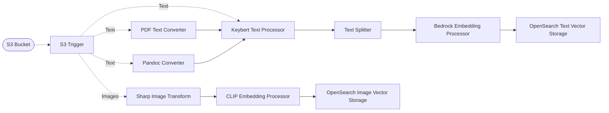
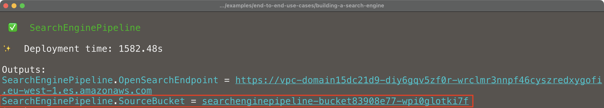
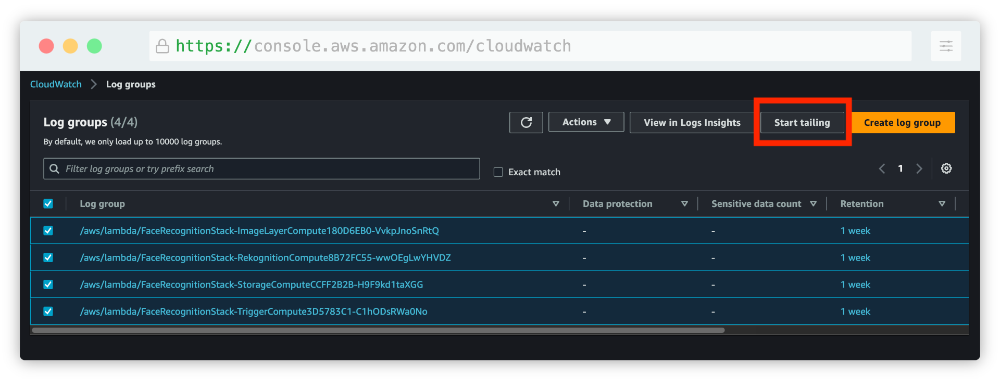
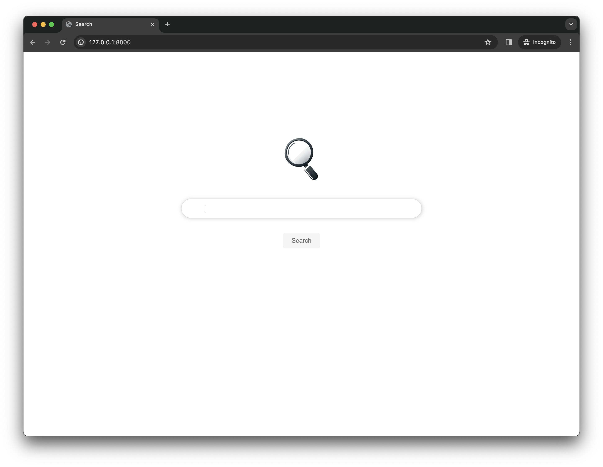
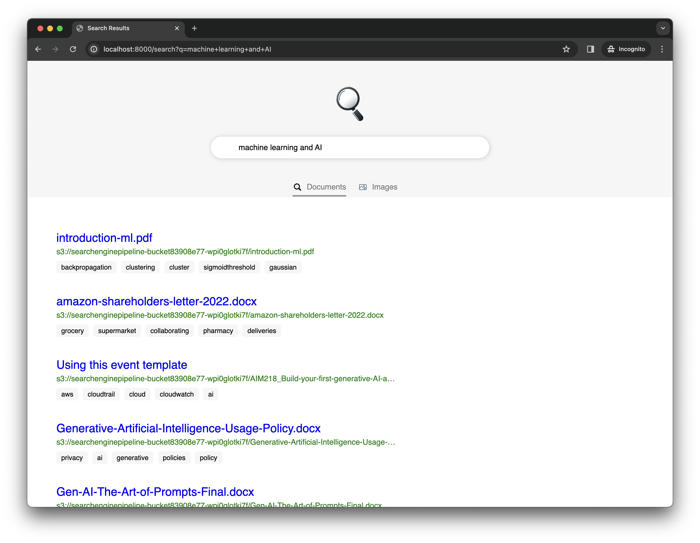

# 🔍 Building a Search Engine

> 👉 This example showcases how to build a search engine multi-modal ingestion pipeline using Project Lakechain. *Please note that this is only an example of what can be built using Project Lakechain, and not a production-ready application.*

## :dna: Pipeline



## What does this example do ❓

This example showcases how to deploy an end-to-end document ingestion pipeline powering a multi-modal search engine supporting text and image search, scaling to large volumes of documents.

This example comes in two parts:

1. The first part is the CDK code provided in this repository, which deploys the Lakechain ingestion pipeline and its associated infrastructure elements to your AWS account.
2. The second part is a small web application that exposes a search engine interface to query the documents indexed by the pipeline.

At its core, the ingestion pipeline implemented in this example ingests documents from an S3 bucket and indexes them into OpenSearch. We also provide a small [Webserver](./server/) application as part of this repository that exposes a web interface to query the documents indexed by the pipeline.

<br>

## 📝 Requirements

The following requirements are needed to deploy the infrastructure required to run this pipeline:

- You need access to a development AWS account.
- [AWS CDK](https://docs.aws.amazon.com/cdk/latest/guide/getting_started.html#getting_started_install) is required to deploy the infrastructure.
- [Docker](https://docs.docker.com/get-docker/) is required to be running to build middlewares.
- [Node.js](https://nodejs.org/en/download/) v18+ and NPM.
- [Python](https://www.python.org/downloads/) v3.8+ and [Pip](https://pip.pypa.io/en/stable/installation/).
<br>

## 🚀 Deploy

Head to the directory [`examples/end-to-end-use-cases/building-a-rag-pipeline`](/examples/end-to-end-use-cases/building-a-rag-pipeline) in the Project Lakechain repository and build the example and its dependencies.

```bash
npm install
npm run build-pkg
```

You can then deploy the example to your account (ensure your deployment machine is configured with the appropriate AWS credentials and AWS region).

```bash
npm run deploy
```
<br>

## 📥 Ingest Documents

You start ingesting documents into the pipeline by uploading your documents to the S3 bucket created by the CDK deployment. The source S3 bucket monitored by the pipeline is displayed in the CDK outputs as `SourceBucket` 👇.

<br />
<p align="center">
  
</p>
<br />

Once you upload documents to that bucket, it can take up to 2 minutes for the pipeline to process them and index them into OpenSearch.

> 💁 We recommend you use the [AWS CloudWatch Logs console](https://console.aws.amazon.com/cloudwatch/home#logsV2:log-groups) in the AWS Console to live tail the CloudWatch log groups associated with the deployed middlewares to see the logs in real-time.

<br />
<p align="center">
  
</p>
<br />

## :house: Running the Webserver

To test querying your documents, you can run the web application part of this example. Head to the [`server`](./server/) directory and install the dependencies in a `virtualenv`.

```bash
pip install -r requirements.txt
```

You can then run the web server using `uvicorn`. You also need to set environment variables expected by the webserver to work.

- `OPENSEARCH_HOSTNAME` - The endpoint of the OpenSearch domain (you can find it in the outputs of the stack).
- `AWS_REGION` - The region in which the OpenSearch domain is deployed.
- `BEDROCK_REGION` - The region from which you want to invoke the Bedrock API to create embeddings for text queries (`us-east-1` by default).

```bash
export OPENSEARCH_HOSTNAME=vpc-<id>.region.es.amazonaws.com
export AWS_REGION=<opensearch-region>
uvicorn main:app
```

> 👉 This will start the web server on local port `8000`. Note that the web-server will download the CLIP model locally to be able to create embeddings for image search queries.
<br>

## 🌐 Web Interface

You can now access the web interface by visiting [http://localhost:8000](http://localhost:8000) in your browser.

<br />
<p align="center">
  
</p>
<br />

### Document Search

You can prompt the search with keywords or sentences that will be used to perform a semantic search on the documents indexed by the pipeline in OpenSearch. The example displays a list of unique documents that best match the query.

> 💁 Note that this example does not filter out documents below a certain similarity score, it only displays a Top 20 ranking of the most relevant documents.

<br />
<p align="center">
  
</p>
<br />

### Image Search

**"Lions in the wild"**

<p align="center">
  
</p>

*Images credits from [Unsplash](https://unsplash.com/fr/s/photos/lions).*

**"Sea, Sun and Boats"**

<p align="center">
  
</p>

*Images credits from [Unsplash](https://unsplash.com/fr/s/photos/sea-and-boats).*

**"Sports"**

<p align="center">
  
</p>

*Images credits from [Unsplash](https://unsplash.com/fr/s/photos/sports).*

<br>

## 🧹 Clean up

Don't forget to clean up the resources created by this example by running the following command:

```bash
npm run destroy
```
