# 🎬 Building a Video Chaptering Service

> 👉 This example showcases how to build a video chaptering service using Project Lakechain. _Please note that this is only an example of what can be built using Project Lakechain, and not a production-ready application._

<br />
<br />
<p align="center">
  
</p>
<br />

## :dna: Pipeline

```mermaid
flowchart LR
  Bucket[S3 Bucket] -.-> S3[S3 Event Trigger]
  S3 -. Video .-> FFMPEGAudio[FFMPEG Processor]
  FFMPEGAudio -. Audio .-> Transcribe[Transcribe Audio Processor]
  Transcribe -. Text .-> Extractor[Structured Entity Extractor]
  Extractor -. JSON .-> Reducer[Reducer]
  S3 -. Video .-> Reducer
  Reducer -. Chapters + Video .-> FFMPEGVideo[FFMPEG Processor]
  FFMPEGVideo -. Chapters .-> S3Storage[S3 Storage Connector]
  FFMPEGVideo -. Chapters .-> S3Storage[S3 Storage Connector]
  S3Storage -. Videos .-> S3Destination[S3 Destination Bucket]
```



## What does this example do ❓

This example showcases how to automatically chapter videos using their transcript and Generative AI technologies using Amazon Bedrock.

> 💁 The pipeline takes an input video from the pipeline source bucket and outputs a collection of chaptered videos and a JSON description of the generated chapters.

<br />
<p align="center">
  
</p>
<br />

The sequence of processing steps in the pipeline goes as follows.

1. The pipeline is triggered by a video upload to a source S3 bucket.
2. The FFMPEG Processor extracts the audio from the video.
3. The audio is transcribed into text using the Transcribe Audio Processor.
4. The text is processed by the Structured Entity Extractor middleware to generate a list of chapters from the transcript as a JSON document.
5. The reducer reduces both the input video and the chapters into a single document.
6. The FFMPEG Processor uses the reduced chapter description and the video to generate multiple videos associated with each chapter.
7. The generated videos are then uploaded to a destination S3 bucket along with the chapters JSON description.

## 📝 Requirements

The following requirements are needed to deploy the infrastructure required to run this pipeline:

- You need access to a development AWS account.
- [AWS CDK](https://docs.aws.amazon.com/cdk/latest/guide/getting_started.html#getting_started_install) is required to deploy the infrastructure.
- [Docker](https://docs.docker.com/get-docker/) is required to be running to build middlewares.
- [Node.js](https://nodejs.org/en/download/) v20+ and NPM.
- [Python](https://www.python.org/downloads/) v3.8+ and [Pip](https://pip.pypa.io/en/stable/installation/).

## 🚀 Deploy

Head to the directory [`examples/end-to-end-use-cases/building-a-video-chaptering-service`](/examples/end-to-end-use-cases/building-a-video-chaptering-service) in the Project Lakechain repository and build the example and its dependencies.

```bash
npm install
npm run build-pkg
```

You can then deploy the example to your account (ensure your deployment machine is configured with the appropriate AWS credentials and AWS region).

```bash
npm run deploy
```

## 🧹 Clean up

Don't forget to clean up the resources created by this example by running the following command:

```bash
npm run destroy
```
