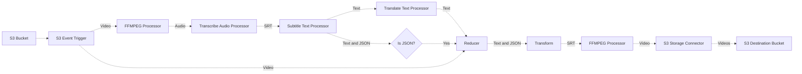
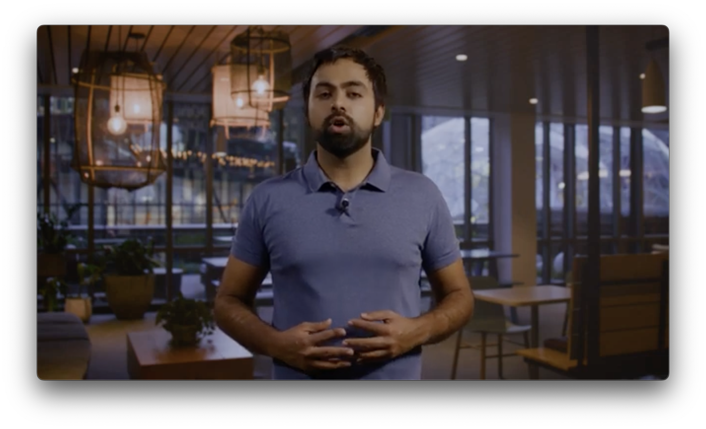
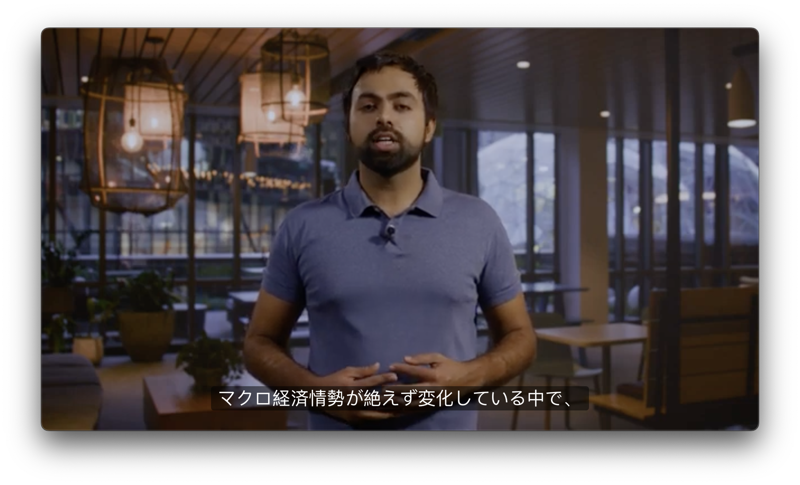
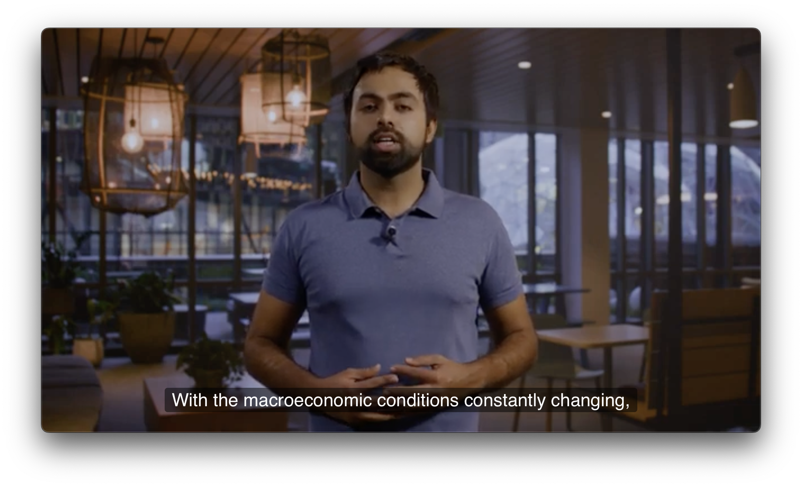

# 💬 Building a Video Subtitle Service

> 👉 This example showcases how to build a multi-lingual automatic video subtitle service using Project Lakechain. _Please note that this is only an example of what can be built using Project Lakechain, and not a production-ready application._

<br />
<br />
<p align="center">
  
</p>
<br />

## :dna: Pipeline



## What does this example do ❓

This example showcases how to automatically create multi-lingual subtitles for input videos, and to embed them into the original video automatically.

> 💁 The pipeline takes an input video from the pipeline source bucket and outputs a video embedding all the multi-lingual subtitles.

<br />

| Original Video | Japanese | English | Arabic
| -------------- | -------- | ------- | ------
|  |  |  | 

<br />

The sequence of processing steps in the pipeline goes as follows.

1. The pipeline is triggered by a video upload to a source S3 bucket.
2. The FFMPEG Processor extracts the audio from the video.
3. The audio is transcribed into text using the Transcribe Audio Processor.
4. The text is processed by the Subtitle Text Processor to parse subtitles into plain text and into a JSON structured format.
5. The plain text subtitles are translated into multiple languages using the Translate Text Processor.
6. The JSON subtitles and the video are reduced into a single document using the Reducer.
7. The reduced document is transformed back into a SubRip Subtitle (SRT) format using the Transform Processor.
8. The FFMPEG Processor will then use the reduced document to embed the subtitles into the original video.
9. The video with the embedded subtitles is uploaded to a destination S3 bucket.

## 📝 Requirements

The following requirements are needed to deploy the infrastructure required to run this pipeline:

- You need access to a development AWS account.
- [AWS CDK](https://docs.aws.amazon.com/cdk/latest/guide/getting_started.html#getting_started_install) is required to deploy the infrastructure.
- [Docker](https://docs.docker.com/get-docker/) is required to be running to build middlewares.
- [Node.js](https://nodejs.org/en/download/) v18+ and NPM.
- [Python](https://www.python.org/downloads/) v3.8+ and [Pip](https://pip.pypa.io/en/stable/installation/).

## 🚀 Deploy

Head to the directory [`examples/end-to-end-use-cases/building-a-video-subtitle-service`](/examples/end-to-end-use-cases/building-a-video-subtitle-service) in the Project Lakechain repository and build the example and its dependencies.

```bash
npm install
npm run build-pkg
```

You can then deploy the example to your account (ensure your deployment machine is configured with the appropriate AWS credentials and AWS region).

```bash
npm run deploy
```

## 🧹 Clean up

Don't forget to clean up the resources created by this example by running the following command:

```bash
npm run destroy
```
