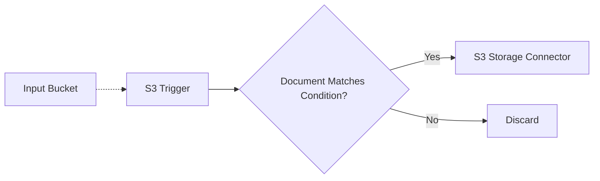

# ❓ Conditions in Pipelines

> This example showcases how to use the `Condition` middleware to express complex conditionals within a Lakechain pipeline.

## :dna: Pipeline



## ❓ What is Happening

The `Condition` middleware allows pipeline developers to express complex conditional expressions within their document processing pipelines. It provides the ability to either express conditions using a closure expression locally that gets executed in the Cloud, or using a user-provided Lambda function.

In this example, we use a closure expression to check if the incoming document is a JSON file, and that the JSON structure is correct. If it is, we store the document in S3, otherwise we discard it.

We've placed 2 documents that you can use as an example in your pipelines to play with conditions :

- [matching-doc.json](./assets/matching-doc.json) - A JSON document that matches the condition.
- [non-matching-doc.json](./assets/non-matching-doc.json) - A JSON document that does not match the condition.

## 📝 Requirements

The following requirements are needed to deploy the infrastructure associated with this pipeline:

- You need access to a development AWS account.
- [AWS CDK](https://docs.aws.amazon.com/cdk/latest/guide/getting_started.html#getting_started_install) is required to deploy the infrastructure.
- [Docker](https://docs.docker.com/get-docker/) is required to be running to build middlewares.
- [Node.js](https://nodejs.org/en/download/) v18+ and NPM.
- [Python](https://www.python.org/downloads/) v3.8+ and [Pip](https://pip.pypa.io/en/stable/installation/).

## 🚀 Deploy

Head to the directory [`examples/simple-pipelines/conditionals`](/examples/simple-pipelines/conditionals) in the repository and run the following commands to build the example:

```bash
npm install
npm run build-pkg
```

You can then deploy the example to your account (ensure the AWS CDK is installed and is configured with the appropriate AWS credentials and AWS region):

```bash
npm run deploy
```

## 🧹 Clean up

Don't forget to clean up the resources created by this example by running the following command:

```bash
npm run destroy
```
