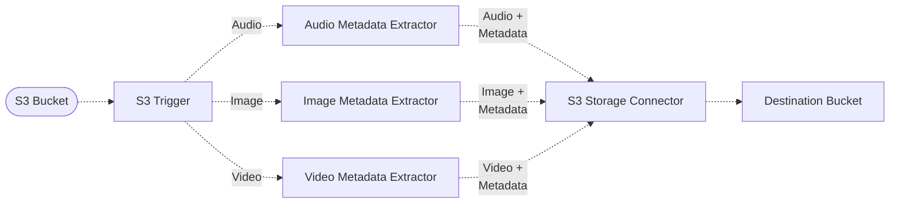

# 📝 Metadata Extraction Pipeline

> In this simple pipeline, we demonstrate how you can extract metadata from different types of documents (images, audio and video) at scale, and store those metadata in the document description. The pipeline then stores the document description of each processed document in a destination S3 bucket.

## :dna: Pipeline



## 📝 Requirements

The following requirements are needed to deploy the infrastructure associated with this pipeline:

- You need access to a development AWS account.
- [AWS CDK](https://docs.aws.amazon.com/cdk/latest/guide/getting_started.html#getting_started_install) is required to deploy the infrastructure.
- [Docker](https://docs.docker.com/get-docker/) is required to be running to build middlewares.
- [Node.js](https://nodejs.org/en/download/) v20+ and NPM.
- [Python](https://www.python.org/downloads/) v3.8+ and [Pip](https://pip.pypa.io/en/stable/installation/).

## 🚀 Deploy

Head to the directory [`examples/simple-pipelines/data-extraction-pipelines/metadata-extraction-pipeline`](/examples/simple-pipelines/data-extraction-pipelines/metadata-extraction-pipeline) in the repository and run the following commands to build the example:

```bash
npm install
npm run build-pkg
```

You can then deploy the example to your account (ensure your AWS CDK is configured with the appropriate AWS credentials and AWS region):

```bash
npm run deploy
```

## 🧹 Clean up

Don't forget to clean up the resources created by this example by running the following command:

```bash
npm run destroy
```
