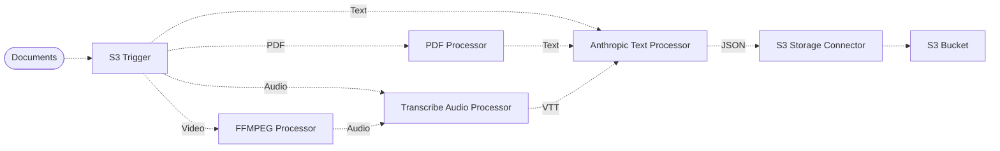

# 🎥 Document Quiz Pipeline

> This example shows how to easily implement a pipeline that generates a list of questions from an arbitrary file, such as text documents (including PDF), audio, or video files, using LakeChain and Amazon Bedrock.

> You can use these questions, for example, to test your knowledge about the content of various documents, such as videos, podcasts, or scientific papers, etc.

## :dna: Pipeline



## ❓ What is Happening

1. The pipeline starts when a document is uploaded to the source `S3` bucket.
2. The pipeline selects the appropriate processor(s) for the file, depending on its filetype. It extracts the associated text.
3. The `Text Processor` generates questions from the extracted text using the Anthropic [Claude v3 Sonnet](https://aws.amazon.com/fr/about-aws/whats-new/2024/03/anthropics-claude-3-sonnet-model-amazon-bedrock/) model hosted on Amazon Bedrock.
4. The generated questions are then added to a JSON file in the destination bucket, with the following format:
```json
{
  "questions": [
    "What is ...?",
    "Why is ...?",
    "How ...?"
  ]
}
```

## 📝 Requirements

The following requirements are needed to deploy the infrastructure associated with this pipeline:

- You need access to a development AWS account.
- [AWS CDK](https://docs.aws.amazon.com/cdk/latest/guide/getting_started.html#getting_started_install) is required to deploy the infrastructure.
- [Docker](https://docs.docker.com/get-docker/) is required to be running to build middlewares.
- [Node.js](https://nodejs.org/en/download/) v18+ and NPM.
- [Python](https://www.python.org/downloads/) v3.8+ and [Pip](https://pip.pypa.io/en/stable/installation/).

## 🚀 Deploy

Head to the directory [`examples/simple-pipelines/document-quiz-pipeline`](/examples/simple-pipelines/document-quiz-pipeline) in the repository and run the following commands to build the example:

```bash
npm install
npm run build-pkg
```

You can then deploy the example to your account (ensure the AWS CDK is installed and is configured with the appropriate AWS credentials and AWS region):

```bash
npm run deploy
```

## 🧹 Clean up

Don't forget to clean up the resources created by this example by running the following command:

```bash
npm run destroy
```
